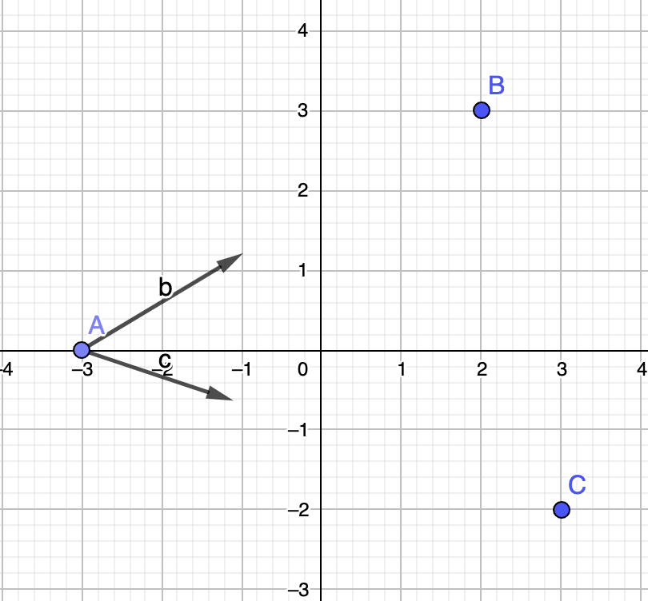
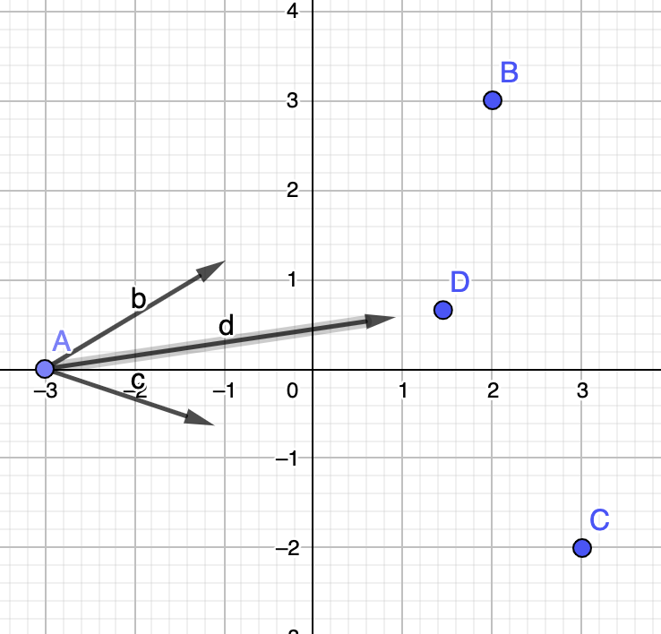
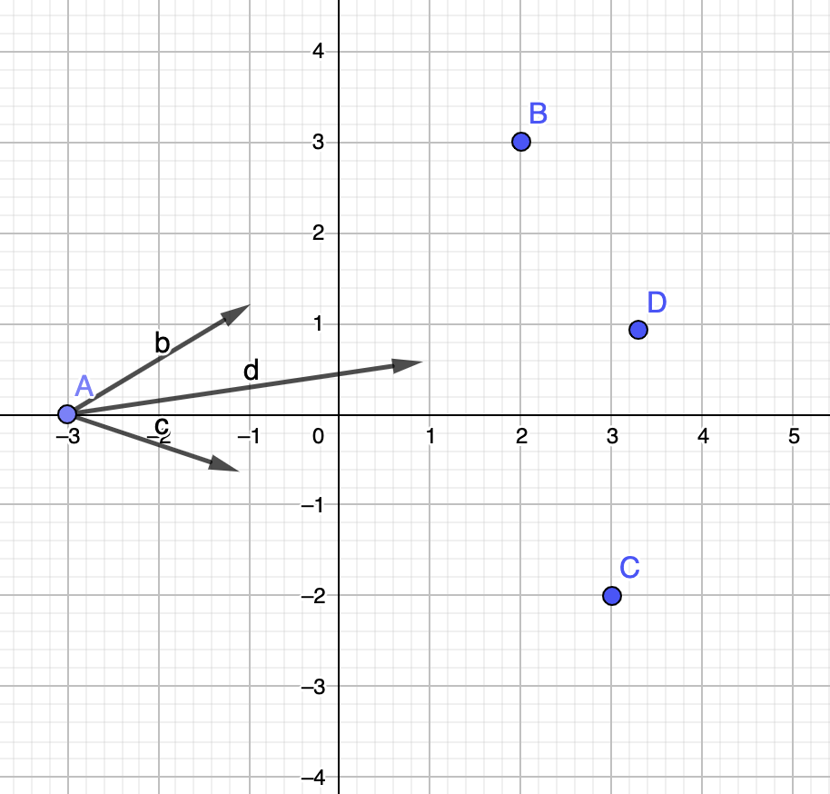

I wanted to write this articles for so long... I think this is about time, since I've finally found time to properly write my thought about this.

As I've described in my recent article [Pi and the Basel Problem](./../2022--03--25-00--pi-and-the-basel-problem/), I was quite intrigued by a video of 3Blue1Brown 
[about the Basel problem](https://youtu.be/d-o3eB9sfls). The video was made in 2018, but I've only encountered it in 2019. There is a huge urge for me to write about it
but COVID-19 hits and my life is in a mess, so I postponed it again and again. I think one of the main reasons why I made this Blog is because I want 
to write something like this.

I mean, I've searched and searched, but it seems I can't find any person that relates Basel problem with gravity. 
3Blue1Brown also uses an inverse square law, but he uses it differently. To be precise, the identity is found using Euclidean connection about 
inverse square law and intensity (at least physical intensity, in my understanding). 3B1B also described that he is basing the video from a paper by
[Johan Wastlund](http://www.math.chalmers.se/~wastlund).

I've become so obsessive with it. It was such a long time that my curiosity is kindled like a child again. The video sparked such joy in me, it helps me 
pass thru difficult times between 2020-2022. I promised myself that I will write about this (regardless if the actual proof is right or wrong).
I will write about how I encountered the problem in high school, that at that time I don't even know it was called "Basel problem" and how famous it was.
However, it was very clear to me that the connection is so profound and baffling, I even doubt myself. Not to mention that I was only a high school student.
Huge chances are that I'm wrong, or this is just a coincidence that I found the solution, but the reasoning is mathematically wrong.
This is because I was basing on Physical argument. Which I will explain later in this article.

Nevertheless, I still remember my astonishment at that time in high school. A sense of proud and doubt. Since I couldn't confirm it myself,
I discarded my derivation and never thinking about it again. You can imagine my surprise when watching that video at that time:

"Wait a minute? Sum of inverse square law? I've worked on this years ago."
"Holy sh*t! The answers really has Pi in it? Like I found years ago???"
"Oh my god, he starts from inverse square law, but derived it differently. Our derivation maybe different but has the same result!"

I know it's just a minor thing. But the feelings are genuine. I feel like a kid again trying to unravel the mysteries of the universe. Hahaha.

Now, my articles will contains two parts. The first part here will describe my derivation in high school as closely as I can remember. 
Bear in mind if you think it contains many logical flaws, I'm just a high school student anyway. But my hope is that I can express the stark contrast
of how getting a glimpse of the intuition to the solution (in the first part) may be accompanied some mathematical "backing" (in the second part).
I want the readers to experience that same kind of joy.

Hence, I dedicated these articles as an appreciation and thanks to 3B1B and Johan Wastlund for making my life exciting and colorful again.

# Using Physical principle as starting point

Before we dive in further, let's recap some things about basic gravity problem in high school.

The problems around gravity in our textbook is usually involving a set of point mass with a variable distance. 
They maybe separated in one dimensionally or within a plane, for example, making a triangle shape, or squares etc.
These point massess should exert gravitational force to each other, so we are required to calculate the total force exerted by gravity.

My first revelation came when the textbook implies that: 

#### Principle 1: Set of masses can be represented as a single point mass

*A set of point mass can be represented by a single mass in such a way that the total net Force has the same direction and magnitude.
The new systems is then mechanically indistinguishable in that instant of time for a mass affected by that force.*

To illustrate this example, consider the following picture:

Imagine we have 3 point of mass A, B, C. We currently evaluating net force in mass A. The gravitational force direction each must point towards
point A and B. In my drawing, the length of the arrow represents the strength of the force. Since AB is closer than AC, we assume AB is stronger, 
if all the point masses have identical mass.

Now, since in physics, objects called vectors can be added up together. It is identical if we replace both B and C, and changed it into a point mass D,
in such a way that the gravitational force caused by "virtual" mass D cause the same net effect to A.

In the image, D is closer because if D has identical mass with B and C, then the strength of gravity is solely determined by the distance AD.
Which means, it had to be closer than B and C in our case.

Note that, since gravity depends on two variables, mass and distance. We can argue that we can choose which factors represents B and C. 
In the example above, we want the distance to represents B and C. We can also consider that if we want D to have combined mass of B and C,
then the distance will match accordingly like this:

In this representations, D is located much further, because the force contributions comes from the mass, rather than the distance. 
In that distance, the total mass can compensate the force to match with net force of B and C.

We have two representations here, but it will not affect Newton's Law at this point in time, because Newton's Law depends solely on the Force
and our evaluated object in question. In our case, point A.

#### Principle 2: Center of mass is just a representations of a set of point masses by adding up all the masses of the points

Just as it is plainly stated. Any set of mass, like B and C, can be "combined" into a point mass D, in which mass D is the total of mass B and mass C,
with the same net force effect.

This approach is already explained in the textbook I read. It is used everywhere to define the inertial moment for rotating body, or total Gravitational force 
of rigid volumes. In general, if we consider infinitesimally small mass $dm$, then if we added up all the massess together, we can retrieve the total 
gravitational force. It is equivalently stated using integral, as follows

$$
\mathbf{F_G }=\int\frac{GM\mathbf{r}dm}{|\mathbf{r}|^3}
$$

If you are wondering why we uses power of 3 instead of 2 for the distance, we uses this notation to include "direction" of the vector provided by 
$\mathbf{r}$ (the bold vector). So we must divide it by the length of the vector again. Some other textbook will define the unit vector of $\mathbf{r}$,
called $\hat{\mathbf{r}}$ (with hat) and keep the inverse square.

As you can see, if we added up all the masses together, we can represents total mass as $m$. Then we can represents the force "as if", it was coming 
from a single point with distance $r_s$. Then we call this $r_s$ an "average" distance for simplicity.

$$
\mathbf{F_G}=\int\frac{GM\mathbf{r} \, dm}{|\mathbf{r}|^3} = \frac{GMm\mathbf{r_s}}{|\mathbf{r_s}|^3}
$$

For rigid bodies, physics textbook by convention uses the total mass. From it, then the average distance or, the location of the point mass is then can be defined,
like this:

$$
r_s = \sqrt{\frac{GMm}{F_G}}
$$

As far as this goes, it still follows standard classical physics. But, we will now uses our imagination, because we found something interesting.

As far as vector addition goes, Newton's Law guarantees that infinitely many small mass should add up into a finite force. Otherwise, things would get ugly.
Earth is comprised of infinitely many point mass. But the resulting force is not infinite. If it is infinite, then we have a sudden really large 
acceleration, and we will see objects can suddenly move with extreme speeds. This does not happen.

Although we can argue that this is caused by Relativity Theory, so objects have speed limit. However, let's just maintain our scope only for classical mechanics.
Even in classical mechanics, gravity does not produce infinite force.

So here's my propositions:

#### Proposition 1: Gravitational force is always convergent

Proposition in our context here means something that I suggested. In this case, this is not a standard physical principle, but rather things that 
I deduced or postulated. But I'm not going to use the words postulate, since it sounds really cool I think I don't deserve it. The proposition 
I made here is just an imaginative statement I conjured when I was in high school. So, no logical grounds from it. But it can be disproven.

Why disprovability is important? Well, just like in regular physics, an idea is not exciting if it is not testable.

Now, let's see how and why I deduced something like this.

Consider a solid 1 dimensional rod along the positive x axis with length L. The left side of the rod have distance D from origin.

One can then calculate a gravitational force exerted on a point mass in origin with the previous integral in [Principle 2](#principle-2).
The integral is calculated by imagining that the rod are consists of infinitely small mass $dm$, located side by side along the x axis.

Here's the catch. Since it is an integral, I am allowed to divide the integral into some finite sections. Let's say $N$ sections. 
Each section then is an integral. But, each section then can be replaced by it's representations of average center of mass.

Now we have 3 representations! Since this is one dimentional, we can just drop the vector notation to make it easier to see.

$$
F_G=\int\frac{GM\, dm}{r^2} = \sum_n^N \frac{GMm_n}{r_n^2}
$$

My argument was, since the leftmost side of the equation is a convergent value, then it is possible that the right hand side, the finite sum is convergent.

This feels like I'm going backwards, because usually we define integral as a Riemann Sum in the limit of infinitesimal. But now we are inspecting the sums.

Both the integral and sums above are related by $m_n$. As more and more sections are introduced, the $m_n$ is vanishingly small. But what if it is just 
a finite non zero constant? If each section contains the same mass $m$, then we are left with this:

$$
F_G=GMm \sum_n^N \frac{1}{r_n^2}
$$

This is what made it interesting for me. If we conditioned such that $N\to\infty$ and then each $r_n$ where integer distance from origin, then we 
have an infinite sums of inverse squares. It dawns to me like a revelation. I was always wondering why the inverse square law had to be "square".
Why does gravitational force is not inversely proportional instead. If it is $\frac{1}{r}$, does such universe can exists?

Mathematically speaking, harmonic series is not usable as gravity because in Newton's Universal Gravitation, gravity can act from a very far place, 
but in a convergent way. Harmonic series is divergent so we can't assign value to it's force, when the source is very far.

So, in reverse, I deduced that **Newtonian gravity would imply that inverse square series is convergent**

# Problem Statement: Basel Problem in terms of gravitational force

To summarize my proposition, we can imagine virtual composition of point of mass with each having mass $m$, positioned one unit away along the x-axis.
It would imply that the resulting force can be thought of as if a single point of mass located at distance $r_s$ is acting a force towards origin.
It would also imply, that we can imagine a virtual rod with inifinite length have such specific mass distribution to allow it to be decomposed as set 
of points in the integer distance of x-axis.

Since, the constant $GMm$ will be a constant. We can summarize our proposition such as:

$$
F_G=\mu\int\frac{\rho\, dr}{r^2} = \mu\sum_n=1^\infty \frac{1}{n^2}
$$

We have $\rho=\frac{dn}{dr}$ as the function of distribution of mass. This is caused by the chain rule of variable change from $dm$ to $dr$.
Meanwhile, $n$ represents integers.

# Physical intuition to solve the problem

We have now defined the problem statement above. At that time, I didn't know it was Basel problem. What I'm curious about is just to find the 
value of this series that rises from gravity. I've seen arithmetic series and geometric series. Geometric series is convergent even though 
the terms goes to infinity, so I was curious if inverse square series will be convergent as well.