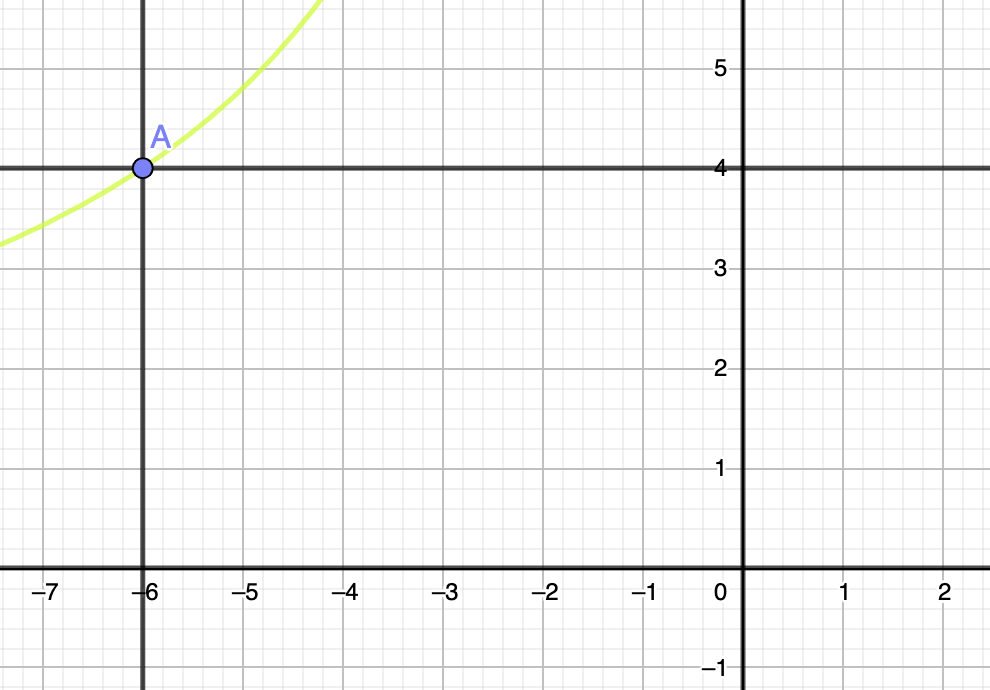
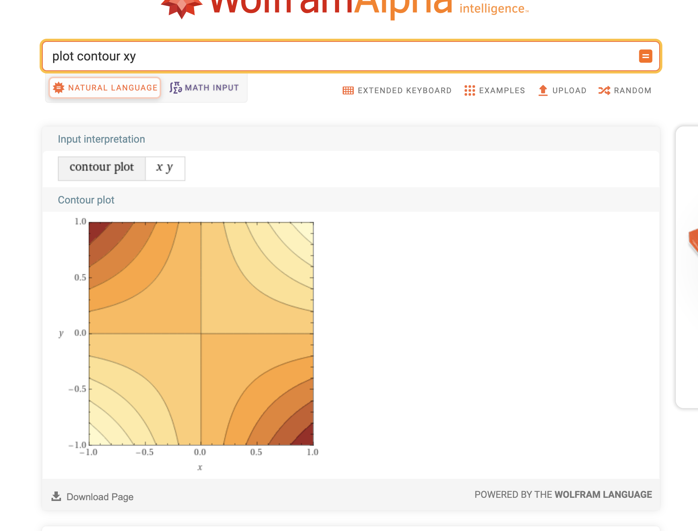
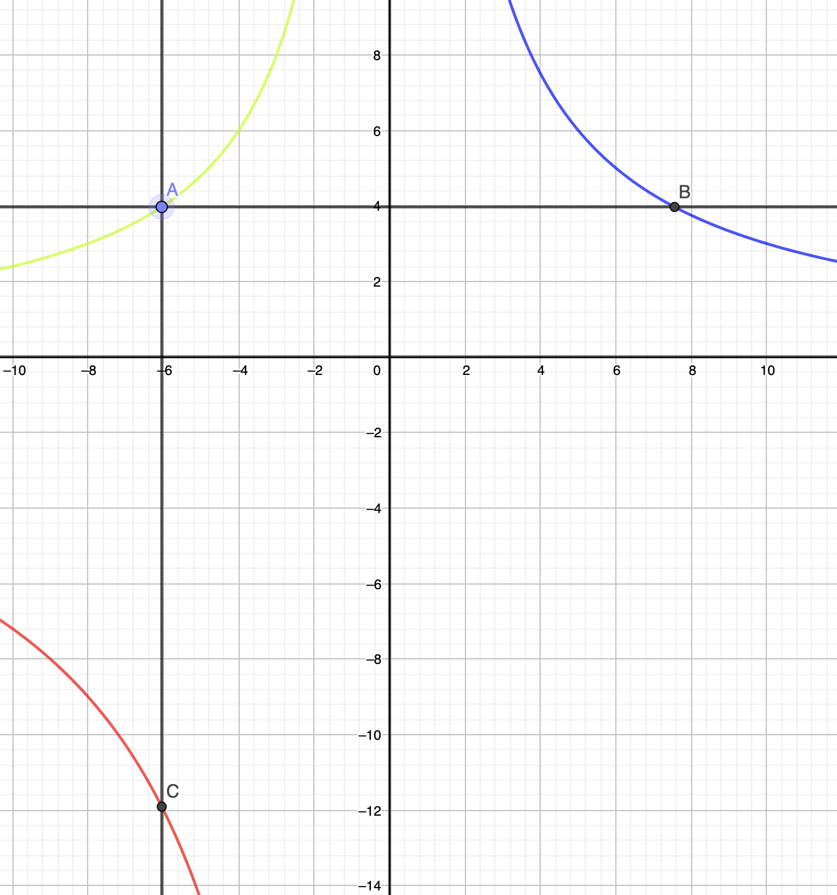
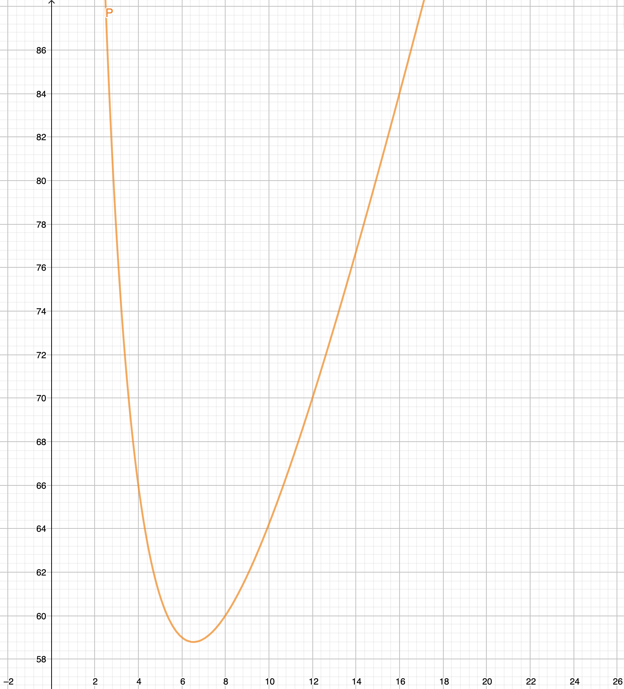

# Problem statement

As usual, I found another math puzzle over twitter here:

<blockquote className="twitter-tweet">
    

        Semua garis di sini panjangnya bilangan bulat.
          
        a) berapa luas keseluruhan?  
        b) berapa keliling keseluruhan? 
        <a href="https://t.co/LheJQgGIr0">pic.twitter.com/LheJQgGIr0</a>
    

    &mdash; Ainun Najib (@ainunnajib) 
    <a href="https://twitter.com/ainunnajib/status/1530118002233921536?ref_src=twsrc%5Etfw">May 27, 2022</a>
</blockquote> 

Since it is in Indonesian language, I will translate it over:

> All of the lengths defined here is integers.
> 
> a) What is the total area?
> 
> b) What is the total perimeter?

We have a rectangle divided in 4 sections. All the top left, top right, and bottom left have defined area. Only the bottom right is unspecified.

Some people have tried to answer the question in the replies, then everyone notices that they all have different answers regarding the perimeters, but the area is always the same.
So, to explain why is that possible, we need to do some little algebra for this simple problem.

# Creating a function to calculate the area

Most attempts uses numbers directly to deduce the lengths of the rectangle. This is because of the original constraints that "All the lengths defined here is integers."
Suppose that we remove that restrictions, we ended up using algebra to calculate the lengths.

Take a look at the top left rectangle (let's call this reactangle A), which area is 24 $cm^2$. If we want to draw it in a cartesian coordinate, let's say the origin is in the bottom right corner of this rectangle.
Then, look at this graph here:

Notice that the point A is in (-4, 6) coordinate. Which means it has length 4 and 6 in horizontal and vertical direction. The area is 24. 
The green line here is a function of $y=\frac{24}{x}$. This is one way to represents the problem. But there is another way to represents this problem, called contour graph.

A contour graph, or plot, is a plot in 2D to represents a function in 3D spaces. To illustrate, let's suppose we have a function called Area.
Area function for reactangle only have two inputs, the horizontal and vertical lengths, which we called x and y. So, we write it like this:

$$
Ar(x,y) = xy
$$

If you ask wolfram alpha to make a contour plot of $xy$, it would look like this:

In a contour graph, every point in the 2D cartesian plot have a color. Each color pixel is associated with a value. If you are familiar with physics, this also can be thought of as a gradient field or potential field.
This is because each location corresponds to a scalar value. The value in this case is the area of the constructed rectangles.

Contour plot also used in GIS or mapping to draw an elevation of a certain location in the 2D cartesian plot. Usually, for neighboring pixels/points with the same certain color, one would draw a line.
This line, called contour line, will denote certain exact lines where the value of the function is exactly the same. It is useful because human can't distinguish continuous color difference accurately, 
so drawing a line helps them "see" exactly where the value is exactly the same.

Now let's go back to the original graph of rectangle A. The green contour line means a location where the x and y values results in an area of exactly 24 $cm^2$ units.
We can drag around point A along this line and the area is going to be 24, but the rectangle now have different shape.
This plot made it easier for us to see that we can make the x value arbitrarily very far to the left, and the y value will move ever slightly approaching 0, but in such a way that the area is always 24.

Now if we defined another contour line for the other rectangle, top right (B), and bottom left (C):

In the above graph, blue line is for the rectangle with area 30. Red is for the rectangle with area 72.

As you can see from the constructions, rectangle B and C, is completely determined by the x position of rectangle A.

With some algebra, we can define the x and y values of each rectangle. To make it completely using algebra, let's say that A, B, C, corresponds to the area of each rectangle.

$
y_A=\frac{A}{x} \\
y_B=y_A \\
x_B=\frac{B}{y_A} \\
x_C=x \\
y_C=\frac{C}{x_C} \\
$

Now, we can define arbitrarily the 4th rectangle to complete the bigger rectangle. Surely this rectangle D (unknown area at the moment), will have horizontal and vertical length $x_D$ and $y_D$.

$
x_D=x_B \\
y_D=y_C \\
$

This means the last rectangle doesn't have any free parameters. It is completely determined by the initial x value of rectangle A. We can just completely ignores it.

The total area (TA) then will be:

$
TA=(x_A + x_B)(y_A+y_C) \\
TA=(x + \frac{B}{y_A})*(\frac{A}{x}+\frac{C}{x_C}) \\
TA=(x + \frac{B}{A}x)*(\frac{A}{x}+\frac{C}{x}) \\
TA=x(1+\frac{B}{A})(A+C)\frac{1}{x} \\
TA=A+C+B+\frac{BC}{A} \\
$

Notice that the total area is just a constant. Whatever the value of x (which controls the shape of the rectangle), the area will be the same.
If you insert the area values, the total area turns out to be 216 $cm^2$. Regardless if the lengths are integers or not.

Now, for the perimeter (P), we follow the same approach:

$
P = 2 (x_A+x_B+y_A+y_C) \\
P = 2(1+\frac{B}{A})x + 2(A+C)\frac{1}{x} \\
$

We see that the perimeters can be any arbitrary values, because x can be defined to be any values we can pick for $x>0$, the perimeters can be as big as we want.
In contrast, it must then have a minimum values, because the functions hinted that it has extremum.
To find out the extremum, find the first derivative which results in 0.

$
P' = 2(1+\frac{B}{A}) - 2(A+C)\frac{1}{x^2} \\
0 = 2(1+\frac{B}{A}) - 2(A+C)\frac{1}{x^2} \\
x^2=\frac{(A+C)}{(1+\frac{B}{A})} \\
x = \sqrt{\frac{(A+C)}{(1+\frac{B}{A})}}
$

If we insert the values, (obviously since we only want positive x values for the length), $x\approx 6.531972647421808$.
If we take the original constraints into considerations (all length must be integers), then $x=8$, which corresponds to $P=60$, is the minimum perimeter.

# Integer solutions

To find integer solution, we can insert the numbers and see where it goes.

$
P = 2(1+\frac{B}{A})x + 2(A+C)\frac{1}{x} \\
P = 2x + \frac{5}{2}x + \frac{192}{x} \\
$

So, the constraints are simplified. $x$ must be divisible by 2, and must divide 192. Also, it needs to be a factor of 24 (the area of rectangle A).
Let's list all the factors for now.

Factors of 24 are {1, 2, 3, 4, 6, 8, 12, 24}.

Factors of 192 are {1, 2, 3, 4, 6, 8, 12, 16, 24, 32, 48, 64, 96, 192}.

So, the common factors of 24 and 192 that are also divisible by 2, are {2, 4, 6, 8, 12, 24}.

From these lists of possible constraints for x, further reduce it by applying the constraint for rectangle B and C.
Which means, x must be a factors of 72, and $y_A$ must be a factors of 30.

Factors of 72 are {1, 2, 3, 4, 6, 8, 9, 12, 18, 24, 36, 72}, so all x is possible.

Factors of 30 are {1, 2, 3, 5, 6, 10, 15, 30}, which means possible integers of $\frac{24}{x}$ are {24,12,8,4}.

So, possible values for x are {4,8,12,24}.
With possible perimeters are {66,70,60,116}.

# Graph of the perimeters

Maybe you are wondering why the possible parameters is not ordered monotonically: {66,70,60,116}.
We can make a graph of the perimeters as a function of x.

If you look at the graph, you can also see that x value of 16 causes integer perimeter. But we didn't include it because the lengths then are not integers, but a multiple of 0.5.