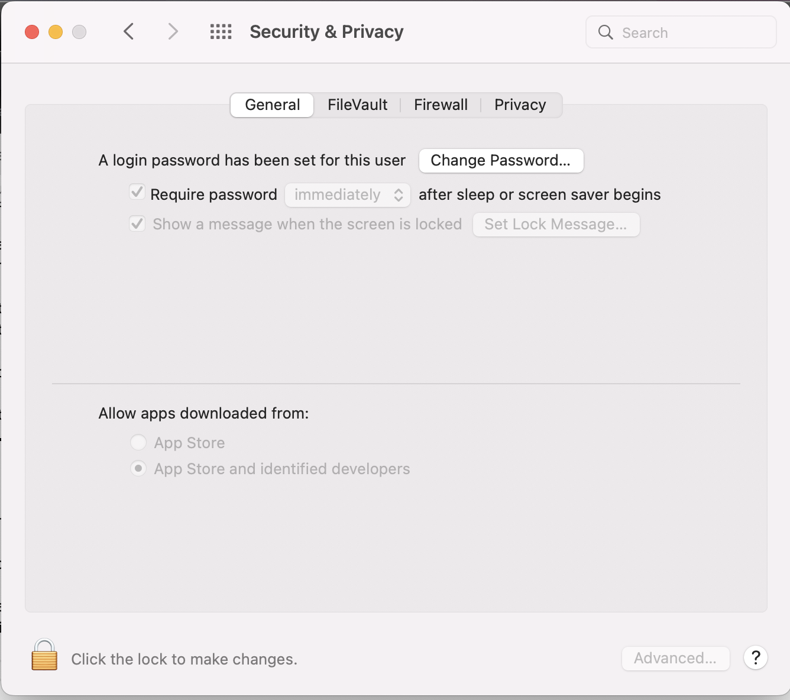

Recently I've had some problem with my laptop login flow. As a reference, the company where I worked for send me a new laptop just earlier this year. 
It was a MacBook Pro. It comes with preconfigured MDM settings so that the login flow is tied to the company's SSO credentials.

So, in summary, whenever I changed my company's login credentials, the local Mac account password will immediately sync'd if it was connected over the internet.

Now, on top of this company policy, I've also had my personal policy when managing company's credentials. In the past, it is very often for me to manage 
company's cloud and server credentials. So I need a secure and long password, that is easy to regenerate when needed. This is why I have two Yubikey in my possession.

I have one Yubikey for personal things. Then I have one for work related things. My Yubikey is the Yubikey 5 NFC model, with legacy USB port (not USB-C).
It has two configuration slots. I left the first slot with default OTP usage. For personal usage, I remembered my complicated and long master password. Because I rarely change them.
For work usage I used my second slot Yubikey for work things, to remember my company's login password. This is because it changes often and I can't possibly remember them.

Now, I had to explain the default behaviour of my Yubikey.

If you want to use the second slot. You need to plug the Yubikey to your laptop. Then you need to do a "long touch" on your Yubikey. 
After about 2 seconds, Yubikey will output my static password into the field on focus in my laptop. Basically, it works by emulating a keypress, as if it was a keyboard.
So, it typed your password quickly into the field. Usually, because it is very convenient, the default settings of the slot is to append "Enter" key at the end.
That way, when you are typing password or OTP, the form immediately sent or activate default behaviour of the form. Just as what happens when you press enter when you are in the form.

# The Problem

Now, I've worked with these setup for a long time. But just yesterday, for some reason I can't login into my laptop after a restart.

Since I'm using MacOS, the default behaviour after a reboot/restart is that I need to pick a user and typed my password befoure Touch ID is enabled.
What I usually do is just plug in my Yubikey, then long touch it, so it would typed my long password in. 
Then it will immediately press enter automatically and I just wait for the initial login step to finish.

For some reason... MacOS said my password is wrong. I was confused and long touch my Yubikey again and still not able to log in, until I eventually be locked out of my account.
I have to wait 10 minutes to log in again, because of several failed attempts.

What is confusing is that I haven't changed my password. Initial log in is needed to activate FileVault in MacOS (to decrypt the disk), before MacOS can log you into the OS (the user account).
So, there's no way that it uses internet to verify my password. It has to be locally. Yet, it didn't work.

Luckily I have a second standard account set up in my mac. From there I could start terminal, then perform `su <my user>`, input my password using my Yubikey, and see if it actually logs in.

Unfortunately, I'm still locked out. So I don't know if the password is correct or not. Yet, if I logged in into company's SSO using my Yubikey, the password is correct.
So there's something weirdly wrong. I also checked by manually typing my long (p)assword, which is 24 characters at the moment. It doesn't log me in.

# The Solution

There are several part on how I managed to regain my account again... I will just put it here to allow me to remember it in the future.

## Make sure the mac are fully rebooted

There are mechanism in-place of the mac local account that prevents me to log in after several failed attempts. In order to see that, I am using my standard user
and opened Security & Privacy settings. In general, in this settings, Mac provides a Lock icon like this:



When you click the lock icon, and you are not an Administrator, it will ask you to provide Administrator credentials. 
Since my work account is an Administrator (because backend engineer has to run sudo all the time), I can put my credentials there.
It told me that my work account was locked for 3115 minutes. Which is around 2 days, lol.

I kind of anticipated situation like this, so actually, I already put my standard user's ssh pub key into my work account. So instead of using the login window,
I can get inside my account via SSH from terminal. I did `ssh <my work account>@localhost`, and I was in.

From there, it is trivial to just change my password using `passwd`, right? Hahaha. Unfortunately, I had some surprise. `passwd` said my account are temporarily locked.
Oh no.

I can ran command just fine as my work account. But passwd is blocked. Jeez.

Feeling clever, I raised my privileges using `sudo su`. Of course it asked my password, in which I used my Yubikey, for curiosity reasons.

It works!!!! WHAT THE HELL????

Now I'm root. It is very weird that I was able to `sudo su` using my password when may local account is locked. Is this a security bug?

Whatever.

I attempt to do `passwd <my work account>`. Fill in my password and replace it with simpler one. I hoped this will reset the temporary lock.

Unfortunately, again, the prompt says my new password doesn't fullfill the criteria of a "strong password", which can be good news and bad news.

The good news, it accepted my old password, which means my password is not wrong, my Yubikey is not at fault.

The bad news, my new password is just the old password with extra character at the end. There is no way that it doesn't fullfil the criteria. 
I already mixed symbols, numbers, normal letters, and capital letters.

So, in summary, I deduced that my laptop's MDM profile is using Jumpcloud agent to sync my company's SSO password with my local account password.
I can only reset the password from within Jumpcloud's interface, inside my work account.

Other option would be to let my laptop connected over the internet and reset my password via Jumpcloud's web portal. But that would be too risky. 
If my local account turns out to be unsynced anyway, then I have to bring it to IT department. Which means I have to go to the office, and it is a little bit 
far from my house. That would cost time and money.

I asked the IT department via Slack, and they told me there's nothing they can do from their side since we are sure the password is correct.

What they advise me instead is to log out my standard user (to clear any cache or running services), then reboot/restart from the login window.

Surprisingly, I was able to login after that. Despite that I did the same thing the first time before all of this happens!

Well, I'm not sure why it works now. But I did learned something new. After the initial reboot the temporary lock are missing/reset. I deduced that 
MacOS can't check the temporary lock window because it hasn't retrieve local data yet before FileVault is unlocked. So, if in the future I got temporarily locked out again,
I have to do a full reboot to reset the lock duration.

## Tweaking Yubikey Settings to properly output the password

The first part solved our issues with the account lock duration. But we haven't solved our core problem yet. Why sometimes my Yubikey works, and sometimes doesn't.

There are several reasons I can think of, and we are going to anticipate all of them:
1. The keyboard layout in the initial login window is different with what Yubikey is using
2. Yubikey typed the password too fast, the OS probably can't handle them properly and miss some characters because the entire string is relatively long
3. There is something wrong with how MacOS login window accept the enter key after the password is typed

The first reason is easy to fix, but annoying to do. By default Yubikey will use US keyboard layout. By default my Mac login window uses ABC keyboard layout.
So, I just need to make sure that I switch the input to US, because probably there's some mismatched keys, although theoritically it should be the same.

The second reason is because Yubikey typed/emit the password as fast as possible without delay. I just need to slow it down.

The third reason is because Yubikey by default appended enter key after emitting the static password. I want to disable the enter press, so I can verify the length of the password before it is submitted.

To fix the second and third reason, I need to change my Yubikey settings, but it is kind of hidden.

Open a terminal and navigate to `ykman` executable. This is Yubikey Manager CLI tools. Download it first if you don't have it. 
Also, you can do it from other computer as well because you need to access the Yubikey itself. In my case, since I can only log in to standard account, 
I could not change my Yubikey settings because it needs device access to change Yubikey settings. I couldn't do it without Administrator access (and it was currently locked).

In MacOS, usually it was in the `/Applications/YubiKey Manager.app/Contents/MacOS`.

In the Security & Privacy settings, you also need to make sure that Terminal and YubiKey Manager is allowed to access "Input Monitoring" (need Administrator Access to allow it like I mentioned before).

Then execute this command:

```
./ykman otp settings 2 --no-enter -p 60
```

The `otp settings 2` arguments means I want to change the OTP settings of slot 2 (the one where I used static password configuration).
The options I change is `--no-enter` (do not emit enter at the end), and `-p 60` (use 60 ms pace delay after each character).

Changing the options doesn't change the secret, so you don't have to configure it again. I checked it immediately and it works.

Next, I do a full reboot and I observed that MacOS login window works more consistently now with my Yubikey.

Problem solved!
