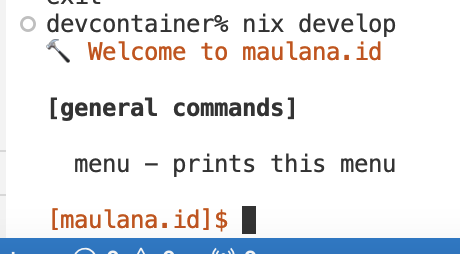
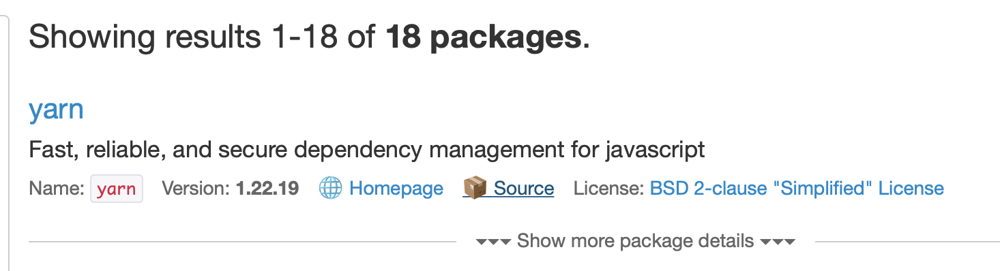

I wanted to write an article in this blog after I left it for a while.
This blog is written using GatsbyJS (a Headless-CMS), so I cloned the repo to my computer.

I immediately run `yarn install`. But it doesn't found yarn or node. 
I forgot that I was using a different laptop. To avoid similar problem in the future,
I decided to make a nix recipe for this repo.

# Quick intro to Nix and Nix flakes

I used Nix for my devops works to pin CLI dependencies, so it can be reproducible.
But, I'm not really familiar with Javascript stack, like Webpack, Babel, Yarn, etc.
So, I never considered to make a Nix recipe for this.

Standard Nix development setup usually requires you to define `default.nix` and `shell.nix` file 
in the root directory of your project. If you have [direnv](https://direnv.net), then you can hook 
Nix shell. This way, whenever you `cd` into your project directory, your shell automatically 
switched to `nix-shell`, which will contain your development dependencies.

As of today, Nix has reached version 2.11 which includes experimental support for 
reproducible build environment called Nix Flakes. You need to enable it first to use it.
The usage is quite widespread now. Since Nix Flakes and Nix itself doesn't tamper each other,
generally it is safe to try it out, even if it is labeled "experimental". The thing 
about Nix and Nix Flakes is that you can easily rollback if you mess up. Or you can 
even pin Nix Flakes dependencies. So there is no real risk of making your setup broke.

So, let's try Nix Flake

# Setting up Nix Flake

There is a Nix Flake template provided by NixOS repo. To get it, you can just execute

```bash
nix flake init
```

It looks like this

```nix
{
  description = "A very basic flake";

  outputs = { self, nixpkgs }: {

    packages.x86_64-linux.hello = nixpkgs.legacyPackages.x86_64-linux.hello;

    packages.x86_64-linux.default = self.packages.x86_64-linux.hello;

  };
}
```

Basically it defines `inputs` and `outputs`. I have my own defaults, so this
is what I created initially

```nix
{
  inputs = {
    nixpkgs.url = "github:NixOS/nixpkgs/nixpkgs-unstable";
  };
}
```

I'm tracking a `nixpkgs-unstable` repo. Despite the scary name `unstable`, 
in my opinion it was stable in some sense. If you install a package, the source 
hash will be pinned, so it will always be reproducible.

Next, I need `node` and `yarn`. The usual way is to define `outputs` that produce
a development shell. However, recently I noticed that [Numtide](https://numtide.com) created another 
experimental project called [devshell](https://github.com/numtide/devshell).
I decided to play around with this.

# Using Numtide's Devshell

I will call this Devshell from now on to refer to Numtide's Devshell config.
This is because the original Flake outputs development shell keys are also called `devShell`.
I will elaborate it more later.

Anyway. I configured my original flake into:

```nix
{
  inputs = {
    nixpkgs.url = "github:NixOS/nixpkgs/nixpkgs-unstable";
    flake-utils.url = "github:numtide/flake-utils";
    flake-compat = {
      url = "github:edolstra/flake-compat";
      flake = false;
    };
    devshell.url = "github:numtide/devshell";
  };

  outputs = { self, nixpkgs, flake-utils, devshell, ... }:
    flake-utils.lib.eachDefaultSystem (system: {
      devShell =
        let
          pkgs = import nixpkgs {
            inherit system;
            overlays = [ devshell.overlay ];
          };
        in
        pkgs.devshell.mkShell {
          name = "maulana.id";
        };
    });
}
```

To explain it bit by bit. I used `flake-utils` input, because originally
Nix Flake requires you to define flake for each systems separately. 
So you can have lists of packages for `x86_64-linux` (normal Linux) and 
`x86_64-darwin` (intel MacOS) separately.

Since `nodejs` package provided by Nix is already cross-platform configured,
I'm using flake-utils to automatically define the same package for both 
of these systems.

For each system, I defined `devShell`, an output key for Nix flake to 
make a development shell, previously known as `shell.nix`.

The definition of the `devShell` comes from the utils provided by Numtide's 
devshell: `pkgs.devshell.mkShell`. Actually they also provide a way to 
import the definition using TOML files. But I don't need that since I want 
to define it using Nix language.

So this is the bare minimum. To test it, run `nix develop` on the directory.
If you are inside a git repo, make sure to git add the `flake.nix`, because 
nix flake only process changes that is already been added.



# Defining packages to install in development shell

Obviously our own core problem is to have `node` and `yarn` installed.
We modify the flake to include these two packages. (I only show the related attribute set)

```nix
pkgs.devshell.mkShell {
    name = "maulana.id";
    packages = with pkgs; [ nodejs yarn ];
}
```

If I `nix develop` again, I will have `node` and `yarn` 
executables. However, devshell README.md page recommends us to
declare the CLI in the `commands` keys. So we change it again 
like this.

```nix
pkgs.devshell.mkShell {
    name = "maulana.id";
    commands = [
        {
            name = "yarn";
            package = pkgs.yarn;
        }
        {
            name = "node";
            package = pkgs.nodejs;
        }
    ];
}
```

This has the same effect, but when you enter the shell, it will 
lists all the available commands. Very neat, I must say.

# Declaring shell's environment variables

After getting node and yarn, I ran `yarn install` to install my 
node modules. Then I run `yarn develop`, but yarn crashed.

Oops, what did I do wrong?

I see a significant error message:

```
error: error:0308010c:digital envelope routines::unsupported
```

Seems like an openssl thing, based on the error format. A quick 
google proved me right. I then found this [stackoverflow link](https://stackoverflow.com/questions/69692842/error-message-error0308010cdigital-envelope-routinesunsupported).

Basically it says that node can't work with the recent openssl.
It suggests to add a `NODE_OPTIONS=--openssl-legacy-provider` in 
the environment variables. We can do that easily with Nix 
devShell as a shellHook. But, Numtide's devshell allow us to 
declare it as attrset.

```nix
pkgs.devshell.mkShell {
    name = "maulana.id";
    commands = [
        {
            name = "yarn";
            package = pkgs.yarn;
        }
        {
            name = "node";
            package = pkgs.nodejs;
        }
    ];
    env = [
        {
          name = "NODE_OPTIONS";
          value = "--openssl-legacy-provider";
        }
    ]
}
```

The error is gone. But I got another error when running `yarn 
develop`. For some reason Webpack/Babel unable to generate my 
`gatsby-plugin-postcss` output.

I'm super noob in Javascript, so I could not debug it further.
I am feeling sad because I originally intend to write an article...
But why I'm stuck in this rabbit hole???

# Using different version of the same Nix package

I remembered that my site worked when I am using Node v14.
So, I decided to change node version. It's quite easy with Nix.
Especially when the nixpkgs repo already prepare a package 
definition for Node v14 themselves.

Using the new Nix flake based command, I searched the package:

```nix
# nixpkgs is the name of the registry
# nodejs is the name of the package
nix search nixpkgs nodejs
```

Apparently, the package name is `nodejs-14_x`. So I use that
in my flake:

```nix
commands = [
    {
        name = "node";
        package = pkgs.nodejs-14_x;
    }
]
```

Rebuilding the flake, and I can see the version is indeed 14, using `node --version`.

But Gatsby still produce the same error... What else were wrong?

After thinking about it a little. I remembered that `yarn` was 
supposed to wrap `node`. So it is possible that the `node` used 
in my shell and the `node` used internally by `yarn` is different.
After all, with Nix, that is exactly the idiomatic and suggested way 
to have complete independent package description.

To test the idea, I run `yarn node --version`. It outputs a version 18.
So, the node version is indeed different.

# Overriding Nix package attributes

We have arrived to the main focus and the meat of this article.

To fix this, we have to tell Nix yarn package to use Nix node package of version 14.

I go to [https://search.nixos.org](https://search.nixos.org/packages?channel=unstable&from=0&size=50&sort=relevance&type=packages&query=yarn) and searching for yarn.
The URL looks like this: `https://search.nixos.org/packages?channel=unstable&from=0&size=50&sort=relevance&type=packages&query=yarn`



There is a source button, and I click that, and it will redirect me to the Nix recipe in GitHub:
[https://github.com/NixOS/nixpkgs/blob/nixos-unstable/pkgs/development/tools/yarn/default.nix#L25](https://github.com/NixOS/nixpkgs/blob/nixos-unstable/pkgs/development/tools/yarn/default.nix#L25)

This is a Nix function, and at the top is where the parameter is declared.
The parameter is an attribute.
One of the attribute is `nodejs`.
So basically it is possible to override this attribute.
We are going to provide nodejs version 14 for yarn.

```nix
{
    name = "yarn";
    package = pkgs.yarn.override {
        nodejs = pkgs.nodejs-14_x;
    };
}
```

After rebuilding the flake, `yarn node --version` correctly says version 14.

But we hit another problem now. `NODE_OPTIONS=--openssl-legacy-provider` options doesn't exists yet in Node 14. Node is complaining.

Then it occured to me, can we just use OpenSSL v1 instead of OpenSSL v3 (the new one) for node 14? 

So we override the attribute again. Repeating the same process, 
I can see that `nodejs` package accepts `openssl` package as
attribute set parameters. That means we can provide OpenSSL v1.
By searching the package using `nix search nixpkgs openssl`.
I found the package name is available as `openssl_1_1`;

My final override for `yarn` looks like this:

```nix
{
    name = "yarn";
    package = pkgs.yarn.override {
        nodejs = pkgs.nodejs-14_x.override {
            openssl = pkgs.openssl_1_1;
        };
    };
}
```

I also used the same method for the `node` commands.

```nix
{
    name = "node";
    package = pkgs.nodejs-14_x.override {
        openssl = pkgs.openssl_1_1;
    };
}
```

Since both were supposed to use the same nodejs version, I define a new variable to avoid mistake 
on having to change it in just one place in the future.
Basically, we will use DRY principle.

My flake ends up like this:

```nix
{
  inputs = {
    nixpkgs.url = "github:NixOS/nixpkgs/nixpkgs-unstable";
    flake-utils.url = "github:numtide/flake-utils";
    flake-compat = {
      url = "github:edolstra/flake-compat";
      flake = false;
    };
    devshell.url = "github:numtide/devshell";
  };

  outputs = { self, nixpkgs, flake-utils, devshell, ... }:
    flake-utils.lib.eachDefaultSystem (system: {
      devShell =
        let
          pkgs = import nixpkgs {
            inherit system;
            overlays = [ devshell.overlay ];
          };
          customNodejs = pkgs.nodejs-14_x.override {
            openssl = pkgs.openssl_1_1;
          };
        in
        pkgs.devshell.mkShell {
          name = "maulana.id";
          commands = [
            {
              name = "yarn";
              package = pkgs.yarn.override {
                nodejs = customNodejs;
              };
            }
            {
              name = "yarn2nix";
              package = pkgs.yarn2nix;
            }
            {
              name = "node";
              package = customNodejs;
            }
          ];
          packages = [ pkgs.openssl_1_1 ];
          env = [];
        };
    });
}
```

Everything works now.

# Automating shell hooks with direnv (spicing things up)

Since my Nix setup already includes `direnv` and `nix-direnv`,
I can connect `direnv` so that whenever I `cd` into my project root, the shell
automatically uses nix shell declaration I defined in the flake.

I created a file called `.envrc` in the root dir of my project.
The content is just:

```bash
#!/usr/bin/env bash
use flake
```

This will make direnv look for `flake.nix` and activates it whenever my shell is inside the directory.

# You can test it out if you have Nix Flake enabled

Things that made Nix Flake very compelling is that you can use the same flake shared by others.

In this example, I made a Nix flake to 
describe devShell. I shared it in my github repo. Since it is publicly available, you can test it out.

You can `cd` into an empty directory, for example `/tmp/test`.
From there, you can activate the same shell
I used in this example.

```nix
nix develop github:lucernae/maulana.id
```

The syntax is fairly straightforward. `nix develop` is the name of the command to enter the development shell. Then `github:lucernae/maulana.id` is the URI that tells us where the flake is.

Yes that's right, it can be from a filesystem, https URL, or special URI like github (because it is very common for people to store their flakes in GitHub).

There are a couple of new Nix command that is quite interesting like `nix build` (allows you to build sources declared by URI) and `nix run` (allows you to locally execute binaries declared by URI).

These will be stories for another day.

# Summary

After a little bit of roundtrip, we finally able to provide a 
devshell using Nix, Devshell, and Direnv.

I believe the journey and stories to get here 
is probably useful for new tinkerer when 
trying out Nix.

Feel free to look at this example flake I used in [this blog's repo](https://github.com/lucernae/maulana.id/blob/main/flake.nix)

I didn't dive in further to pin the node dependencies. I'm not 
familiar with node js, so this is suffice.

I also proceed to do what I wanted to do earlier, which is writing a new article...

But perhaps after this one article :D