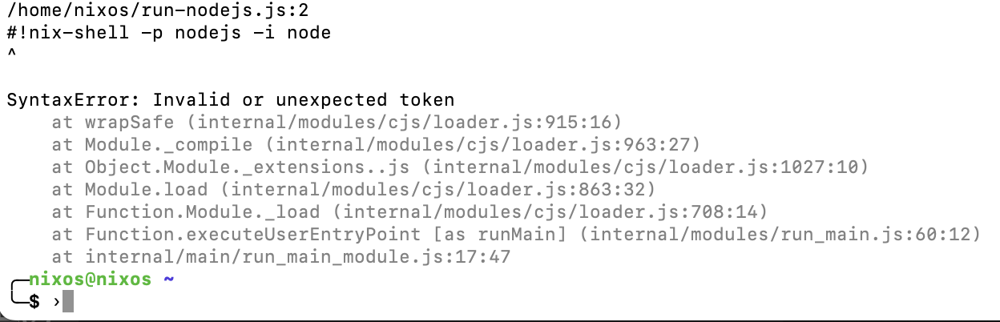

OK, this incident is so funny for me, I decided to make another blog posts. Lol.

Before getting to the main part, I have to explain about shebangs and Nix-shell.

If you already knew about this, you can skip to the [main part](#nodejs-in-nix-shell)

# The shebang

For those who don't know, shebangs is this little pun we have in the context 
of shell scripting in Unix-like environment. When you open an executable shell script, 
most often it will have these character at the beginning of the line: `#!`.
That is called a shebang.

I don't know exactly how does it originates, but "shebang" as an English word 
means some kind of "shady operation" for me. Because I knew the term largely 
associated with mafia movies, like the sentence "running the whole shebang".

What makes it a good pun, is that Unix interpreter originally called
a "shell". The program is called "sh" as a short of "shell". 
It is usually located at `/bin/sh`. Now the `#` sign, as we called it a "hash"-sign 
is an appropriate name associated with shell. Both has "sh" in their name.
A `#` sign is also a comment. So a shell interpreter will ignore it.
That means, `#!` can be literally read as she-bang, or hash-bang.
Because the exclamation mark can usually spelled as BANG sound effect.

The shebang is important, because it unambiguously tell the program executor
to switch to another program to execute the following script. For example,
consider the following line at the beginning of a script.

```
#!/bin/sh
```

A GNU-Linux distribution might have different shell interpreters, according to the users' 
current profile/choice. When I open terminal, it is possible that I run bash as my main shell.
When bash reads the first line/character, it reads a `#` (a comment), so it doesn't execute anything.
But then it reads `!`, so it recognizes that the line has a shebang.
It then proceed to read `/bin/sh`. After that, bash understood that it must switch 
using `/bin/sh` program to run the remaining lines in the script file.

Well perhaps, historically the `sh` is the original shell. But people keep inventing 
better shells, like adding completion functionality and lots of internal command.
So now we have many modern shells like BASH, ZSH, ASH, or FISH. Users tend 
to use these shells in their own profile. However most package installation script still 
uses `sh` as the default interpreter, because it usually exists in all machines.

Over time, we have many Linux distros and they have their own preferred opinion 
on where to put binary programs. The shells might be located in `/bin` or `/usr/bin`
or `/usr/local/bin`. To make things simple, we somehow agreed that a single switcher program 
exists in the same location in all distro, which is the `env` program in `/usr/bin/env`.
The `env` program is chosen because it is the program that can extract information 
of the current environment variables. You can even execute it in your shell and it will print your 
current environment variables. The executable of the interpreter is known by `env`, via 
an environment variable called `PATH`. So if we see:

```
#!/usr/bin/env python
```

That means `env` will call the `python` program. The author of the script doesn't 
have to specify the full absolute path to `python`, since `env` will know where `python` is.
The effect is the same as the case if you execute the line right after `#!` in terminal like this:

```
/usr/bin/env python
```

It is a very neat and clever tricks of Unix-like systems.

# Nix-Shell as shebang interpreter

Nix package manager can install and manage packages without each package conflicting.
It solves the issue by installing each programs in a very specific location,
only computed by the hash of the program input at build time.

For example, Nix install the `sh` interpreter in my machine at:
`/nix/store/45mbffhkf7wr5av8jwhk7cc4ghh3cwx1-bash-interactive-5.1-p16/bin/sh`
in nix store. The special location with the hash part: `45mbffhkf7wr5av8jwhk7cc4ghh3cwx1`
is produced that way and computed from the source files of program meant to build it.
This includes meta information such as the name of the package (in this case, the sh is actually bash), 
and the version (5.1-p16).

But then, how do we write shebang for these packages? The real location of the program 
might be different for each computer systems. Nix solves this by symlinking the programs 
and include it in the Nix PATH variable, which is computed when you enter the shell 
and activate Nix profile. That way, even if you install two different python3 version with the 
same interpreter name (which is python), it won't conflict.

If you built a shell script using Nix, you can specify the location of the interpreter.
So the shebang may look like this:

```
#!/nix/store/45mbffhkf7wr5av8jwhk7cc4ghh3cwx1-bash-interactive-5.1-p16/bin/sh
```

But how does Nix handles scripts that is not built by Nix?

For systems that only uses Nix as package manager, the host system already has 
basic shell and env program in the standard location. So Nix won't interfere with that.

For systems that is managed directly by Nix, such as NixOS, it maintain compatibility 
by symlinking the current profile path to the path expected by other systems.
To illustrate, NixOS will symlink `/nix/store/45mbffhkf7wr5av8jwhk7cc4ghh3cwx1-bash-interactive-5.1-p16/bin/sh` 
into `/run/current-system/sw/bin/sh`, and then link it to `/bin/sh`. Same thing happened with `/usr/bin/env`, 
because this program is very important to have it available in its own location.

Now, we get to explain the "next level" part. Hahaha.

Nix has it's own special shell binary called nix-shell. This shell can act as a standard shell.
You know, like sh or bash. Then, it also can evaluate nix expression (duh, of course that's why it is called nix-shell).
Besides that, it can also manipulate nix profile "on the fly" as you execute it.

To explain how mindblowing this is. Suppose that you haven't installed python in your system.
You want to try it out, but you don't want to install it. With Nix-Shell, you can run it like this:

```bash
nix-shell -p python3
```

Maybe it took some time to download the package at first (then store it in cache).
Then the shell prompt that appears has `python3` programs in it. If you exit the shell, 
then python3 don't exists. It's a clean way of "window shopping on binaries".

If you need several packages, you can list it out

```bash
nix-shell -p python3 -p kubernetes-helm -p kubectl
```

This is especially useful when you have certain package version already installed, but you 
want to shadow it with newer packages to test it out. It saves me in the past when I was testing 
python2 to python3 migration and helm 2 to helm 3 migration.

It is also possible with Nix-Shell to jump to an interpreter of your choice. Executing this
will make you jump into a Lua REPL prompt, instead of regular shell prompt.

```bash
nix-shell -p lua --command lua
```

Now, let's get back to the "shebang business". Nix-shell has it's own special behaviour with a shebang.
First, take a look at this example:

```bash
#!/usr/bin/env nix-shell
#!nix-shell -p python3 -i python
print("hello from python\n")
```

The first line is our standard shebang. It calls `env` program to call `nix-shell`.
The second line is "Nix-Shell shebang" which tells Nix-Shell to install python package,
and then run python interpreter. The third line is a Python statements.

In short, when you run this file in Nix-capable system, it behaves as if it is a Python script.

It is a polyglot interpreter!

# nodeJS in Nix-Shell

Now that you understand how shebang and Nix-Shell works, let's get back in business.

I made a file like this:

```bash
#!/usr/bin/env nix-shell
#!nix-shell -p nodejs -i node
console.log('hello')
```

The actual content is not "console.log", but you get idea. I was trying to make a script 
for this blog, which uses nodeJS. To my surprise, the above script doesn't work.
It threw an error



We can realize immediately that nodejs threw error because it 
can't parse `#`. In NodeJS, `#` is not a comment or any other token.
This strike me as very odd. I thought when nix-shell pass the script to the 
program (in this case nodejs), it strips out the original nix-shell shebang.
But it seems this is not the case.

Then it occured to me that I never used nix-shell with nodejs before.
I used to switch from bash to python. In python, `#` is a comment line as well.

So, what if we modify the shebangs to be commented in nodejs?
I'm curious and modify it as this, using `/* */` as multiline comment pair:

```bash
#!/usr/bin/env nix-shell
/*
#!nix-shell -p nodejs -i node
*/
console.log('hello')
```

And it does work!
