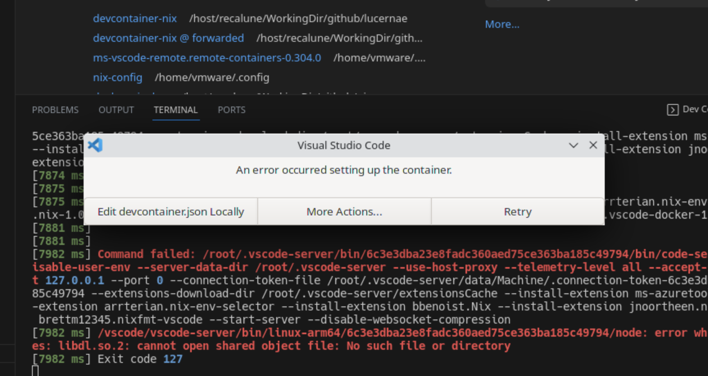
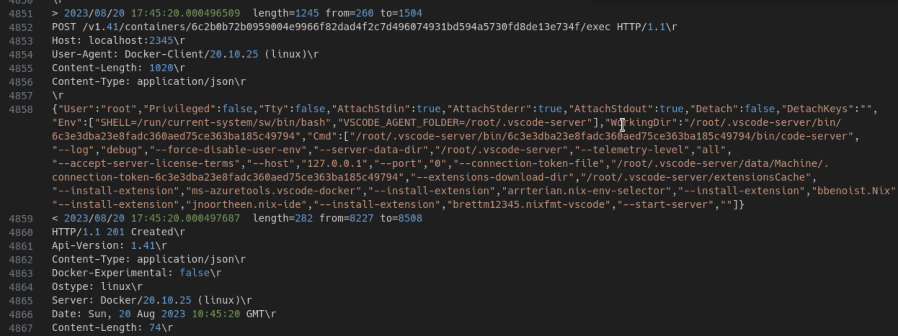

Continuing my personal quests to make nix easily usable as devcontainer, I found out several challenges with how Devcontainer works.
Using devcontainer is fun. But making it isn't.
The main problem for me is the difficulty on creating the perfect container that can be run within devcontainer ecosystems.

Specifically for nix, the challenge is because vscode and github codespace does something that is not necesarrily explained in [devcontainer spec](https://containers.dev/implementors/reference/).
There is many assumptions being made about the structure of the devcontainer image.
At the moment, Microsoft tend to prefer debian-like Unix FS structure and package manager.
There is no tooling avaible to make sure a container is compatible under this assumption.

In my previous post [Patching ELF header with Nix](../2022--11--20--00--patching-elf-header-with-nix/), we talk about 
the main issue. Microsoft's Remote Containers extension is installing their own node binaries. 
I believe the intent was to make sure that specific node distribution works with the extensions.
The problem for nix is that shared library linking was done differently since the lib location is taken from nix store
instead of `/lib` or `/lib64` like standard Unix distribution.
Currently there is no way to include ELF header patching as part of devcontainer lifecycle.

As far as the problem statement goes, we are going to recreate the debugging/investigation process.
I am writing this as personal docs, or for other parties that needs it.

# Step 1: Designing your devcontainer capabilities

My recent attempt is trying to make my NixOS devcontainer works on Apple Silicon hardware. Which means it must be Aarch64 compatible images.
Nothing fancy on Nix side, you just need to do cross compile build with Aarch64-linux as the target host platform.
The build will then convert these binaries into a working OCI Image format using nix `dockerTools` [function](https://nixos.org/manual/nixpkgs/stable/#sec-pkgs-dockerTools).

Once you got Aarch64 image ready, push it to Docker registry with platform `linux/arm64/v8`.

On Apple Silicon hardware, there are several options to run docker images. You can use Docker Desktop, Rancher Desktop, or Colima.
Regardless of the option, usually it works by spawning a linux VM (dubbed LimaVM or MobyVM for Docker).
This VM is Aarch64 Linux. Then the docker engine or containerd will opt to run docker image with the same architecture.
If you specify different architecture, it will try to use QEMU binfmt to run the emulation.

# Step 2: Checking the logs of your devcontainer Creations

I've tried doing this both on GitHub Codespace and locally.

I believe debugging this kind of thing really sucks in Codespace since you don't have control over the logs etc.
The container just fails and you can't do anything other than viewing the creation logs.
Sometimes the codespace just dead without error logs.

So, the recommended thing to do is to investigate this locally.

I created a NixOS VM (or any linux distro) with Aarch64 architecture on my M2 mac.
If you have native host, you can do this as well (like a Raspberry Pi).
In my case, I'm using VMWare to do this as it has nice integration with Mac (can copy-paste).

Prepare you `devcontainer.json` as usual in your preferred repo. From Command Palette, pick "Dev Containers: Reopen in Container".

It will undergo creation process.

When it failed, you will have this kind of screenshot:



Pick "More Actions...".

This will let the window still open, so you can copy error logs from the terminal window.
The dev container will also still runs. So you can get inside the container to check.

In my case, the error message is something like this:

```log
[7982 ms] Command failed: /root/.vscode-server/bin/6c3e3dba23e8fadc360aed75ce363ba185c49794/bin/code-server --log debug --force-disable-user-env --server-data-dir /root/.vscode-server --use-host-proxy --telemetry-level all --accept-server-license-terms --host 127.0.0.1 --port 0 --connection-token-file /root/.vscode-server/data/Machine/.connection-token-6c3e3dba23e8fadc360aed75ce363ba185c49794 --extensions-download-dir /root/.vscode-server/extensionsCache --install-extension ms-azuretools.vscode-docker --install-extension arrterian.nix-env-selector --install-extension bbenoist.Nix --install-extension jnoortheen.nix-ide --install-extension brettm12345.nixfmt-vscode --start-server --disable-websocket-compression
[7982 ms] /vscode/vscode-server/bin/linux-arm64/6c3e3dba23e8fadc360aed75ce363ba185c49794/node: error while loading shared libraries: libdl.so.2: cannot open shared object file: No such file or directory
```

# Step 3: Debugging/Investigating the containers

If you see the second line, it failed to execute `node` binaries because the shared library can't be found.
It is expected if you are using Nix. However, I already uses [Nix-LD](https://github.com/Mic92/nix-ld). 
So, this was not supposed to happen.

To prove it, I will use docker exec to directly call this binaries.

The call is as simple as this:

```shell
# from the host terminal, my Linux VM
# my devcontainer name is nixos-devcontainer-1
docker exec -it nixos-devcontainer-1 /vscode/vscode-server/bin/linux-arm64/6c3e3dba23e8fadc360aed75ce363ba185c49794/node --version
```

The call above succesfully returns the node version. So the error is probably somewhere else.

To investigate further, we want to know what command exactly is executed by VSCode

# Step 3: Use socat to intercept docker API

In the above error message, the logs actually prints the command being executed. But only the command, not the whole context being sent to Docker API.

We can use socat to make Unix Socket forwarder while printing out the message transferred between the socket.

This command, create another socket `tcp://localhost:2345` that will forward the messages to the real Docker API unix socket in 
`unix:///var/run/docker.sock`. The terms `&> /tmp/socat.log` output the debug messages to a file `/tmp/socat.log`

```shell
socat -d -v -d TCP-L:2345,fork UNIX:/var/run/docker.sock &> /tmp/socat.log
```

Next, just open the file `/tmp/socat.log` in your favorite editor. I use separate VSCode window to view the file so I can search the exact command.

I searched the error message and found the call to exec API.



When I reconstruct the same call and execute it via docker exec, the call succeed.

So, I can only guess that the call itself is a success, but it either can't be started immediately after container spawned,
or the subprocess of that call is the one who failed. In this case, I don't have any way to fix this issue.

# Remark

Above step-by-step notes showed the problem, but I'm still not sure how to fix it.
It is highly likely that the call failed because the container was not ready yet.
Interestingly, if I wait for a bit, even by doing nothing. Then reload the VSCode window, this time it was succesfully connected to the devcontainer.
The shell and environment works fine.

The ideal solution would be to just patch all the nodejs binaries inside vscode-server directory under the vscode docker volumes.
However, I wasn't sure where to inject that process in the given lifecycle.
Especially in GitHub Codespaces where you don't know when Codespace inject the nodejs and code-server component.