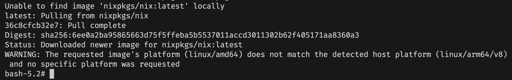
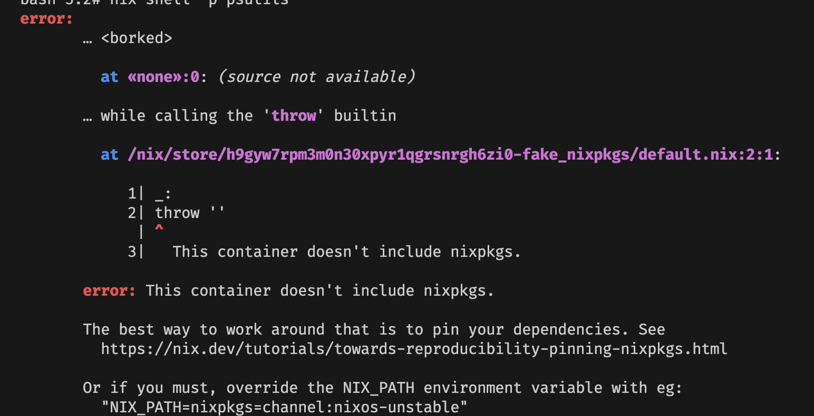
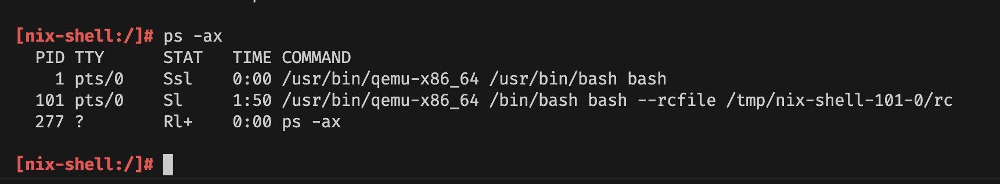
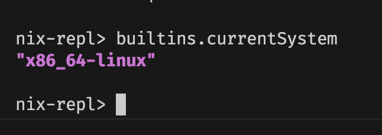
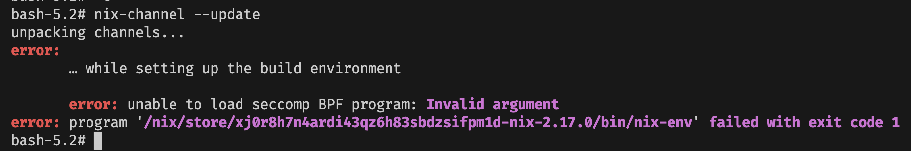

Continuing my personal quests to make Nix easily usable as devcontainer, the challenge I have in the past 
is how to run Nix itself (as a builder), from inside the container.

To be more specific, if you run a docker container on x86_64-linux system (majority of standard desktop/laptop PC),
Nix can easily be used to build a docker image. The challenge I was discussing now is, if the target image 
is of a different architecture than the builder. 

Typically you build the image for x86_64 architecture, because your PC use it. 
The server you are running on in the cloud, also use x86_64. So normally your docker image is compatible by default.
However, since Apple released their iconic Macbook Air M1, there is some kind of weird demand surging for ARM architecture.

Linux on ARM systems itself is not new. Raspberry Pi uses ARM because of its low power and efficient nature.
There exists OS distro Specifically to cater Raspberry Pi, so people build ARM binaries for their packages.
But usually these ARM systems is not so fast for building things. It can run things efficiently, but building 
packages or binaries requires fast disk IO and/or parallel cores. So, before all of this, normally 
you build ARM packages in x86_64 systems via cross compilation, or using emulation like QEMU.
This can be really slow.

Apple Silicon in Macbook Air M1, however, is insanely efficient and fasts, it can even run (and later, build) 
x86_64 binaries in ARM system. So, this is kind of like a turn around.
Developers then can easily build ARM binaries, and since it is already efficient to run ARM systems,
then the demand suddenly surged for a server to also hosts ARM architecture.
Altough AWS Graviton or Ampere Altra already exists before M1 announced, the existance of Macbook Air
(in my opinion) kickstart more high demand for these ARM-based servers.

Since then, it was natural for a more widespread usage of docker images that caters specifically for this architecture.

# How docker container works in Apple Silicon

At the beginning, Apple supported running x86_64 binaries using their Rosetta 2 translation layer.
So, existing package manager like brew and nix actually works (other than the new path issues).
While Nix itself capables of doing cross-compilation, it needs NixOS to manage QEMU emulation layer for docker containers.

## How native binaries works in Apple Silicon

If you only needed the binaries, Nix flake provides an easier way to build or fetch binaries from Nix store.

Consider building our example `hello` package using nix flake, then running it

```shell
nix build nixpkgs#hello
./result/bin/hello
# will output: Hello world
```

Now, on Apple Silicon system, not only did the arch becomes `aarch64`, the OS becomes `darwin`.
So, essentially the nix build command above tries to build `aarch64-darwin` system.
It is the same as running this command

```shell
nix build nixpkgs#legacyPackages.aarch64-darwin.hello
./result/bin/hello
# will output: Hello world
```

To see if it is the case, use `file` command to check/poke the binaries.

```shell
file ./result/bin/hello
# will output: ./result/bin/hello: Mach-O 64-bit executable arm64
```

You can build an `x86_64-darwin` binaries like this:

```shell
nix build nixpkgs#legacyPackages.x86_64-darwin.hello
./result/bin/hello
# will output: Hello world
```

It can be executed even with different system, because macos has Rosetta translation layer.
But you can further check if the binaries are now of different type:

```shell
file ./result/bin/hello
# will output: ./result/bin/hello: Mach-O 64-bit executable x86_64
```

You can even build linux binaries:

```shell
nix build nixpkgs#legacyPackages.aarch64-linux.hello
./result/bin/hello
# will output:  exec format error: ./result/bin/hello
```

However you can't run it, since it needs Linux kernel to execute it. If you inspect it using file, 
it looks like this:

```shell
file ./result/bin/hello 
# will output: ./result/bin/hello: ELF 64-bit LSB executable, ARM aarch64, version 1 (SYSV), dynamically linked, interpreter /nix/store/cq6hdmfn4aid08zjmrywnsk2klfhjy57-glibc-2.37-8/lib/ld-linux-aarch64.so.1, for GNU/Linux 3.10.0, not stripped
```

## How Docker works on MacOS

As I've said before, Docker wraps binaries inside containers. 
Containers itself is not VM, but more like process namespaces, executed by Linux kernel.
So obviously it needs Linux to run Docker.

To run Linux in MacOS, we needed a Linux VM. This can be achieved using QEMU or other similar ways.
Recently, Apple also provides a Virtualization framework as well.

Originally, Docker for Desktop works in MacOS M1 by using its own MobyVM virtual machine.
MobyVM also ships with the Docker daemon and other Docker tools.

Around 2015, there are efforts to make Docker more "Open Source". The Docker that we know has since 
refer to Docker as company and many-many things, while the containerization approach that we previously called as Docker has become an open standard
called an Open Container Initiatives. Or OCI for short.

Under the hood, OCI is responsible on making an open standard, or spec, that others can implement.
This will ensure that "how you run containers" has the same experience, even though it was implemented by different vendors.

Now around 2021, (this was after Apple released its Macbook Air for about a year), there are efforts 
to package OCI compliant stacks for MacOS Apple Silicon, as an alternative to Docker.
What I mean by alternatives is that it was not made by Docker (you know, as a company), but rather 
as a stack of open-sourced, OCI compliant tools. This consists of Containerd (alternatives of Docker daemon)
and RunC (runtime component that interfacing with Linux libcontainer). This tools already exists because 
Docker also helps breaking apart its Docker Engine to comply with OCI spec.
However, the VM does not. The missing piece here is what made possible by LimaVM, a VM made as an alternative 
to MobyVM, that is also packaged with containerd, nerdctl (CLI for containerd), and RunC.

After LimaVM exists, people can focus on making a better developer experience on managing containers in MacOS.
Now, tools like Colima and Rancher Desktop exists because it also uses LimaVM under the hood.

After explaining the whole higher level architecture (or building blocks), you can then understand that what I mean 
by Docker containers is not necesarrily having it run using Docker for Desktop. Colima or Rancher Desktop should work as well.

## Tying this up together 

To wrap up this section, let's summarize a little bit. Here's what happened when you run `docker run ...` 
from inside a MacOS terminal with Docker (or LimaVM).

1. Docker/Nerdctl (CLI) of MacOS will talk to Dockerd/Containerd via unix socket

Unix socket provides a nice abstraction layer. Note that the CLI itself runs on MacOS, but the Dockerd/Containerd 
runs inside LimaVM, which runs on MacOS using virtualization layer.

2. Dockerd/Containerd will try to pull Docker image from the registry with matching architecture

This means, since you are running a MacOS M1, you use aarch64 or arm64 architecture. LimaVM is a Linux with 
arm64 architecture. So the Docker Image platform that is going to be retrieved is something like platform linux/arm64.

If Docker daemon can't find it, then it will fetch whatever's available. Mostly this is linux/amd64 (x86_64)
for reasons I mentioned above (people normally build this arch).

3. Dockerd/Containerd will use RunC to run the image as containers

RunC will "talk" with the Linux kernel to run binaries inside containers as processess.
However, if the binaries are of a different architecture than LimaVM, then kernel will use QEMU binfmt 
to emulate the executions.

By understanding these, you will understand these following consequences:

1. Whenever the containers (or rather the Linux kernel) tries to use privileged executions, it relies on QEMU to pass the syscalls to MacOS Darwin kernel

2. When you try to mount a volume into the docker container, you actually mount it from LimaVM. However LimaVM conveniently bind mount (via QEMU) the same path from MacOS disk

Normally LimaVM expose the user space path, which is typically in `/Users/<username>`.
If you try to mount a path from outside this directory, it might not exists in LimaVM, unless you expose it.

3. When you expose container ports, it was actually exposed inside LimaVM. So you need to reach it by specifying Lima's host IP.

That's the general idea about it.

# Running Nix inside docker containers to cross-compile

The first time you use Nix inside docker containers on MacOS with Apple Silicon, you will have the following roadblock.

The Nix docker image most probably an x86_64 arch. So when it runs on aarch64 LimaVM, it uses QEMU. Since it uses QEMU,
it needs further syscalls to build for aarch64 architecture. What I initially want to do is to build a self bootstrapping Nix.
If I can build Nix aarch64-linux from an x86_64 arch docker container, then I can use the resulting build to natively build 
other aarch64-linux package. Seems like a nice idea, right?

## Use nixpkgs/nix of x86_64 arch to build aarch64 nixpkgs/nix

We first run from inside a community docker image `nixpkgs/nix`.

```shell
docker run -v ./:/root/working-dir -w /root/working-dir -it nixpkgs/nix bash
```

It was around 100MB, relatively small for a whole package manager :D.

In my case, it says that the target platform does not match the downloaded image (we already know).



However, the shell is usable. We can see that it uses QEMU emulation by doing `ps -ax`. Uh, but however 
this is a barebone image, so only basic shell is included. We can install it first.

```shell
nix-shell -p ps
```

But, we got error. 



Apparently the barebone image doesn't include NIX_PATH, so we can add it accordingly

```shell
export NIX_PATH=nixpkgs=channel:nixos-unstable
nix-shell -p ps
ps -ax
```

As you can see, the process list shows that it was actually QEMU x86_64 interpreter that executes bash on PID 1.



Another way to confirm, you can use `nix repl` and evaluate `builtins.currentSystem` to show you the current system Nix uses.

```shell
echo 'builtins.currentSystem' | nix repl 2> /dev/null
# will output: "x86_64-linux"
```



Let's prepare our build systems. First, we need to update nix-channel so we can install things from a file.

```shell
nix-channel --update
```

Whoops, we got `error: unable to load seccomp BPF program: Invalid argument`.



This is the first roadblock I encountered. 
It implies that our QEMU interpreter doesn't implement seccomp BPF.
However since we only want to build things inside this container, it should be no problem to bypass this security feature.

Let's add the option `filter-syscalls = false` to disable this. While we are at it, we also enable nix flake command.

```shell
export NIX_CONFIG=$'filter-syscalls = false\nexperimental-features = nix-command flakes'
nix-channel --update
```

We are now ready to build!
In fact, I've forked [docker-nixpkgs](https://github.com/nix-community/docker-nixpkgs), to modify the recipes 
to use flake to build depending on the architecture.

With nix flake, you can directly build by referring "online" flake stored in GitHub, without having to clone it first in your 
working directory.

```shell
nix build github:lucernae/docker-nixpkgs/flake#docker-nixpkgs.aarch64-linux.nix \
    --out-link result-aarch64-linux
```

However, I got error like this:

```log
error: a 'aarch64-linux' with features {} is required to build 
'/nix/store/2ci7cqgr0wa1g3yrlcrsjs2ylxfivch5-nix-2.13.5-config.json.drv', 
but I am a 'x86_64-linux' with features {benchmark, big-parallel, nixos-test, uid-range}
```

Okay, we need to enable `aarch64-linux` as an `extra-platforms` to be able to cross build.
Since we have more than one nix config now, let's just dump it into a file.

```shell
cat << EOF > /root/working-dir/nix.conf
filter-syscalls = false
experimental-features = nix-command flakes
extra-platforms = aarch64-linux
EOF
mkdir -p /etc/nix
ln -sf /root/working-dir/nix.conf /etc/nix/nix.conf
unset NIX_CONFIG
```

If we rerun the build again, we are now able to resume. Yay!

## Using nixpkgs/nix aarch64-linux as our default image for Apple Silicon

The above build command will output a link directory in `result-aarch64-linux`.
This points to a tarball of the docker image (you can inspect it yourself).
Remember that this is a link to the nix store **inside** the container.
We actually need to copy the file out to our mounted working directory.
So that it can be accessed from outside the containers.

```shell
cp ./result-aarch64-linux ./archive-aarch64-linux
```

Load it into docker registry, but do it from outside the containers of course:

```shell
cat ./archive-aarch64-linux | docker load
```

It will print the local image tag. Mine probably different from yours, so copy from your terminal accordingly.
Retag the image into a more meaningful name.

```shell
docker tag nix-2.13.5:dgy3wk3dnm9cjbb1n9h1a76b74m33ik7 \
    ghcr.io/lucernae/devcontainer-nix:nix-v1.0.0--aarch64-linux---23.05
```

I name it that way because I uses GitHub container registry (ghcr.io).

Now use this new containers:

```shell
docker run -v ./:/root/working-dir -w /root/working-dir -it ghcr.io/lucernae/devcontainer-nix:nix-v1.0.0--aarch64-linux---23.05 bash
```

Do the check the same way, but notice that it is now natively running without QEMU in aarch64-linux systems recognized by Nix.
You can also use uname to show the architecture.

```shell
nix-shell -p coreutils
uname -a
```

Subsequent build using this container now will use aarch64-linux.

## Wrapping up by creating Docker manifest

When you build using buildx, you can specify multiple platforms to build under a single image tag.
This is very convenient for Docker ecosystems.
In my humble opinion however, it is quite problematic to do for a CI Job/Pipeline.

The reason is because currently buildx performs the build in a single host, by doing QEMU emulation for the other architecture.
Normally in a more efficient CI Pipeline, you delegate the build and send the job into a host with corresponding architecture.
So, if you target 2 platforms, ideally there are two host/runner for each, so it can build very efficiently and fast.
It will results in 2 image tags getting pushed into the registry.
If we use this kind of approach, then we must combine these tags under one single multiplatform tag, just like docker buildx do.

Of course you can keep managing 2 tags/variant for each architecture, but combining them would be 
easier in terms of developer experience, since you only refer to one tag then the daemon picks up which image is relevant for your arch.

There are not that many documentation I can find regarding how to create these manifest.
It actually came from Docker's [own documentation/blog posts by Jeremy Drouet](https://www.docker.com/blog/multi-arch-build-and-images-the-simple-way/).

Note that you need to push both nix image for this to work.
As an example here, I use my own ghcr.io namespace.

```shell
# don't forget to login
docker login -u lucernae ghcr.io
docker push ghcr.io/lucernae/devcontainer-nix:nix-v1.0.0--aarch64-linux---23.05
```

Since currently nixpkgs/nix is hosted on docker.io, I need to push it to my own registry.

```shell
docker tag nixpkgs/nix:latest ghcr.io/lucernae/devcontainer-nix:nix-v1.0.0--x86_64-linux---23.05
docker push ghcr.io/lucernae/devcontainer-nix:nix-v1.0.0--x86_64-linux---23.05
```

Then we create the manifest for a tag `ghcr.io/lucernae/devcontainer-nix:nix-v1.0.0`.

```shell
docker manifest create ghcr.io/lucernae/devcontainer-nix:nix-v1.0.0 \
    --amend ghcr.io/lucernae/devcontainer-nix:nix-v1.0.0--x86_64-linux---23.05 \
    --amend ghcr.io/lucernae/devcontainer-nix:nix-v1.0.0--aarch64-linux---23.05
docker manifest push ghcr.io/lucernae/devcontainer-nix:nix-v1.0.0
```

Once the manifest is pushed, you can inspect it back to see if the tag points to multiple architecture

```shell
docker manifest inspect ghcr.io/lucernae/devcontainer-nix:nix-v1.0.0
```

My output is something like this:

```json
{
   "schemaVersion": 2,
   "mediaType": "application/vnd.docker.distribution.manifest.list.v2+json",
   "manifests": [
      {
         "mediaType": "application/vnd.docker.distribution.manifest.v2+json",
         "size": 529,
         "digest": "sha256:e1e6bf01a2cd162509afef91e17c4e101b9a8b4c51857658ca8e8f16d0e016cd",
         "platform": {
            "architecture": "arm64",
            "os": "linux"
         }
      },
      {
         "mediaType": "application/vnd.docker.distribution.manifest.v2+json",
         "size": 529,
         "digest": "sha256:e808c08b178d50caae3d69495b7849db527e3b7fe4dea212ad0de764c536d022",
         "platform": {
            "architecture": "amd64",
            "os": "linux"
         }
      }
   ]
}
```

The benefit from multiplatform image is that you can select a specfic platform from a single tag,
or omit it to use the platform best match for your arch.
Like this:

```shell
# will pull linux/arm64, an ARM based image
docker pull --platform linux/arm64 \
    ghcr.io/lucernae/devcontainer-nix:nix-v1.0.0

# will pull linux/amd64, your usual docker image in x86_64 system
docker pull --platform linux/amd64 \
    ghcr.io/lucernae/devcontainer-nix:nix-v1.0.0

# will match based on architecture of the dockerd/containerd daemon
docker run -it -e NIX_PATH=nixpkgs=channel:nixos-unstable \
    ghcr.io/lucernae/devcontainer-nix:nix-v1.0.0 \
    nix-shell -p coreutils --run 'uname -a'
```

# Remark

The point of this exercise is just to provide an alternative to use nix in a CI environment, 
or to evaluate Nix in a system that already has Docker in it.

Theoritically it is self-bootstrapping. If you start in a system that has Nix installed, you 
can build a Docker image using Nix for a different architecture.
If you start in a system that has Docker (but without Nix natively installed), 
you can also use Nix to build another Docker image for other systems as well.

Caching also works wonderfully for Nix + Docker setup, because if you build the image using Nix, 
then the binary packages is most likely pure and cacheable in the nix store. If the build is repeated
with access to the same Nix store, then it will just fetch existing package.
The cross compilation is also an important bonus :D.