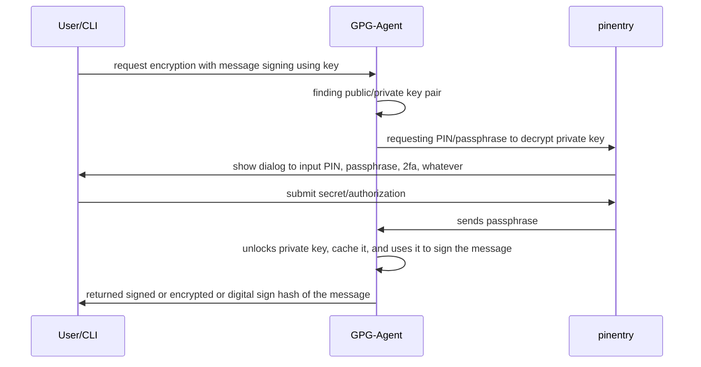

# Background Story

It has been my long subconscious intention that I want to make GPG somewhat easier to use.
Main motivation was because as a software developers, you commit codes nearly every day.
When you do a git commit you can sign it using GPG to make sure your commit is "verified".
Verified, meaning the person who commits is really you.

I've changed laptop multiple times until today. In the early days, I didn't know about password managers, or the likes.
So I maintained my GPG private/public key pairs entirely in disk.
When I moved into a different laptop I also moved it.
The GPG setup was really a pain because you need to import keys and set it to trusted.
You also need to renew your expiry key.
Overtime, I'm getting used to it because it was like a process that happens maybe once every 2 year.

Nowadays, I put my keys on a Bitwarden vault. Then extract it from Bitwarden whenever I have a new machine.
It is quite portable, and I'm quite happy paying Bitwarden subscriptions, even though it is generally a free and open source programs.

The first pain point I encounter was when I was working in an automation platform systems.
We can deploy ephemeral development containers in docker.
Also, around that time GitHub released GitHub Codespaces, a service to generate development container that is integrated with GitHub repo.

The key feature that I think is missing is that GitHub Codespace doesn't have (or in my opinion, not an ideal way) solution for GPG commit signing.
Sure, you can fire up a Codespace. But then you generate Codespace all the time, whenever you make a branch or working on a PR.
Setting up GPG all the time for each new Codespace is not so fun, since you need to put your private key there, then input your passphrase.
On macOS, it is a little bit bearable since GPG Pinentry-mac will try to retrieve the passphrase from macOS Keychain.
Meanwhile, there is no keychain or some sorts in Codespace.

An alternative way is to forward the GPG socket to your own personal computer. That way GPG in the Codespace will use your local computer socket connection.
Unlocking your private key is easier in that case.
However, one main benefit of using GitHub Codespace is that you can open VSCode in a browser.
One of the limitation on having the UI from inside the browser is that its environment is sandboxed.
There is no native connection between your computer and the VSCode UI in the browser, so you can't forward your GPG socket as seamlessly.

So, there is no neat solution yet.

Another point that I want to remark is that how GitHub seems to "missed the point" on having GPG-signed commits. In Codespace you 
can enable GPG verification commits. But the one who signs the commits is using GitHub's signature.
I was really confused seeing this. Sure, your commits were signed. But if the key being used is from GitHub, then what's the point?
It only verifies that the commits were made from inside GitHub's platform, but it doesn't say the one who made commit is the commit author.

This journey then arrives at our main pain point again, which is the pinentry.

As a way to have a secure private key, the key is usually encrypted with a passphrase. When someone issue a GPG command via CLI (or integration such as Git),
they contact GPG Agent to retrieve the private key. If the key is already cached, it is used immediately.
If it is not, then GPG Agent will try to "unlock" the key using passphrase. Then GPG Agent will contact a "pinentry" program.
We can think of this "pinentry" as a program to "shove" and "show" dialog to us users to unlock the key.
User can then input their passphrase or PINs.

If the passphrase is a random characters and difficult to remember, like what I have, it is useful for the pinentry to have 
some sort of integration with a Keychain or Password manager. We have this in Mac (which is super excellent) and Linux (which is somewhat working to a degree).
Don't ask me about Windows, I've never signed my commits on Windows.

The keychain integration allows us to input the master password of the keychain, for the pinentry to retrieve the passphrase from inside the keychain vault.

It's kind of like a neat concept, right?

Someone must have made something like this, right?

Well, I've never seen it. To be fair, there does exist some blog posts from folks who do this kind of integration via CLI of their keychain.
But come on. This can be more auto-"tamed" seamlessly.
Why no one make a pinentry program for this?
Probably because there is very little incentives or no money to do this.

So that's why our journey began.

# How pinentry works

I began to read and try to tackle this problem after I integrated mermaidjs to this blog.

The reason is that I need to make **many** diagrams...

And perhaps emoji... maybe I should integrate it next.

Anyway, here's a general sequence diagram of how things works.

Assuming the use case is a CLI command of GPG to encrypt a message:

The technical details is as follows.

User can access GPG "action" using CLI or its integration. Integration in Mail client or Git is some of its examples.
Basically this integration will try to contact GPG Agent.

GPG Agent is a daemon that runs in the background. So it is always alive, and it is spawned the first instant someone tries to access GPG.

Suppose that we try to access GPG using CLI, or terminal/shell. It will use unix socket to try to communicate with GPG Agent.
GPG Agent is then tries to resolve what was the CLI is going to do, or what was the request.

Encrypting a message requires a public key of the recipient (the recipient later on will use their private key to decrypt).
Signing a message requires private key of the sender.

Both Encrypt and Sign can happen for a single message.

But basically, if it requires a private key, GPG Agent will ask pinentry for the passphrase. This passphrase will be used to unlock private key.

GPG Agent and pinentry communicate using something called [Assuan Protocol](https://www.gnupg.org/documentation/manuals/assuan/Introduction.html)

From my understanding of reading existing pinentry code, a pinentry acts as a **Server** in this particular communication.
GPG Agent acts as the **client**. The client talks to the server using pipe.

For example, in mac, we have `pinentry-mac` program. If you execute it via shell, it will be on standby and awaiting text input.
A single command or **request** in Assuan protocol consists of a command word and the parameter. This requests ends with enter/newline character.
The server then responds with `OK` if it understands the message. Some commands might need to transmit data, so we use `D <the data>` to send it.

It is difficult to find how the commands actually works. I only found the documentation in the latex file: [pinentry.texi](https://github.com/gpg/pinentry/blob/master/doc/pinentry.texi)

Next article, we will focus on how to operate this `pinentry` program!