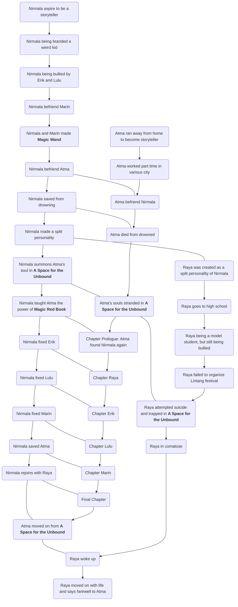

Just today, I finally completed the platinum trophy of [A Space for the Unbound]().

This is a lovely game made by Indonesian studio: Mojiken Studio, and published by Toge Production.

As an Indonesian myself, and a former indie game developer (without having success), this game is bittersweet.
I can't help but projecting my own insecurities as storywriter through Nirmala's and Atma's adventure.
The game exposes many mini-arcs or stories that deeply feels psychological and mentally relatable.
Some of them, were cameos from real world counterparts. Such as a cat named Tofu.
Which is Fahmi's cat, also one of the creator of the beloved game Coffee Talk.

In my first playthrough, I was fascinated by how the story unfolds. When it ended, most of my questions were answered (and some, conjectured).
But in my second playthrough, there is a hidden scene right at the end after the normal credit.
This hidden scene, I believe, is the missing piece to "construct" a fan made timeline that answered most question in the game.

I will begin the explanation of the timeline using this as personal basis.

# A Space for the Unbound

"A Space for the Unbound" is the title of the game. But it's not really explained what is it exactly.
We can have many theory, but my theory is that "A Space for the Unbound" is a place unbounded by time and space.
This is a place between life and death, and where souls and shared consciousness gathers.

This argument can be inferred after playing the game twice, and the simplest explanation that fits the whole narratives.
If we accept it as truth, then we can use this as an arguments to explain the whole timeline of this game.

# Chronological timeline

## Prelude

In the beginning, in Loka city, Raya Fitri Nirmala (with nicknamed Nirmala) lives.
Our timeline starts somewhere around elementary school where Nirmala is still a kid.
She likes to draw and write stories, but people called her weird.
She is bullied in school and her temperamental father makes it worse.
Because the situation at her home is not so good, she played by the riverbank near a broken bus that she called "basecamp".

Around this time she got bullied by Erik. But she met Marin and befriended her. Nirmala taught Marin how
to draw and make stories. Soon enough Marin went to a drawing club, along with Lulu.
This made Nirmala lonely again, so she spends time near the riverbank again.

At some point, came along Atma.

In my theory, Atma is a real person. He run away from home to chase his dream as story writer. He is around his last grade of high school.
He went from place to place, to learn more about people, so he can write better stories.
After working part-time, he begins to understand that it is increasingly difficult to work just to survive while also chasing his dream.

Then Atma met Nirmala. Seeing how she is passionate with her story. Atma found hope again and vow to help Nirmala complete
her stories. While Marin were busy, Atma helped Nirmala gather ideas and brainstorming. Nirmala enjoyed this so much, she began to
tell him that she doesn't want to go home. Atma convinced her that she has to endure to make both of their dream come true.
Atma told Nirmala that he had to go to another part-time job soon (probably in a different town). But he promised that he will be back to complete their story together.

Once Atma is gone, Marin came back. Nirmala was excited to share her story with Marin. But Marin made her upset because Marin thinks Atma is not real, and were just an imaginary friend.
Of course Nirmala can't prove Atma's existence, because Atma were not from this town. Nirmala became frustrated and pushed Marin away.

After a while, Atma is back, and Nirmala made progress with her story.
Nirmala and Atma wrote their stories together in a book they called the **Magic Red Book**.
They discuss the story together and Nirmala asked him to fetch the **Magic Wand**.
The wand that she made with Marin.
When Atma came back, Nirmala nearly drowned due to heavy rain. Atma saved her, but he drowned in the process.
When people were gathering, Nirmala frantically tried to warn everybody that Atma should be nearby.
But since no one knows about Atma, and due to Nirmala already being considered as a "weird kid", no one believes her.
Atma's body were probably drifted elsewhere and never to be found here.

Meanwhile, in the process of being drowned, Atma remembers his promise with Nirmala and struggled to save himself so he can then complete the story he made with Nirmala and save her.
This is the speculative part. Due to his strong will to save Nirmala, Atma died, but his souls were trapped in **A Space for the Unbound**.

Nirmala, however, deeply traumatized by this. She began to blame herself and exhibit a split personality disorder. She casts away **Nirmala**, and now wear a facade of **Raya**.
A face she will have to maintain to survive in the real world.
Deep in her consciousness, Nirmala made an allegory, a new story to describe their journey as a Star Princess that were split in two,

Real world continues, and Raya's life passed until she reached her last years of high school. Her life were chronicled by Nirmala as the allegory she wrote, just like in the main menu, of the story sections.

At some point near the end of high school, Raya failed to make Lintang festival a success. Realizing that her attempts to become a normal girl has backfired, combined with stress from her abusive father.
She becomes depressed. This is the speculative part. Due to sheer mental pressure, Raya becomes suicidal and attempted to take her own life, in which the method was never mentioned.
The attempt failed, but she was comatose in the process. While in this state, her souls were trapped in **A Space for the Unbound**.

Now, after this, is the major part of the story within the game.

In her subconscious, in **A Space for the Unbound**, Raya has realized that she is in between life and death. But she doesn't want to wake up. She is in a state of lucid dreaming, so she understands she had
the power to shape this world, however she sees fits. She made several attempts to redo the Lintang festival. But due to the nature of the **Space for the Unbound**, other shared collective consciousness
were also mixed in. Like other people memories, and wills. This made Raya unable to **completely control** the outcome of the Lintang festival. It always failed. So eventually she wanted to give up.

Knowing this, Nirmala, her other split personality, realized that she can't let Raya gave up and content with this situation.
By observing how this space works, Nirmala understands that she also has some controls of the space, due to her being also a "collective consciousness", although currently being suppressed by Raya herself.
Thus, Nirmala had an idea to **summon** Atma.
When Atma manifested, Nirmala quickly realized that this Atma was not a figment of her memories, but rather a real Atma born from his own souls that trapped in **A Space for the Unbound**.
But he is disoriented, so Nirmala need to refresh Atma's memories by replaying the last activity they did together. The day when Atma were drowned.

## Prologue Chapter Atma

Now here's comes the Prologue Chapter: Atma. Atma, technically doesn't realize that he already dead, continue with his conversation with Nirmala.
Nirmala, slightly modified the story he discussed with Atma, several years back.
Now, she tries to expose the allegory of a real world problem of Raya, as a story that is easier for Atma to digest.
In the hope that Atma can make a proper ending out of it.
In the process, Nirmala also expose the ability of the **Magic Red Book**, to let Atma has some sort of controls in **Space for the Unbound**.
While Nirmala taught Atma about the basics, Raya observed what happened. She decided to intervene, so after the drowning scene. Raya reshape the world and summon Atma in her classroom.
Nirmala was then locked away by Bosque. So Nirmala decided to go incognito and help Atma from behind the scene.

## Chapter Raya

The Chapter Raya, shows that Atma has no recollection whatsoever to this Loka high school. Simply because his real memories were never enrolled in this school. But Raya tries to convince him otherwise.
Through a series of scene, Atma finally believed that he indeed enrolled in this school. Through some interactions, most people never knew about Atma. But any person who is a vendor or provides services,
like canteen lady, street sellers, street mechanics, etc, seems to know Atma. In my understanding, it can be inferred that somehow Atma's own collective consciousness were mingled among Raya's memories.
So these people probably were people Atma personally knew. There is a high chance that these people were all Atma's part-time employer. Even though they didn't actually live in Loka city. Otherwise, these people
will recognize that Atma has died.

Throughout the chapter, Atma used the **Magic Red Book** power multiple times to alter the shared consciousness of people in this space.
He also saw Raya's capability of nearly omnipotent power to control this space.
He also saw **the glitches** which is a phenomenon in this space if a natural shared consciousness were being forced to follow Raya's will.

As a trivia, when using the **Magic Red Book**, you can see the color of the **flower of the hearts**. If it is a golden yellow, it is aligned with Nirmala's tendency to use the natural resemblance to reality, while the blue flower
is aligned with Raya's tendency to force her wills.

## Chapter Erik

The Chapter Erik, shows Nirmala's attempts to recreate the real memories of Raya, so that she is able to overcame her grief when Admiral died because of Erik.
Raya is angry that the Erik in this world doesn't behave like she wanted to, so she erased him from this space.

## Chapter Lulu

The Chapter Lulu, shows Nirmala's attempts to teach Atma that there is something wrong with this world, and she needed Atma to guide Lulu to confront Raya.
Throughout the game, Atma is helping Lulu to expose the contradiction of the world with the reality that Lulu remembered (this is obviously a funny reference to Ace Attorney game).
They were succeeded, but now Raya confused to know that she is unable to control Atma.

The chapter ended with the **Magic Red Book** destroyed by Raya, so that Atma is unable to change her heart. Raya then casts Meteor on the city (I bet this is a cameo reference to FFVII and Kimi no Nawa).

## Chapter Marin

The Chapter Marin, shows Nirmala's final attempts to make Raya confronts her reality. Since this Marin is the only one familiar with the kid version of Nirmala, she is aware of the power of **Magic Red Book** and
**Magic Wand**, and she acts as a proxy for Nirmala. Marin taught Atma about the power of the **Magic Wand**. Using the **Magic Wand**, Atma is able to "time travel" to various time rift, and even recover the **Magic Red Book**.

Technically, both **Magic Red Book** and **Magic Wand** uses the same principle by exploiting the "bug" in **Space for the Unbound**. Since it is a shared collective consciousness, of course multiple timelines/memories/consciousness
exists in this space. If the **Magic Red Book** allows Atma to "dive" into a specific consciousness of a person (and consequently it can "cross-dive" to other person without restriction, since they are in the same space).
Then, **Magic Wand** allows Atma to "dive" into a specific place, constructed by collective memories of multiple people for the same place. So it is mistakenly seen as "time travel" from the player's perspectives.
This would explain why **Magic Wand** doesn't work everytime. It is only available, if the particular place and time were remembered so strongly in the memories of multiple person.
You can't dive to a time/place where no one exists to remember it. Which is why some of the place were blocked.

In this chapter, Raya fabricates another "Atma" to replace the real one.

Marin and Atma finally able to confront Raya. Upon meeting Atma, Raya finally realized that this Atma is a real one from the soul of original Atma, so she can't control Atma.
However, she deleted Marin and fell unconscious. Atma then able to use the **Magic Red Book** to view Raya's memories.

## Final Chapter

In the final Chapter, Nirmala and Bosque is able to save Atma, so he respawned in the basecamp.
Nirmala now explains everything.
Bosque mentioned the fact that Atma is the only one capable of resisting Raya's power in this space, because he is an anomaly. He is not Raya's creation or a figment of people subconsciousness.
He is an unbounded soul, trapped in this space, due to past regrets.

Atma vaguely understand what it means. He is already dead, and whatever that means, as a soul, his only wish is to fulfill his past promises to Raya/Nirmala.
Nirmala asked Atma to complete the story and write the ending.
This is because, Atma is the only one capable of deciding the result.

 - If Atma wish to stay exists in this space, then Nirmala would cease to exists, and Raya will overtake this space. This is because Raya is in comatose in the real world and will eventually die.
 - If Atma wish to save Raya, that means Atma himself will cease to exists. Raya will woke up and had to endure and face her reality again.

Atma chose to save Raya/Nirmala. He ventured to reach Raya and confronted by Admiral. Bosque helped him. After a series of confrontation with Dark Atma, and Admiral. They finally reached an understanding.
Admiral asked Atma to save Raya, implied that it agreed that Raya needs to wake up.

Atma finally confront Raya. From their conversation, it was implied that Raya is perfectly aware that she is trapped in **Space for the Unbound**, just waiting to die.
However, since she had regrets in life, she can't move on, much like Atma.
She then constructs the "buckets lists" so that she feel content with herself, and finally moved on. However, Nirmala prevents Raya to complete the bucket lists, over and over again. Nirmala wanted Raya to wake up.
Then, until finally Nirmala found a loophole and Atma were summoned. Thus, Raya made a new bucket lists together to complete with Atma so both of them can move on...

The final chapter is essentially an allegory of how the bucket lists now has changed its meaning. Originally, Raya designed so that these bucket lists were easy to achieve, and Raya will help Atma completed it.
This way, Atma's souls can move on from this space. Raya can also move on, as long as she can make the Lintang festival succeed (her regrets). However, both of them inadvertently added "precious treasure" in their bucket list together.
Near the end of the game, this has changed its meaning from a simple treasure to what they really cared for in life. For Raya, her treasure is the time she spent together with Atma, both in the past before he died and
in the present where she wanted both of them to move on from life. For Atma, however, it was the complete opposite. She wanted Raya to continue living because she has becomes the treasure for him, both as a person and
as an idealized hope. Atma wanted Raya to continue writing to fulfill her dream in his place.

After a while Raya realizing that Atma can't be subjugated to her powers, because Atma is also a soul, capable of having his own wish and personality.
It also appears that Atma has some help from a higher being that continues helping Atma to go forward (this is of course, us the players, as a meta sense).
So Raya gave up.

After a hint from Nirmala, Atma finally able to locate Raya using the **Magic Red Book**, then he space dived again.
After talking it through and letting Raya slowly accepting the fact that she needs to face her reality, Raya is finally reunited with Nirmala, and the bucket lists were completed (Nirmala was Raya's treasure).

Upon joining with Nirmala and accept herself, the space slowly subsides. Atma convinced Raya, even though his job was finished and he will move on from the space, he told Raya that the Atma she knew will always be remembered in her own hearts.
With this, Raya slowly ascends while seeing Atma disappear from **A Space for the Unbound**.

## Epilogue

In the epilogue, Raya finally woke up and rehabilitate. Time has passed, so she isn't in high school anymore. She walked over the bridge to see the sunrise, but her main destination is to say farewell to Atma in the riverbank.

## Alternative meaning of the Epilogue

There is another "rather bleak" interpretation of the ending. As a player, we experienced the bucket lists being completed from the PoV of Atma. So his "treasure" were actually Raya/Nirmala being saved.
With this, Atma can move on from **A Space for the Unbound**. However, there is one weird scene. The epilogue is too cliche, and also can be seen as an allegory.
In a real sense, there is no way that these characters Raya encountered were happened to be on the street. It's just too poetic.

So an alternative meaning is that Raya were originally trapped within two layers of **A Space for the Unbound**. The first space is her own space, and the second one (that we experienced in the game) is Atma's.
It is possible that, Raya were dead already but she can't move on. At some point, she were stuck on Atma's space. After helping Atma moved on, she realized that she has to move on as well with her own way.
She remembered that Atma said, "After the storm, you will find your sunrise". So as an allegory to that, Raya constructed her own space where she make amends with people she knew to make peace with herself.
She watched the sunrise in the rain, then finally bid Atma farewell because now she is ready to move on herself.

## Another alternatives...

Same with previous alternatives, but this one using the assumption that Raya is still in comatose. It's just that she needs to move on twice, from both layers of **A Space for the Unbound**.
The last farewell to Atma basically will woke her up, and her life will finally began anew.

# Time charts

