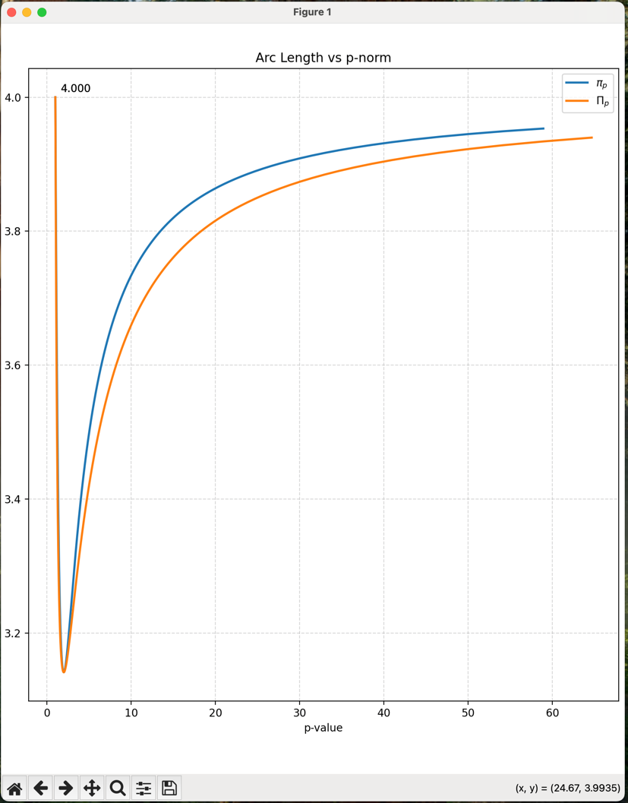

import { PythonRunner} from "../../../components/python-runner.jsx"

I was attempting on making another Information Entropy articles when I came across an interesting paper:
[$\pi$ is the minimum value of $\Pi$](https://www.jstor.org/stable/2687579?seq=3).
The paper is a fascinating read, I even totally forgot how I found this in the first place.
It's quite fun to discuss how we relate this to Physics.

But first, let's break down the ideas bit by bit.

# $L_p$ space and p-norm

First, we need to understand what are $L_p$ space and the p-norm.

In short, given a set of coordinates $x_1$, $x_2$, $x_3$, etc. We are interested in finding some
sort of notion of "distance". This is what we call a ["Norm"](https://en.wikipedia.org/wiki/Norm_(mathematics)#Definition). Whatever we call a norm has to satisfy the following attributes/properties/axioms

1. Triangle inequality (summing two norms can't be less than the norm of the sums)
2. Absolute homogeneity (scaling input is proportional to scaling the norm)
3. Positive definiteness (the norm is zero at the origin, and can't be negative)

If we look at definition/property 3, it is quite intuitive that our notion of distance is something that can't be negative.
After all, there is no negative distance. If A and B is a separate point, the separation
has to be some number that is positive.

However, there are many ways to define functions with this properties. But for now, let's focus on
something we called p-norm. The `p-` here refer to the degree `p` used in the norm computation.
Our familiar notion of distance, the Euclidean distance is a $p=2$ norm, so a 2-norm.
It is famously described as Pythagorean Theorem: $r^2=x^2+y^2$, in this case $r$ is the norm.

So, in general given $x_n$ dimensional axis, a point $X$ will have p-norm relative to origin, as described like this:

$$
||X||_p = (x_1^p+x_2^p+...+x_n^p)^{\frac{1}{p}}
$$

Quite straight-forward definition

# The notion of unit circle

After defining a way to measure distance, we introduce our next object, called circle.
A circle is just a set of points in the space, that has the same distance from the origin.
In $L_p$ space, the distance is defined by its p-norm. But there are more than one p, values.
When $p=2$, it's our familiar circle. When $p=1$, it will look like a diamond shape.
When $p=\infty$, the "circle" looks like a square.

You might be confused on why $p=1$ diamond is called circle as well. Well, this is because
most illustration projects different p values onto Euclidean grid. So, a circle $L_1$ space
with the equation $1=x_1+x_2$, will look like a diamond on Euclidean, Cartesian grid.
This is because the Cartesian grids were drawn using $L_2$ space rules.

To limit our dimensional observation. Consider two different axis, $x$ and $y$.
An $L_p$ unit circle is an equation like this:

$$
1=x^p+y^p
$$

The arc length of the circle is simply the unit segment of the circle, but projected along $x$ and $y$ 
coordinate, so we can compute it using integral. If we call the segment $ds$:

$$
\begin{align*}
\frac{ds}{dt} = \sqrt[p]{\left|\frac{dx}{dt}\right|^p+\left|\frac{dy}{dt}\right|^p}
\end{align*}
$$

Note that we can introduce a "time" parameter $t$ to trace the curve of the circle's arc.
Suppose that $\left|x\right|^p = t$, then $\left|y\right|^p=1-t$. The arc length derivative above then becomes:

$$
\begin{align*}
x &= \sqrt[p]{t} \\
\frac{dx}{dt} &= \frac{t^{\frac{1-p}{p}}}{p} \\
\end{align*}
$$

$$
\begin{align*}
y &= \sqrt[p]{1-t} \\
\frac{dy}{dt} &= \frac{\left(1-t\right)^{\frac{1-p}{p}}}{p} \\
\end{align*}
$$

$$
\begin{align*}
\frac{ds}{dt} &= \sqrt[p]{\left|\frac{dx}{dt}\right|^p+\left|\frac{dy}{dt}\right|^p} \\
&= \sqrt[p]{ \frac{1}{p^p} \left[ t^{1-p}+(1-t)^{1-p} \right]} \\
&= \frac{1}{p} \left[ t^{1-p}+(1-t)^{1-p} \right]^{\frac{1}{p}} \\
\end{align*}
$$

If we take the boundary of integration from $t=0$ to $t=1$, we will have a quarter of the circumference of a circle.
In the Euclidean unit circle (our normal circle), the circumference is $2\pi$.
Suppose that $\pi$ depends on $p$ norm degree. Then we can say that:

$$
\begin{align*}
\pi_p &= 2 \int_0^1 s_p \, dt \\
&= \frac{2}{p} \int_0^1 \left[ t^{1-p}+(1-t)^{1-p} \right]^{\frac{1}{p}} \, dt
\end{align*}
$$

# Variations of $\pi_p$ using numerical methods

The proof of the optimization of $\pi_p$ has been given in the paper, so we won't be digging that.
What I found interesting to demo is the numerical approach to find the minimum. It's quite easy to show.

The author of the paper proved that $\pi_p$ is the minimum by creating another function $\Pi_p$.
This is used to estimate $\pi_p$ by making the function intersects at $p=0$, $p=2$ and $p=\infty$.
The function is then proved to be always less than or equal. In other words $\Pi_p \le \pi_p$.

$$
\begin{align*}
\Pi_p = \frac{4}{p} \int_0^1 \left[ t^{p-1}(1-t)^{1-p} \right]^{\frac{1}{p}} \, dt
\end{align*}
$$

The insight was that the right hand side is an expression of [Beta function](https://en.wikipedia.org/wiki/Beta_function):

$$
\begin{align*}
B(x,y) = \int_0^1 t^{x-1} (1-t)^{y-1} \,dt
\end{align*}
$$

So we can easily see that: $x=2-\frac{1}{p}$ and $y=\frac{1}{p}$.

For a given Beta function, we have an interesting relationship with the [Gamma function](https://en.wikipedia.org/wiki/Gamma_function).

$$
\begin{align*}
B(x,y) = \frac{\Gamma(x) \Gamma(y)}{\Gamma(x+y)}
\end{align*}
$$

As you may have know, for an integer $n$, $\Gamma(n)=(n-1)!$. So it can be computed easily that
$\Pi_1 = 4$.

Meanwhile $\Pi_2 = \pi$ because $\Gamma(\frac{1}{2}) = \sqrt{\pi}$ is a famous known value for non-integer input of Gamma function.

$$
\begin{align*}
\Pi_2 &= \frac{4}{2}\, B(2-\frac{1}{2},\frac{1}{2}) \\
&= 2 \, \frac{\Gamma(\frac{3}{2})\Gamma(\frac{1}{2})}{\Gamma(2)} \\
&= \frac{2}{1!} \, \frac{1}{2} \Gamma(\frac{1}{2})  \Gamma(\frac{1}{2})\\
&=  \Gamma(\frac{1}{2})^2 \\
&= \pi
\end{align*}
$$

For continuous values (not just integers), we can use the same numerical method to graph the function.

Here's the snippet of the integration value, drawn using matplotlib and scipy.
Blue for $\pi_p$ and orange for $\Pi_p$, the approximation.



As a demo, I also put the script here to be run on client side via Pyodide + WebAssembly

<PythonRunner client:only="react" pythonScriptSelector="#pythonScript" plotScriptSelector="#plotScript"  />

<details>

  <summary>Python Script (Collapsible)</summary>

<div id="pythonScript">

```python
import numpy as np
from scipy.integrate import quad


def p_norm_arc_length(p=2) -> float:
    """
    Calculate the integrand for arc length using p-norm
    Args:
    x: Point at which to evaluate the integrand
    p: The p-value for the p-norm (default is 2 for Euclidean norm)
    """
    length, _ = quad(
    lambda t: 2/p * (t**(1-p) + (1-t)**(1-p))**(1/p),
    0, 1
    )
    return length


def approx_p_norm_arc_length(p=2):
    length, _ = quad(
    lambda t: 4/p * t**((p-1)/p)*(1-t)**(-(p-1)/p),
    0, 1
    )
    return length

# Calculate and plot arc lengths for different p-values
theta = np.linspace(0, np.pi / 2 * 0.99, 1000)
p_values = 1 + np.tan(theta)
arc_lengths = []
approx_lengths = []
for p in p_values:
    # Calculate arc length using numerical integration
    length = p_norm_arc_length(p)
    approx = approx_p_norm_arc_length(p)
    arc_lengths.append(length)
    approx_lengths.append(approx)

results = [p_values.tolist(), arc_lengths, approx_lengths]
results
```

</div>

<div id="plotScript">

```javascript
function generatePlot() {
  const result = window.pythonResult
  const generatedID = window.pyodideElementID
  const plotID =`${generatedID}-plot`
  let plotDiv = document.getElementById(plotID)

  if(!plotDiv) {
    plotDiv = document.createElement('div')
    plotDiv.id = plotID
    const parentDiv = document.getElementById(generatedID)
    console.log(parentDiv)
    parentDiv.prepend(plotDiv)
  }

  const p = result[0].map((i) => i)
  const pi_p = result[1].map((i) => i)
  const approx_pi_p = result[2].map((i) => i)

  Plotly.newPlot(plotDiv, [
        {
          x: p,
          y: pi_p,
          mode: 'lines',
          name: 'Numerical Integration (π_p)',
          line: {color: 'blue', width: 2}
        },
        {
          x: p,
          y: approx_pi_p,
          mode: 'lines',
          name: 'Approximated (π_p)',
          line: {color: 'orange', width: 2}
        }
      ],
      {
        title: 'Comparison of π_p and Approximation',
        xaxis: {
          title: 'p',
          showgrid: true
        },
        yaxis: {
          title: 'π_p Value',
          showgrid: true
        },
        legend: {
          x: 0,
          y: 1
        }
      }
    );
  document.getElementById(`${generatedID}-spinner`).classList.add('hidden')
}

generatePlot()
```

</div>

</details>

# Euclidean distance and stationary action principle

Now that we see in above graph that $\pi_p$ with $p=2$ is basically the minimum possible, with $\pi_1$ and $\pi_\infty$
equal to 4, and are the maxmimum. I'm wondering what were the significance in Physics?

In a Physical Theory, a theory usually tested against [Noether's Theorem](https://en.wikipedia.org/wiki/Noether's_theorem).
You have a good/sound base of a theory if it can explain continuous symmetry with the Lagrangian.
A Lagrangian is any functional description that relates the physical action with the effect on the observables.

The action affected by Lagrangian has to be the optimum. This is based on a principle that any physical
action should not have any preference at all on how a physical system evolve.
It must evolve with the least effort possible. If it stays at minimum, it should try to stay at minimum.
if it stays at maximum, it should stay at maximum.

Action is usually described as:

$$
S = \int_t \, L \, dt
$$

In this description, $L$ is the Lagrangian, usually described using the observables we are trying to measure.
This is for example: distance, angles, momentum, etc.

Now here's the catch or insights.

In the Euclidean description, or in general when $p=2$, any distance being measured in the unit circle,
does not depend at all with the direction of the point relative to the axis.
Only when $p=2$, you can have a function that variates distance based on angle from the axis, and still the
total distance doesn't change.
It has a continuous distance symmetry under rotation (aka: rotation invariant), which is why a Physical systems obeys Noether's Theorem.

From this, it is a direct consequence that kinetic energy is just 2-norm addition for each axis, obeying
Pythagorean Theorem, since it has to use $\pi_2$ as the arc constant.

This ideas extends remarkably for Quantum Physics as well. Note that in Quantum Physics, the Lagrangian (or rather
usually we use the Hamiltonian), obeys the same stationary principle, even though things that is measured is not
the actual position/angles, but rather a probability function.
Thus in the context of Quantum Physics, a theory is sound, if the probability function is conserved and optimized in 2-norm.
Which is why we have the [Hilbert's Space](https://en.wikipedia.org/wiki/Hilbert_space), as the space of quantities used
in quantum physics.

If we linked it like this, it is quite natural for us to think that wave function $\psi$ needs to be squared first to get
its probability values. It's because the physics works in 2-norm.
