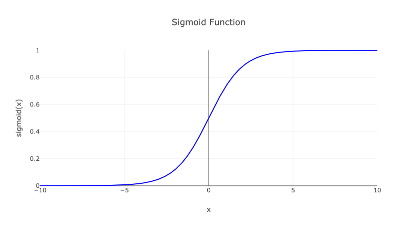

import { PythonRunner} from "../../../components/python-runner.jsx"

[https://en.wikipedia.org/wiki/Sigmoid_function](https://en.wikipedia.org/wiki/Sigmoid_function)

If you are familiar with how the exponent function behave, you can intuitively build a sigmoid function
so that your ML classifier can smoothly classify between a binary choice (yes/no class or 0/1 class).

The function curve is S shaped and natural, so you can even build the function with just this motivation:

"I want to have a function that stays 0 from negative infinity, but stays at 1 until positive infinity"

So the function looks like a step, function, but it is smooth.
If you draw it:




<PythonRunner client:only="react" pythonScriptSelector="#pythonScript" plotScriptSelector="#plotScript"  />

<details>

  <summary>Python Script (Collapsible)</summary>

  <div id="pythonScript">

    ```python
    import numpy as np

    def sigmoid(x):
        return 1 / (1 + np.exp(-x))

    # Generate x values for plotting
    x = np.linspace(-10, 10, 1000)

    # Calculate sigmoid values
    y = sigmoid(x)

    # Return results for plotting
    results = [x.tolist(), y.tolist()]
    results
    ```

  </div>

  <div id="plotScript">

    ```javascript
    function generatePlot() {
      const result = window.pythonResult
      const generatedID = window.pyodideElementID
      const plotID =`${generatedID}-plot`
      let plotDiv = document.getElementById(plotID)

      if(!plotDiv) {
        plotDiv = document.createElement('div')
        plotDiv.id = plotID
        const parentDiv = document.getElementById(generatedID)
        console.log(parentDiv)
        parentDiv.prepend(plotDiv)
      }

      const x = result[0].map((i) => i)
      const y = result[1].map((i) => i)

      Plotly.newPlot(plotDiv, [
          {
            x: x,
            y: y,
            mode: 'lines',
            name: 'Sigmoid Function',
            line: {color: 'blue', width: 2}
          }
        ],
        {
          title: 'Sigmoid Function',
          xaxis: {
            title: 'x',
            showgrid: true
          },
          yaxis: {
            title: 'sigmoid(x)',
            showgrid: true,
            range: [0, 1]
          },
          legend: {
            x: 0,
            y: 1
          }
        });
      document.getElementById(`${generatedID}-spinner`).classList.add('hidden')
    }
  
    generatePlot()
    ```

  </div>

</details>

Insted of deriving purely from calculus intuition, let's try to derive it from information theoritical perspectives.

# Classifying data with N class

We already know that Sigmoid is used to classify between two different class. It can be 0/1 or yes/no, or something similar like this.
But let's pretend that we don't know, so that we have some general formula, then we derive it to match Sigmoid.

Let's say, instead of 2 classes, there are $N$ classes.

If we want to use it as neuron activation layer function, we know that the input will be just a single linear parameter.
So we will call it $t$.

That means, the probability distribution that we predict is mostly scale linearly, and the probability for 
each class activation is divided using the range of t.

For example if we have 2 classes, it could be that between $-\infty$ and 0, it will be class 0 and between 0 and $\infty$, it will be class 1.
For $N$ number of classes, we expect the distribution to be divided along $t$ in $N$ segments.

Note that, because it is a class, the order itself doesn't really matter. But let's just say we use the $N$-th class as the reference.

The probability of the neuron activating $N$ can be written as $p(x) = p(N) = p_N$ for simplicity.

The effort to activate this will depend on how much information it contains.
Let's say the information function $I(p)$ for activating $N$ can be written as $I(p_N)$.

Of course for other classes, we simply uses index $i$ (started from 1), to mark information of i-th class $I(p_i)$.

These are our preparation setup.

# Comparing information and comparing entropy

We could go on by using either information comparison or entropy comparison.

Comparing entropy is probably straightforward. You just apply Max Entropy principle to get the distribution.

So let's go using information comparison.

Let's say we are going to order the classes, using how much scores it compares to with our reference $I(p_N)$.

We can just get the difference of the information and treat it as scores $z_i$, the relative scores.

$$
\begin{align*}
I(p_i) - I(p_N) &= z_i \\
-\operatorname{ln}(p_i) - (-\operatorname{ln}(p_N)) &= z_i \\
\operatorname{ln}(\frac{p_N}{p_i}) &= z_i \\
\frac{p_N}{p_i} &= \exp(z_i) \\
p_i = p_N \exp(-z_i)
\end{align*}
$$

For probability distribution, we have a constraint that all the probabilities must add up to 1

$$
\begin{align*}
\sum_i^N p_i &= 1 \\
p_N + \sum_i^{N-1} p_i &= 1 \\
p_N + \sum_i^{N-1} p_N \exp(-z_i) &= 1 \\
p_N &= \frac{1}{1+ \sum_i^{N-1} \exp(-z_i)}
\end{align*}
$$

We got the reference probability $p_N$. It was apparent from the scoring formula we used above, the $z_N=0$, because
information difference between the reference class and itself is just 0.

Now, to get the other probability:

$$
\begin{align*}
p_i &= \frac{\exp(-z_i)}{1+ \sum_i^{N-1} \exp(-z_i)} \\
&= \frac{\exp(-z_i)}{\sum_i^{N} \exp(-z_i)} \\
&= \frac{\exp(z_i)}{\sum_i^{N} \exp(z_i)} \\
\end{align*}
$$

Above are 3 different ways two write the formula for $p_i$.
Notice that the negative sign in the score don't matter because, the score is the thing you measure.
So it will just end up positive or negative depending if you include the negative sign or not.
So let's just omit it.

It turns out we found the formula that is usually called [Softmax function](https://en.wikipedia.org/wiki/Softmax_function)

For multiple classes like this, if a class is very rare, its informational value is high, relative to the reference. So it ends up
highlighted. Meanwhile classes that often show up, will end up becoming the reference classes $N$, or the noise. Because it has low scores.

# Deriving sigmoid from soft max function

The next step is again straightforward. Instead of $N$ classes, we just have two classes of yes/no to evaluate.
Basically one class will become the reference (if it appears often), and the other one becomes the highest scores (if it very rare).
The distribution is just between the two classes.

If we say the highest score class has the probability $p$, then the reference will have probability $1-p$.
Let's say the reference class has index 1, and it has score $z_1=0$, based on the formula we use above.
The important class has index 2, and will have non-zero score $z_2$ if it is very biased.

Then the derivation follows

$$
\begin{align*}
p_i &= \frac{\exp(z_i)}{\sum_i^{N} \exp(z_i)} \\
p_1 &= \frac{\exp(z_1)}{\exp(z_1) + \exp(z_2)} \\
&= \frac{1}{1 + \exp(z_2-z_1)} \\
&= \frac{1}{1 + \exp(z_2)} \\
p_2 &= \frac{\exp(z_2)}{\exp(z_2) + \exp(z_1)} \\
&= \frac{1}{1 + \exp(-z_2)} \\
\end{align*}
$$

As you can see above, both probabilities for $p_1$ and $p_2$ only determined by the score value of $z_2$.
Which we can just rename it to the input parameter $t$.

Basically, for very biased distribution, one has to be bigger than the other in the sigmoid function result.
If we treat $t$ as positive numbers, then the important class (probability on higher score of $t$) will have probability $p$:

$$
p = \frac{1}{1+ e^{-t}}
$$

# Sigmoid from entropy

If you look at the previous derivation where the score coefficient is negative:

$$
p_i = \frac{\exp(-z_i)}{1+ \sum_i^{N-1} \exp(-z_i)} \\
$$

It looks eerily similar with [Boltzmann distribution](https://en.wikipedia.org/wiki/Boltzmann_distribution).

It is not a coincidence, because in Statistical Physics, there is a mechanism to label energy state
distribution. This is basically a classifying mechanism, so the underlying principle is the same with information entropy,
it's just that in Physics, the states will use Physical quantities, such as energy.

So, in Boltzmann distribution, the term $z_i$ corresponds to the energy of the system.
It can be parametrized using temperature $T$. So $z_i$ is proportional to $k_B T$, the energy chunk of Boltzmann.
Where $k_B$ is the Boltzmann constant.

This is why I said before that deriving sigmoid/softmax from entropy is fairly straightforward.

In machine learning and neural network training, the concept overlaps.

Essentially, when doing a training using softmax/sigmoid activation, you allow the network to evolve
by minimizing the gradient of energy, following Boltzmann view of Statistical Physics.

On the other hand, from the Point of View of Information Theory, the softmax/sigmoid activation is chosen,
so that you allow the network to evolve to match the most informational-worthy of inputs. The principle
here is that you maximize learning on the data that has important information.

Both view are equivalent, so it raises new discussion whether Physics is actually Information theory in the fundamental level.
