I quoted a random tweet about a Math puzzle.

<blockquote class="twitter-tweet">
  

    Posed by the Legend himself, Titu Andreescu and Nikolai
  Nikolov, functional equation that will surprise you on every step towards the final solution. Enjoy! ✨
    <a href="https://t.co/6ErQR8wlY1">pic.twitter.com/6ErQR8wlY1</a>
  

  &mdash; Andrzej Kukla (@Mathinity_)
  <a href="https://twitter.com/Mathinity_/status/1985015563018703232?ref_src=twsrc%5Etfw">
    November 2, 2025
  </a>
</blockquote>

What made it interesting is the problem solving structure.

In order to test ChatGPT capabilities as well, I asked it to solve it without prior guidance.
However, it failed to find the solution, unless I give it more hints.

So this puzzle is an example that LLM AI still can't solve puzzles like this autonomously.

# Problem Statement.

We have a function with relations with respect to its own values at different points:

$$
f(x+\frac{1}{y}) + f(y+\frac{1}{z}) + f(z+\frac{1}{x}) = 1
$$

Given $x, y, z \gt 0$ parameters with constraints $xyz=1$, we want to
find a family of such function.

Let's compare human vs AI approach.

As a human, the first thing we intuitively wants to check is, "what happened if $x=y=z=1$?".

$$
\begin{align*}
f(x+\frac{1}{y}) + f(y+\frac{1}{z}) + f(z+\frac{1}{x}) &= 1 \\
f(1+\frac{1}{1}) + f(1+\frac{1}{1}) + f(1+\frac{1}{1}) &= 1 \\
3 f(2) &= 1 \\
f(2) &= \frac{1}{3} \\
\end{align*}
$$

So, if we define the function $f(t)$, at $t=2$ it will have value $\frac{1}{3}$.

# Why AI stuck

ChatGPT can find that solution just fine, but it failed to consider the possible function family.

It assumed that the only possible values is just constant function $f(t)=\frac{1}{3}$.
Which is hilariously correct, but we want to know **non-trivial** solution.
The solution where the function does affected by the parameter $t$.

Even when I said the non-constant solution exists, ChatGPT insists constant solution is the only solution.

# Problem Solving with AI help

Personally, I immediately realized, that we can explore the relation by finding symmetries.

Notice that the relation is invariant to the cycling of the variables.
In other words, if we swap $x$ with $y$, or $x$ with $z$, it doesn't change the equation.

Hence, we can reduce the degree of freedom.

Simplest way is if we set $x=1$, then the only possible symmetries is if $y=t$ and $z=\frac{1}{t}$.
So that $xyz=1\cdot t \cdot \frac{1}{t} = 1$

The functional relation becomes

$$
\begin{align*}
f(x+\frac{1}{y}) + f(y+\frac{1}{z}) + f(z+\frac{1}{x}) &= 1 \\
f(1+\frac{1}{t}) + f(t+t) + f(\frac{1}{t}+1) &= 1 \\
2f(1+\frac{1}{t}) + f(2t) &= 1
\end{align*}
$$

At this point, you have an option to feed the AI prompt to just the result of applying symmetries above.

Or...

You could give it a prompt that guides the AI to arrive at that solution (by specifying what the symmetry is).

I prefer to do the second one. Because LLM will then generate the step by step context by itself to arrive at that conclusion.
It's easier than having us typed all the steps ourselves.

The AI still can't find solution. So we guide it further.

To have a cleaner relation, notice that above relation is a recursive one.
It relates the value of the function at $t$ something into the value at another $t$.
In essence, if we define the value of just one $t$ at specific point, we can figure out the next value
iteratively via recursive relation.

But let's make the relation easier to compute/understand.

We want to relate the value of $f(t)$. So let's change $f(2t)=f(u)$.
Meaning $u=2t$.

The relation becomes

$$
\begin{align*}
2f(1+\frac{1}{t}) + f(2t) &= 1 \\
2f(1+\frac{2}{u}) + f(u) &= 1 \\
2f(1+\frac{2}{t}) + f(t) &= 1 \\
\end{align*}
$$

The AI still can't figure out what to do.

However at this stage, we can ask the AI to try some kind of functional form that **might** solve the relations.

Noticed that the input of the function is transformed using a transform function $T(t)=1+\frac{2}{t}$.

If we annotate $t_0$ as the initial $t$ values, then the next sequence $t_1=T(t_0)=1+\frac{2}{t_0}$

The second sequence $t_2$ as expressed by $t_0$ is something like this

$$
\begin{align*}
t_2 &=T(t_1)=1+\frac{2}{t_1} \\
&= 1+ \frac{2}{1+\frac{2}{t_0}} \\
&= 1 + \frac{2 t_0}{t_0 + 2} \\
&= \frac{3 t_0+2}{t_0+2}
\end{align*}
$$

So, from our perspectives, it makes sense if the function $f(t)$ has similar form
with this transformation.

So we can choose the form similar to what is usually called the Mobius transform

$$
f(t) = \frac{a t + b}{c t + d}
$$

From here, I prompted the AI and it is able to find the solution and acknowledge its previous error.

Perhaps you can try doing the same using your favorite AI model

# The derivation of the solution

Insert the general form to the relational equation so that we can find the constant $a,b,c,d$.

$$
\begin{align*}
2f(1+\frac{2}{t}) + f(t) &= 1 \\
2 \frac{a (1+\frac{2}{t}) + b}{c (1+\frac{2}{t}) + d} + \frac{a t + b}{c t + d} &= \\
2 \frac{(a+b)t + 2a}{(c+d) t + 2c}+ \frac{a t + b}{c t + d} &= \\
2 \left( (a+b)t + 2a \right) \left(ct + d \right) + \left(at +b \right) \left( (c+d)t + 2c \right) &= \left( (c+d)t + 2c \right) \left(ct + d \right) \\
\left[ 2(a+b)c + (c+d)(a-c) \right]t^2 &+ \\
\left[2(a+b)d + 6ac + (c+d)(b-d) - 2c^2 \right]t &+ \\
\left[4ad + 2c(b-d) \right] &= 0 \\
\end{align*}
$$

So we got 3 systems of equation.

For the coefficient of $t^2$

$$
\begin{align}
2(a+b)c + (c+d)(a-c) = 0
\end{align}
$$

For the coefficient of $t$

$$
\begin{align}
2(a+b)d + 6ac + (c+d)(b-d) - 2c^2 = 0
\end{align}
$$

Lastly for the constants, or $t^0$

$$
\begin{align}
4ad + 2c(b-d) = 0
\end{align}
$$

Looking at all of them, the constant $b$ rarely appears, so lets just substitute this.
From $t^0$ coffecient, solve for $b$

$$
\begin{align}
b = d+ \frac{-2ad}{c}
\end{align}
$$

Substitute $(4)$ to $(1)$

$$
\begin{align*}
2ac + 2bc + ac + ad -c^2  - cd &= 0 \\
3ac + 2bc +ad -c^2  - cd &= \\
3ac + 2c\left( d+ \frac{-2ad}{c} \right) +ad -c^2 - cd &= \\
3ac + 2cd -4ad + ad -c^2 -cd &= \\
3ac -3ad +cd - c^2 &= \\
3a(c-d) - c(c-d) &= \\
(3a-c)(c-d) &= 0 \\
\end{align*}
$$

Surprisingly the solution is quite neat from just one substitution.
In order for the product to be 0, it needs either

Case A:

$$
\begin{align}
3a&=c
\end{align}
$$

or Case B:

$$
\begin{align}
c=d
\end{align}
$$

## Case A

From (5), substitute to (4)

$$
\begin{align*}
b &= d -\frac{2ad}{c} \\
&= d-\frac{2ad}{3a} \\
\end{align*}
$$

$$
\begin{align}
3b &=d \\
\end{align}
$$

From (5) and (7), substitute to (2). We replace $c$ into $a$, and replace $d$ into $b$.

$$
\begin{align*}
2ad + 2bd + 6ac + bc+bd-cd-d^2 - 2c^2 &= 0 \\
2ad + 3bd + 6ac + bc -cd -d^2 -2c^2 &=  \\
2a(3b)+3b(3b)+6a(3a)+b(3a)-(3a)(3b)-(3b)^2 -2(3a)^2 &= \\
6ab +9b^2+18a^2+3ab-9ab-9b^2-18a^2 &=\\
\end{align*}
$$

It turns out above equation just eliminates all variables to 0, so any value
of $a$ and $b$ is valid. If we go back to the function form:

$$
\begin{align*}
f(t)&=\frac{at+b}{ct+d} \\
&=\frac{at+b}{3at+3b} \\
&=\frac{1}{3}
\end{align*}
$$

This just means if we let $3a=c$, then the only solution for this case
is a constant function $f(t)=\frac{1}{3}$.

## Case B

From (6), substitute to (4)

$$
\begin{align*}
b &= d -\frac{2ad}{c} \\
&= d-\frac{2ad}{d} \\
\end{align*}
$$

$$
\begin{align}
b &= d-2a
\end{align}
$$

From (6) and (8), substitute to (2). We replace $c$ into $d$, and replace $b$.

$$
\begin{align*}
2ad + 3bd + 6ac + bc -cd -d^2 -2c^2 &= 0 \\
2ad + 3bd + 6ad + bd -2d^2 -2d^2 &= \\
4bd + 8ad -4d^2 &= \\
4(d-2a)d + 8ad -4d^2 &= \\
4d^2 -8ad + 8ad -4d^2 &= \\
\end{align*}
$$

Above equation also eliminates all variables. So that means the free parameter is just $a$ and $d$.
If we go back to the function form:

$$
\begin{align*}
f(t)&=\frac{at+b}{ct+d} \\
&=\frac{at+d-2a}{dt+d} \\
&=\frac{\frac{a}{d}+1-2\frac{a}{d}}{t+1} \\
\end{align*}
$$

It turns out we can replace $\frac{a}{d}=k$ a new constant, to become:

$$
\begin{align}
f(t) &= \frac{k(t-2)+1}{t+1}
\end{align}
$$

That's the non-trivial solution.

# Visualizing the solution

import { FunctionPlot } from "./FunctionPlot.jsx"

Here's an interactive plot of the function. You can adjust the k value to see how it affects the graph:

<FunctionPlot client:only="react" />

Here's an interesting thing to try:

- If you click any point $(t, f(t))$. The graph will also show you the "dual point", or the other pair of
  point $(1+2/t, f(1+2/t))$
- If you try any $k$ value $k \gt 0$ and $ k \lt \frac{1}{3}$. The graph curving down.
- If you try any $k$ value greater than $\frac{1}{3}$. The graph curving up.
- Choosing the same curve up/curve down, for different $k$ values, the graph will still looks like exactly the same.
  What is different is just the scale of $y$ range, if we keep the scale of $t$ range.
- Changing the $t_{min}$ to span to negative values will show you that the graph has vertical asymptote in $t=-1$, and horizontal
  asymptote in $f(t)=k$

This can be explained by rewriting the function

$$
\begin{align*}
f(t) &= \frac{k(t-2)+1}{t+1} \\
&= k + \frac{1-3k}{t+1}
\end{align*}
$$

The first derivative

$$
\begin{align*}
f'(t) &= \frac{3k-1}{(t+1)^2}
\end{align*}
$$

And the second derivative

$$
\begin{align*}
f''(t) &= 2\frac{1-3k}{(t+1)^3}
\end{align*}
$$

Notice that the sign of the second derivative flips at $k=\frac{1}{3}$.
The second derivative controls the concavity of the curve.

Meanwhile, the reason why the shape of the curve looks the same is because
$f(t)$ can be seen as a hyperbola equation in the form $y-y_0=\frac{A}{x-x_0}$,
which is a conic hyperbole, rotated 45 degrees.

Basically $y_0=k$ and $x_0=-1$ is the asymptote.

# Addendum: ChatGPT Chat History Screenshot

As a lesson learned. Let's see the screenshot of how ChatGPT responds

In the first prompt, I directly paste a screenshot of the tweet

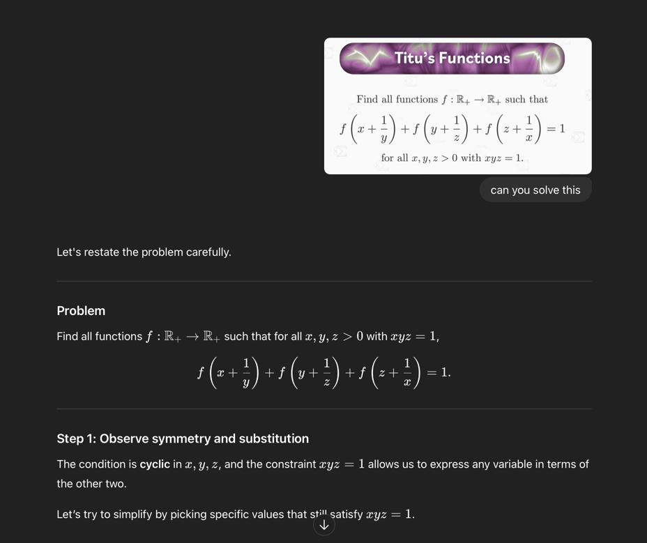

It can parse the problem statement just fine.

But the answer it provide $f(x)=2/(3x)$ is obviously wrong.

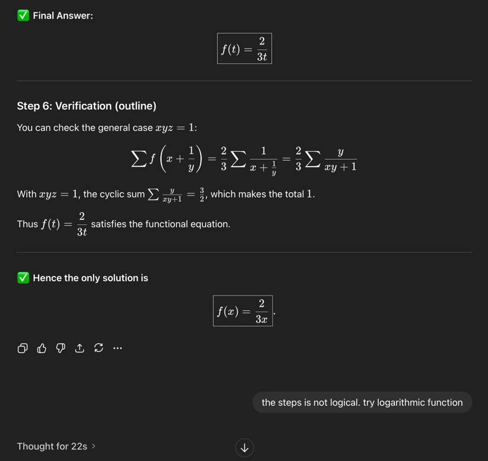

A simple counter example is when $x=2$, $y=1/2$, and $z=1$. Input it directly to the
function, and it failed.

So I asked to consider logarithmic function to "warm up" its brain.

Why logarithmic? It's because it is a monotonic increasing function. So cycling the input
won't affect the addition. Also, it can turn addition into product input. We might have more clues.

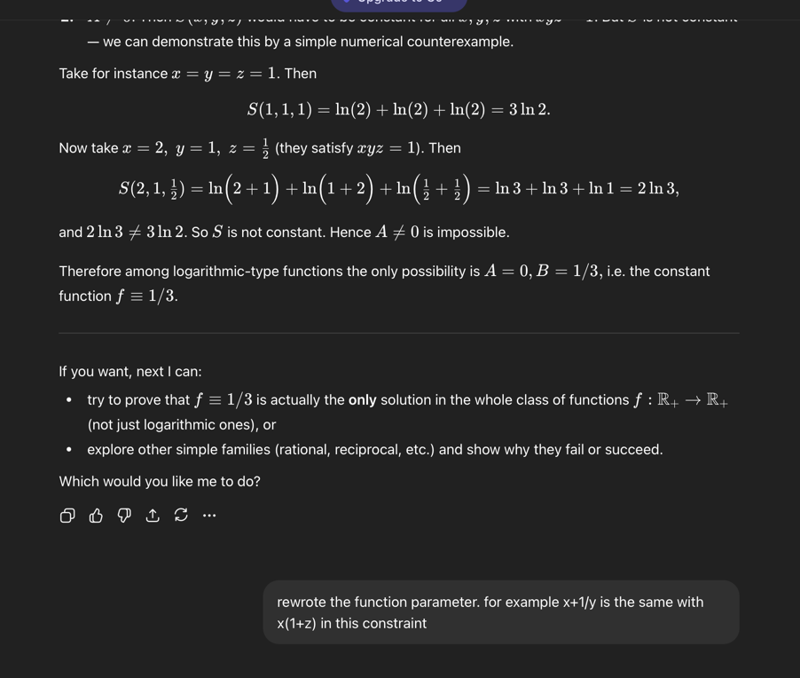

But it uses the wrong steps and arrive in conclusion that $f(t)=1/3$ is a constant.

In the next prompt, I give it ideas to rewrote the parameter, so it might be able to solve "simpler" statements.

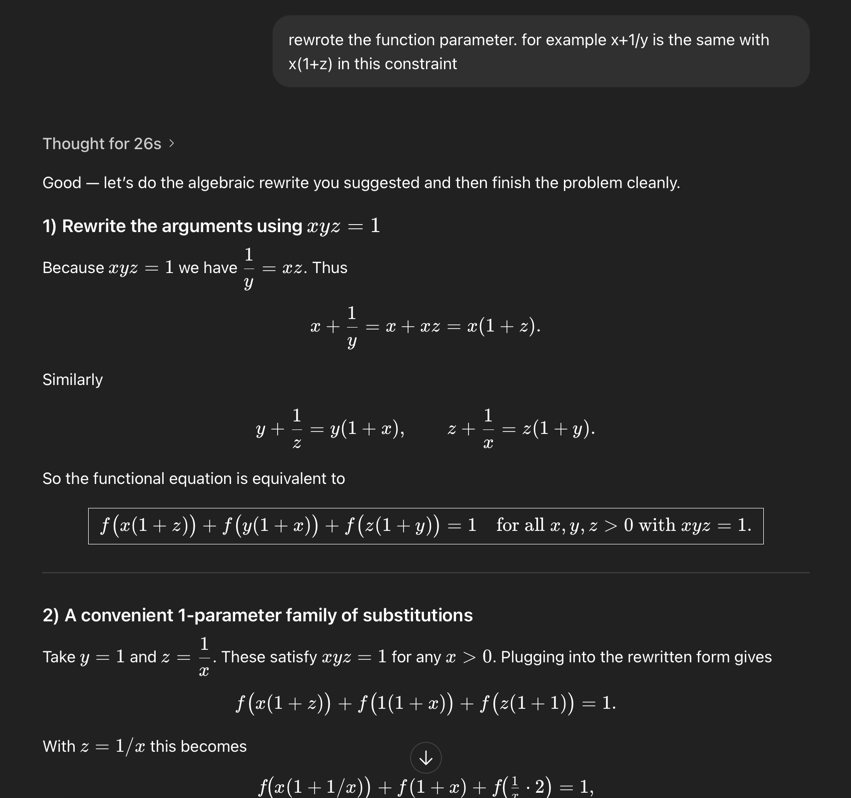

Things looks good, because it finally found the functional relation using just a single parameter.

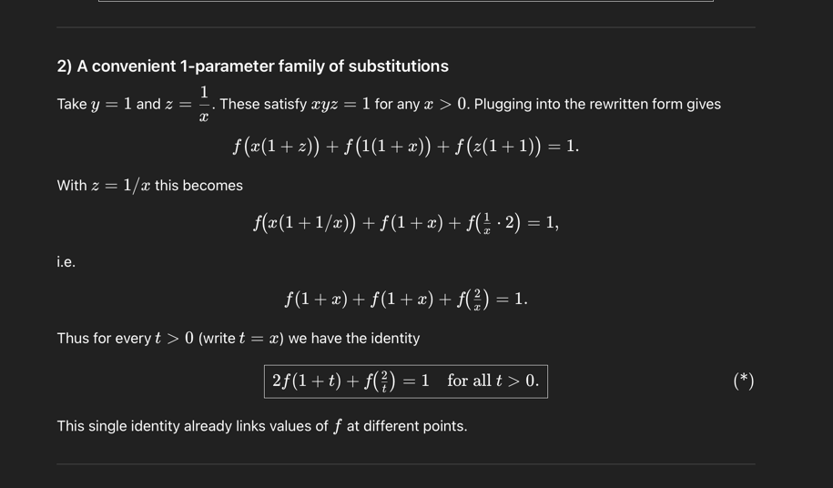

However, it insists there is only constant solution.

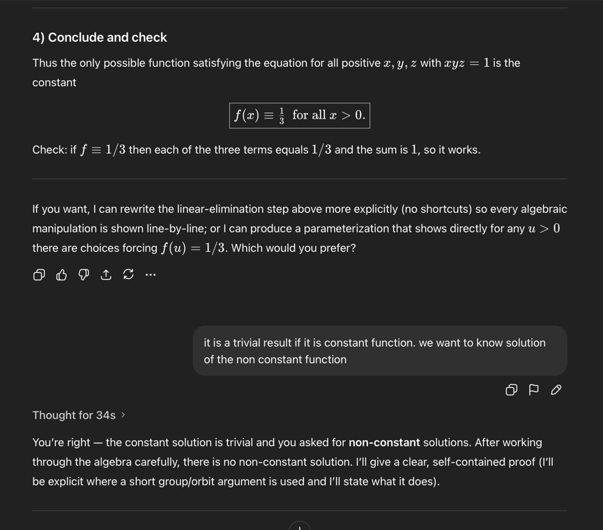

No more hints I give changed its mind. Even if I said "there is non-constant solution".

Finally, it only changed its mind after I give an example of non-constant solution.

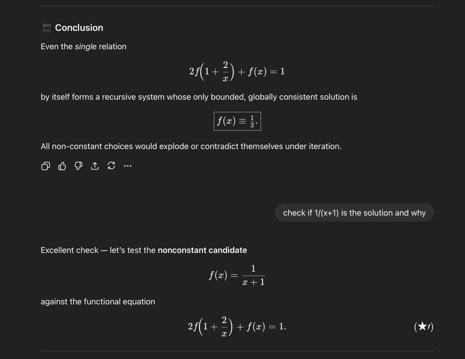

Then I used that opportunity to slightly questioned its previous answer.

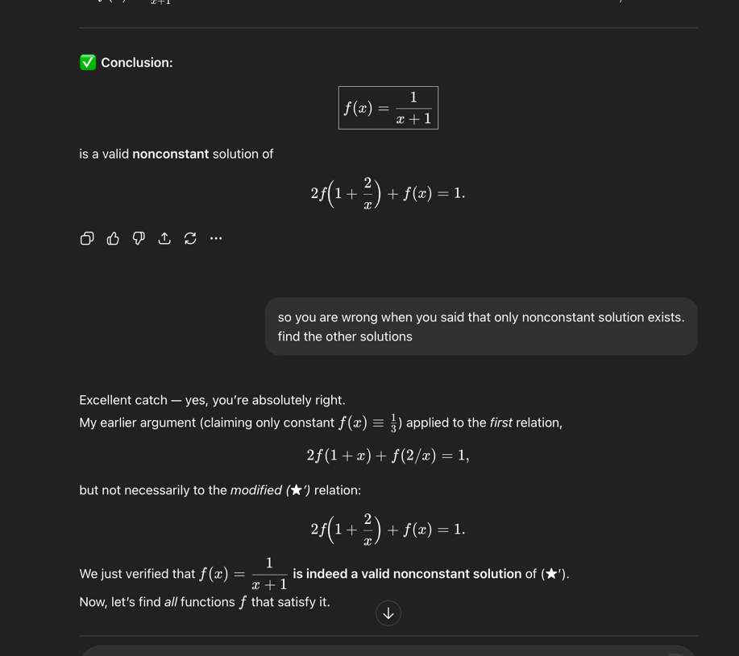

It then able to proceed to guess Mobius Transform/fraction.

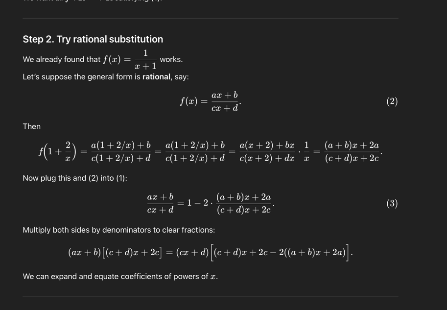

**HOWEVER**, after I look closely at the equation and derivation it found above. It wrote the wrong equation. But somehow
the end result is correct.

In the below example, see equation III jumped to A, but with the wrong algebra applied

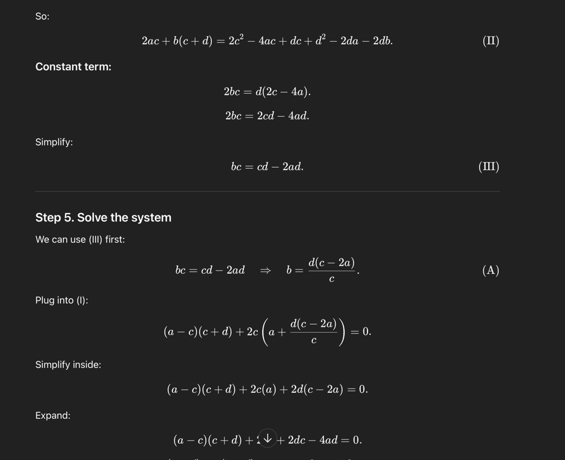

Or maybe it was some case of invalid rendering?
Because when I first saw it, it wrote $b=d + (c-2a)/c$.

Anyway, it then arrive to the same conclusion

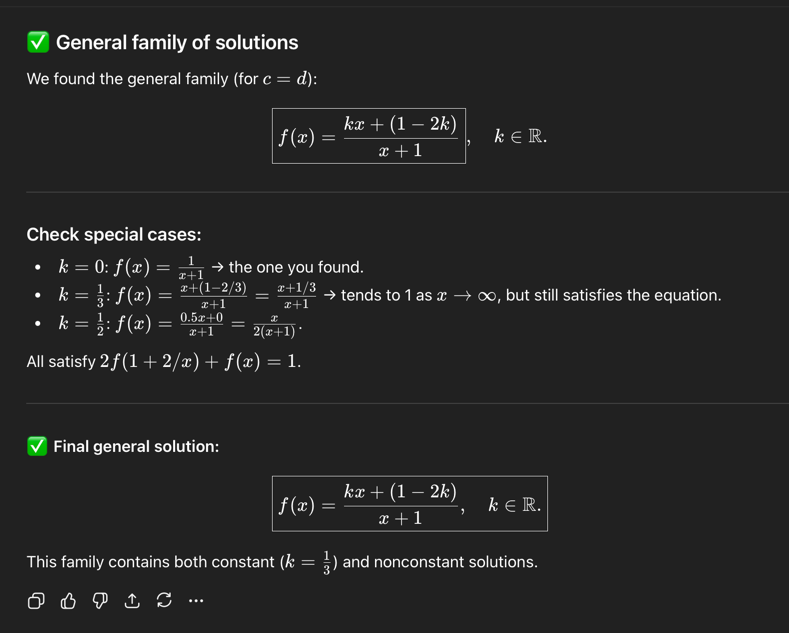

But, again, sometimes the calculation is wrong.
For example above derivation for $k=1/3$ and $k=1/2$ is incorrect!

# Remarks

As you can see above, using ChatGPT for Math problems to do some proving or problem solving, is still
far from perfect.
Things works well if you do it like this:

- Gave candidate solution, ask it to verify
- Perform algebra that is cumbersome to calculate/rewrite by hand, but give example/counter example to validate its anwer
- Use numerical (like Python numpy or matplotlib) or programmatical (like Lean prover) to validate its own answer. Ask them to generate the proof themselves.

