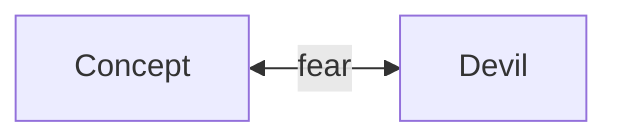
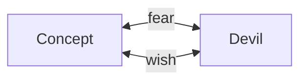
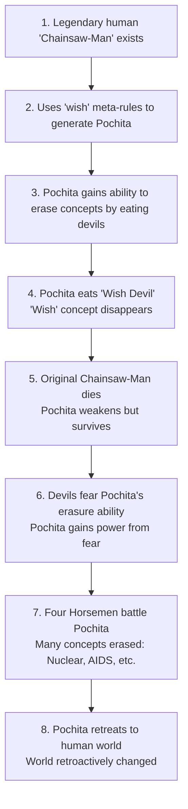

> This is my personal thought on Chainsaw-Man manga, and a personal-made theory

Chainsaw-Man manga just ended yesterday, and the ending is quite shocking for me because it retroactively change the
meaning of the manga since the beginning. It is not a retcon, but something more. The ending made everything much more sense.

# Pochita's identity

When reading the ending, at first I was quite surprised on why "Chainsaw" as a concept still exists after Pochita gone.
Because I thought Pochita is a "Chainsaw Devil". However this made it clear that Pochita is actually a "Chainsaw-Man Devil".

I always liked how Fujimoto experimented with "meta" concept with this manga. He made connection in an abstracted way of thinking.
He established that every devil has a corresponding concept, with relations of "fear". The ending means it implies that,
Pochita on its own, is a "Chainsaw-Man Devil", meaning that there is a concept called "Chainsaw-Man" that once feared by both man and devil,
thus the "Chainsaw-Man Devil" or Pochita was born.

Along the part 2, it is elaborated further that the meta concept is applied retroactively as if human and devil world (Hell) lives
in a separate timeline/worldplane. The devil world is like a metadata or collection of rules. If a devil gets eaten by Pochita, then its
corresponding meta-concept is gone in the human world. It is gone because the thing it refers to is hidden or doesn't exists anymore,
and it was applied retroactively. It is one-to-one connected, because if "A exists due to someone fears B", then if "A gets canonically
erased, then the only way to make it happen is for B to also disappear, because if not like that then A will always regenerates from B."
Basically devil and concepts is linked by fear and the only way to make the "fear" as a rule still valids when the devil disappears is to make the
concept also disappear from the world, retroactively.

From the chapter's ending, it is now clear that Pochita is "Chainsaw-Man devil" meaning that the concept of "Chainsaw-Man" is gone.
If Pochita is a "Chainsaw devil" then the concept that needs to be gone is "Chainsaw", but it still exists.

Throughout the manga we also been showed that once a concept disappear, it was reflected back in the manga, even if the concept is abstract,
like death or foot. So when death were eaten by Pochita, all creatures that has high fertility rate gets multiplied without dying, and
in itself, generates more fear, causing another new Devil to exists because humanity fear for them. So insect devil, locust devil all appears
retroactively, at real time during the manga plot. These insects deaths were undone at the same time.

A new question now rises. If Pochita is a "Chainsaw-Man devil", then there must exists someone called "Chainsaw-Man", so that both human and devil fears them.
But there is no "Chainsaw-Man" exists throughout part 1, other than Pochita themselves. But we know from existing rules that the pairing
is always one to one: a devil exists because of a corresponding concept was feared, vice versa.
If there is no corresponding Chainsaw-Man, then what if we have alternative theory?

I imagine that in that universe, originally the rules is not singular by "fear". Because "fear" itself is also a concept.
What if there are multiple rules (mathematically speaking) that also generates devil. But this rules were eaten by Pochita?
If the rules were eaten, then Pochita himself can exists even without its generator, the "Chainsaw-Man".

So I imagine here's what happens, originally there is an extra "meta-relationship-rules" that generates devil. Let's just call this a "wish"
as a placeholder name. The name itself won't matter as you will see below. It can be an entirely unknown forgotten concept, so
a placeholder name can still serve this purpose. But "wish" as a placeholder feels more analogically appropriate.
This rule is then eaten by Pochita, so no one remembers it.
So devil and human only knew that "fear" generates devil. They don't know that there are other ways.

Here's the rundown of what is likely happening in the original timeline (before Pochita exists):

1. There is a human with near-legendary status among both human and devil, notoriously called as Chainsaw-Man
2. Chainsaw-Man uses (or accidentally applied) "wish" meta-rules to generate Pochita, the "Chainsaw-Man Devil". Pochita then exists.
3. Pochita, the "Chainsaw-Man Devil" has a very unique meta ability of able to erase concepts entirely by eating
   that said concepts or corresponding devil (I will explain why/how this happens later)
4. Pochita ate "Wish Devil" (the fear of getting wish granted). The corresponding concept is a "Wish" concept. So "wish" as a concept is gone.
   Consequently, the only way for a devil to be born and grow stronger is due to using "fear" meta-rules. The Chainsaw-Man and its "Chainsaw-Man devil"
   is now disconnected from this rules, because the "wish" rule is gone.
5. At some point, the original Chainsaw-Man died (the progenitor or the origin of Chainsaw-Man Devil). But since it's now disconnected with Pochita.
   Pochita still exists but degenerate into a weaker supernatural form (because his source of power, derived from "wish" rule. is now gone).
6. However, because of Pochita's meta ability, the devils are now fear of "Chainsaw-Man" and "Chainsaw-Man Devil". So in effect now Pochita is strong enough
   to be feared by most devils. Most devils fear of Chainsaw-Man Devil since they will disappear if Pochita eats them.
7. Due to his unique ability, the Four Horseman devils seeks to gain Pochita's power. They failed to do so, and in the process
   Pochita ate many devils, causing all sorts of humanity's concept like Nuclear Weapon, AIDS, and all sort of fear concept gone from the world.
8. Pochita retreats from Hell to human world in weakened state. But the world were already retroactively changed because all sorts of concepts were missing.

# Solution to Pochita's identity

Given the likely rundown above, I can only conclude with the following theory to make everything makes sense:

1. Denji is the original Chainsaw-Man, a devil hunter feared by both humans and devils. A devil hunter who likes to use Chainsaw to kill devils.
2. Via some sort of contracts or "wish" rules, Pochita as "Chainsaw-Man Devil" spawned/generated in Hell (Demon World).
3. Denji has natural relationship/companionship with Pochita the devil. Something that is not a Hybrid/Fiend relationship, but something else entirely.
4. Due to battle with 4 Horseman + Makima the Control Devil, Denji died. Wishing for Pochita to survives, Denji asked Pochita erases Denji's connection with the "wish" rules.
5. Pochita thus can exists in its own as "Chainsaw-Man Devil" but it is weakened greatly because Denji dies. So Pochita flees to human world.
6. Due to the battle, the world retroactively changed. To make the causality makes sense, timeline corrected itself.
   This is the timeline in part 1. The alternate history. The timeline of the entire manga.
7. Makima is searching for Chainsaw-Man Devil in the human world, arriving at much earlier timeline because it needs to search
   from a period where "Chainsaw" itself is invented as tools, until the "Chainsaw-Man" human/devil itself appears.
8. In parallel, Pochita appears to Denji (a kid in the beginning of the story) because he is the sole reason why it exists in the future.
9. Since the "wish" rule is gone, Pochita is stuck in its dog form. Unable to have any power left, since it singularly needs more devils or human fears him to have any power back.
10. The story follows the manga

At this stage, one thing that really hits me is that the ending reframes the entire dialogue in early chapters of Chainsaw-Man.

In this theory, what I understand is that Pochita already accepts that he is going to die, because the original "Chainsaw-Man"/Denji already dead,
which is the sole reason for its existence. Pochita is only able to survive because the kid Denji now give his blood to him.
With this kind of mindset, when Pochita and Denji dies again due to the Zombie Devil. Pochita said to Denji:
"This is a contract, I will give you my heart, in exchange, show me your dreams."

In retrospect, if what I was thinking is true, what Pochita does here is essentially a payback of what Denji did to Pochita in 4 Horseman battle.
So Pochita only wants to see his own dream continued into Denji.

Now fast forward to the chapter ending... We can see a throwback here. Pochita said that Denji's life in the original timeline (the one where Pochita doesn't exists),
is essentially happier for Denji. So Pochita thanked Denji for showing his dream (it knew that it has to end). Thus Pochita
sacrificed his own dream to Denji. By eating his own heart, Pochita will erase "Chainsaw-Man Devil" from the world.
Consequently, due to only having "fear" rules in place, the existence of "Chainsaw-Man" will be erased.
Consequently, timeline will reset back to the original timeline where Pochita hasn't yet been generated, essentially undoing all that is happening
due to Pochita's own existence.

For me, this is like a kid wishing they was never been born just to see their parents happiness.

# Pochita's meta ability and its connection to Denji

From the very beginning of the manga, I was always wondering why Pochita's form is very uniquely intimate with Denji.

It is using a dog form (most devil forms were hideous and fearful).

The full form of Pochita has umbilical cord wrapped in its head as scarf.

This is very iconic because if you check the origin of how Chainsaw is invented, it is actually used to aid childbirth.

Meaning the meta concept that corresponds with Pochita is Birth or Origin. Pochita has the power to "undo" birth, retroactively, as if the devil/concept was never been born.

There is one other issue remaining though. Why it has to be a chainsaw? Not other tools?

But this question finally answered in the ending. Since "Chainsaw-Man" as a concept was erased. There is no way that
"Chainsaw-Man" exists, unless it is rediscovered. In part 2, we have some proof that Nuclear Weapon Devils were eaten by Pochita,
so Nuclear weapon were forgotten by the world, except the 4 horsemen still remembers it.

The question is that why the 4 horsemen still remembers it. The reason is being the meta relationship. Nuclear weapon in our history were
invented, solely as a part of War. So Yoru being the War devil is intimately related with Nuclear discovery.
So even though Pochita erases Nuclear Devil, only the "Nuclear" concept were erased from the world.
We can think of the world as the engine that process data. With the devil and the concept as the "metadata" layer.
Even if the "nuclear" metadata were wiped out, the surrounding physical rules and war motivation never got deleted.
Which is why Nuclear as weapon can get rediscovered, and once deployed, the Nuclear Devil were respawned again.

In the ending case. It was clear that "Chainsaw-Man" as a concept was erased. But it turns out that Denji is fond of "Chainsaw" as a tools,
long before he even met Pochita. In part 1, it was seen as if Denji prefers to use Chainsaw because he always use Pochita to cut trees.
But I believe it is actually the other way around!

Pochita exists... Because the "Chainsaw-Man" Denji is happen to be a devil hunter who LIKES TO CUT THINGS USING CHAINSAW!

This is kind of mindblowing for me personally.

Basically Pochita was tied to two concepts because "Chainsaw-Man" is a phrase. First it needs "Chainsaw" concept to exists, meaning
it was originally invented as birth tool. Second, he was born out of devil hunters who uses "Chainsaw". So his power is
essentially meta-related with birth and devil hunting and fear. Meaning he is just so happen to causally have the power of "undoing" the "birth" of "devil".

This doesn't even take into account that "Chain" itself means a connection. So having his power retroactively and causally have
 a cascading impact is very fitting.

This is so meta.

# My final interpretation of the ending

Given my own personal theory. I know some of you will think it is very far-fetched. But I was just working on it based on the holes
and how to fill it, like a puzzle.

Due to this, my interpration of the entire manga has changed.

1. The part 2 manga ending, is essentially the original history of Chainsaw-Man. In superhero movies this would be like the "origin" story, or the "birth" story (man... so meta).
2. Fujimoto omit any mentions of Chainsaw-Man devil after Pochita ate himself to simulate a manga world where the concept of Chainsaw-Man manga itself doesn't exists. That is why the tone is so different.
3. Nayuta originally exists as human (not Makima the Control Devil). Because Chainsaw-Man Devil doesn't exists yet. The whole fiasco of the 4 horseman battle never appears.
4. There is no Gun Devil accident in this timeline because devil's involvement in human history is very limited. Meaning Aki is alive but didn't join Public Safety division.
5. The part 1 and part 2 is essentially an alternate history, if "Denji" the "Chainsaw-Man" made a contract with "Chainsaw-Man Devil",
   to become a human hybrid. So that Pochita can flee from Control Devil and continues to see Denji's Dream.
6. Pochita most probably knew Denji's original relationship with Power and Nayuta in the original timeline.
   That's why he said Denji's life is better without Pochita and thank him for allowing to see his dream up to the ending.
7. Pochita knew he was dying from the beginning, and knew he was born from Denji. So that's why the "Pochita" form is the form
   that is most convenient and comforting for Denji.
8. At some point Makima said that Chainsaw-Man ate many devils in the past.
   One of them is the very concept of human-devil hybrid relationship that were forgotten now, because the concept/devil got eaten.
   This explains why Pochita and Denji had to make a contract to restablish this new relationship so Denji can change into
   literal Chainsaw-Man hybrid.
9. The whole manga can be thought of as a loop. Denji generated/gave birth to Chainsaw-Man Devil, that in effect undoing lots of concepts to change
   the human world. The Chainsaw-Man Devil then eat itself to undo it's own existence to restore the world back.

