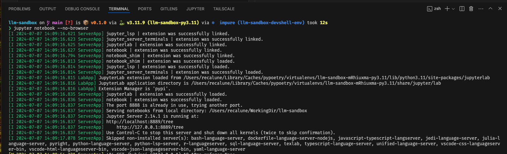
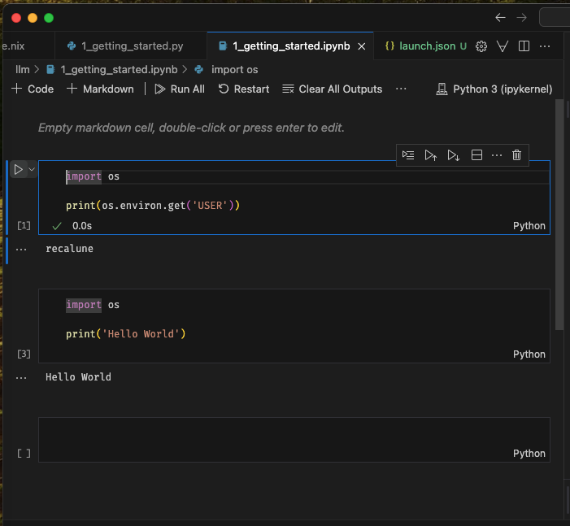
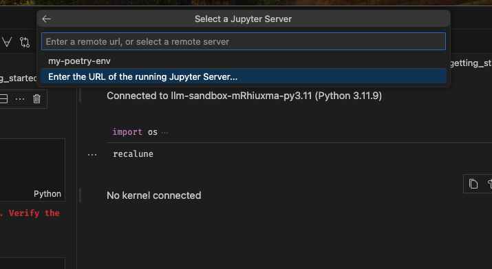
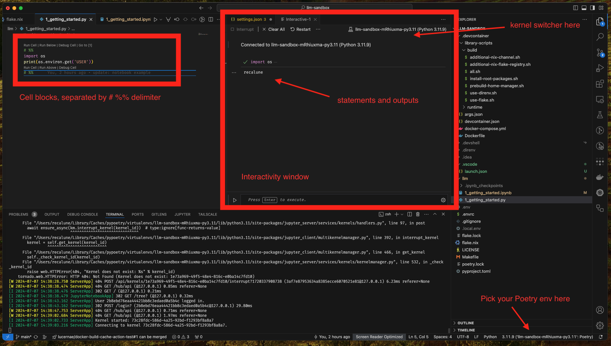

# Sharing your setup so others can replicate

The main issue I have with learning how LLM application development goes is how scarce the standard is for sharing a setup.
Python is already a notorious programming language with convoluted package management design.
People would argue that retrying other's python code is synonymous with tinkering how to install
the prerequisite, be it with pip, pyenv, pipenv, virtualenv, poetry, etc.
Many times the efforts were wasted in ensuring that you are using the same environment with the experiment you are trying to replicate.VSCode

This wouldn't be an issue for larger org, because there will be dedicated team to support this. But for
academics and independent researchers, sometimes they have issues with the package dependencies being drifted,
or the current Python stable version changed, then made it unable to replicate past experiments in new machines.

Jupyter notebook is especially elusive. Although Jupyter setup made it easier to iterate experiments using
a browser based, interactive style, it is difficult to share it. There is no requirements/dependencies specifications
in the notebook itself. This is because the code execution uses something they called "kernel". This kernel were setup
were usually described in the README when users are expected to run a series of command incantation so that their Jupyter
setup will work.

I personally hate this setup for several reasons:

1. You probably want to try many many notebooks from different people. Each of them might need different kernels.
   Meanwhile you only have 1 Jupyter instance. What if they used different packages or native dependencies?
2. Jupyter kernel itself is not strictly limited to Python. It can also be used for other backends like Julia or OCaml.
   If you shared your notebook for the purposes of learning. How can you expect others to immediately ramp up their skills to learn about each quirks of different kernels?
   They are still inexperienced. So this is a total waste of time to onboard new engineers into the experiment/ecosystem.
3. Jupyter notebook shouldn't be used in production. But to reuse notebooks as close to the real production environment as possible,
   you need a unified way of updating dependencies for your notebooks. It's pretty annoying for everyone if the notebooks you tested
   on your local machine doesn't work in production environment because the dependencies were different/drifted.

So, before we began the quest to learn this new thing called LLM-based application development. Let's try a possible approach
of sharing replicable experimentation


# Quick Intro

The crux of the idea is to use Nix as a meta way to describe and manage the project dependencies.
Under the hood, Nix can pin the tooling dependencies. In this example we will use Poetry as the sub tool to
manage Python's dependencies. We will use Python kernel to run the notebooks.

To illustrate the positive developer experience in this setup, I will assume that you have Nix + Direnv already in
your systems/machines. Installing [Nix](https://nixos.org/download/) + [Direnv](https://direnv.net) is something that you can just do once per systems/machines.

Now, suppose I shared you a sandbox notebooks in this repo: https://github.com/lucernae/llm-sandbox

In order to quickly try the same Jupyter instance with above repo, you only need to do something like this:

```shell
nix run github:lucernae/llm-sandbox#jupyter
```

You will get an output in your terminal, as if you run `jupyter` command locally. The difference is that Nix ensures
that the `jupyter` command you use is the same with what I shared. For first time execution it might take a while
for nix to download and build the dependencies. But as long as the dependencies unchanged, the next time you execute
a command, it will just use an existing local cache.

Suppose I shared you a setup for a specific tagged branch (so the repo won't change in this tag). Execute as following:

```shell
nix run github:lucernae/llm-sandbox/v0.1.0#jupyter
```

Since `nix run` command above essentially run Jupyter CLI. You can pass arguments on it by adding the arguments after `--` double separator sign (like in git).

Let's say, you want to run notebook server:

```shell
nix run github:lucernae/llm-sandbox#jupyter -- notebook
```

The above command is synonymous if you call `jupyter notebook` from your local CLI.

Of course the above command will run notebook server using your current directory, so you won't have the same
file lists with mine. From Jupyter in the browser that were opened, you can create a new notebook and tried to run it.
It will have the same exact Python kernel environment that I have shared.

# Replicable and Reproducible experimentation

Jupyter notebook works by executing block of codes and storing the output results (for rendering purposes) in the same files/directory.
So it is not an ideal read-only or pure workflows. Although it is possible for Nix to create a setup where `nix run`
command runs Jupyter server with the repo directory loaded, it is not ideal since running the notebook itself will alter the files,
meanwhile Nix likes to have every dependencies and source code as read-only.

So for the next setup, you need to clone the repo in your working directory

```shell
git clone https://github.com/lucernae/llm-sandbox.git
cd llm-sandbox
```

## Terminal based operations

If you have Nix + Direnv setup, the repo can be equipped with `.envrc` file and several local environment files.
This will guarantee that you and I have the same general environment variables that you can override in your local machine.
Such example involves using API key or token from remote services that obviously shouldn't be committed into the repository,
and everyone's key is different.

In the directory, run

```shell
direnv allow .
```

This will allow Nix to build the repo dependencies and set your terminal environment to use that.
This would mean the Jupyter CLI inside this directory **is not** the Jupyter CLI you already have in your local machine (if you have it).
Same principle with other CLI described in the Nix `flake.nix` files. For example, `poetry` and `python` will use the same binaries that I declared in the repo, not yours.

You can check this by printing where the CLI refers to

```shell
command -v python
command -v jupyter
command -v poetry
```

This should point to a path started with `/nix/store` a read-only hash-indexed prefix path.

It might take a while for nix to build the dependencies while your terminal itself will halt input.
Once it is done, you can do your terminal/vim/neovim magic do your job.

Check out the notebook like you usually do.

In the case that you don't want to use direnv, because that's your thing. You can activate the python environment using Poetry.

```shell
poetry install
poetry shell
```

If you are at least a Nix user like me, everything can be simplified using `nix develop` command where nix will make the Poetry environment for you **and then**
activates the Python environment. So you were basically inside the poetry shell.

However for multi-environment experimentation, sometimes this is not something you want to do and you want to switch Poetry shell manually from the terminal.
In this example repo, I've made it so that it won't activate Poetry automatically. So you need to activate poetry shell manually, but the poetry binaries were the exact same with what I have.

## VSCode (Visual Studio Code) Jupyter integration

While, I personally prefer PyCharm integration to operate with Jupyter for work-related projects (simply because my company paid for the PyCharm license. Hahaha),
I am too broke to buy my own PyCharm license. I bet most of you were broke as well.

So here's what you can do with a free VSCode + Jupyter extensions.

Make sure you install the Jupyter extension and Python extension from VSCode extension activity bar.

VSCode is not sophisticated enough to assume that our Jupyter CLI is context/directory specific only.
VSCode usually assumes that any dependencies were installed globally (which is bad design IMO).
So, in order for VSCode to detect your Python kernel, we need to register our poetry environment to global
Jupyter configuration file.

First, let's figure out where Nix store our Poetry env:

```shell
# activates poetry shell if you haven't. this lets poetry switch to the current directory context
# sometimes VSCode activates this by themselves.
poetry shell
poetry env info --path
export MY_POETRY_ENV=$(poetry env info --path)
```

You will get a path like: `/Users/recalune/Library/Caches/pypoetry/virtualenvs/llm-sandbox-mRhiuxma-py3.11` in my case.
If it doesn't show up in `poetry shell` output, then you can take it from `poetry env info` output.

Then add it as our Jupyter kernel.

```shell
jupyter kernelspec install $MY_POETRY_ENV --name "my-poetry-env" --user
```

This way, when you started Jupyter notebook server from your global CLI, you can pick the kernel from the repo poetry env.

Alternatively, since the repo has its own Jupyter CLI, you can spawn Jupyter Notebook server for this repo only (which means it won't read your global kernelspec configuration).

You can pick either approach, basically what we need to do next is to pass the notebook server URL (and its token) to VS Code.

```shell
# in nix + direnv setup, executing this will run context-repo jupyter server.
# if you want to run your global jupyter server, run it from outside this repo directory
jupyter notebook password
jupyter notebook --no-browser
```

The `no-browser` option is to tell Jupyter that we want to run the server "headlessly". You can also run it with browser support,
but why add extra processing power when you will use VS Code to interact with Jupyter?

In the command output, you will see URL like this: `http://localhost:8889/tree`.
The command `jupyter notebook password` is to ensure that you setup a password for your Jupyter connection.
Setting a password is more convenient from token based auth, because you are going to connect it with VS Code, and
you don't want to re-add the connection when the token changes.



### Choosing kernel for running notebook

A notebook file has `.ipynb` extension. If you open it, VS Code can help render it like this:



As you can see, there is a "Run" button on the Python code block. You can click it, or alternatively click the
kernel selection button, or do CMD/CTRL + SHIFT + P shortcut "Select Notebook Kernel", while still inside the notebook window.

You will then be shown a dialog: `Select Another Kernel` > `Existing Jupyter Kernel` > `Enter the URL of the running Jupyter Server`



You can put the URL there `http://localhost:8889/tree` from my example (can be different in yours).
Then you select the poetry kernel you registered (if you used your global Jupyter instance), or the default ipython kernel (if you use context-repo Jupyter instance).

You can then run the code block in the notebook.

### Choosing kernel for running python blocks in python code

If you run notebook blocks in python file `.py`, VS Code provide interactive mode.

Check the screenshot below:



Since this is just a python code, you can just use/switch to Poetry env directly as VS code also supports this.

# Remarks

That's it for the current notes. The main focus is to show that there exists a possibility to ensure your notebook dependencies
is easy to replicate by others.

I admit that learning nix itself to set up this dependencies is a high learning curve. However, in a big organization, isn't that
typically how things scale? Mostly the developers in each team runs and uses tooling that the main infra/automation teams already set up.
They don't have to understand `how` to set it up, but they need to understand how to run the set up.
If the `run` part is as simple as possible, then it scales nicely to hundreds of engineers, and it is easier for them to
standardize how they shared knowledge and experimentation across teams.
