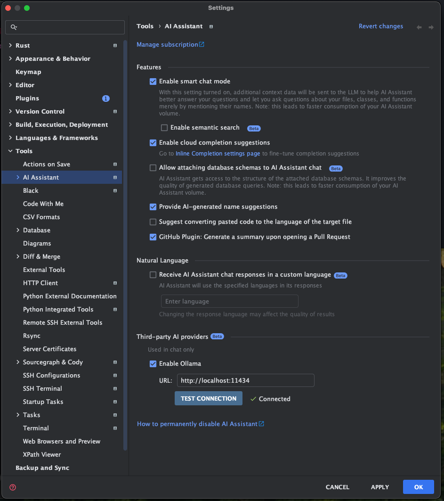
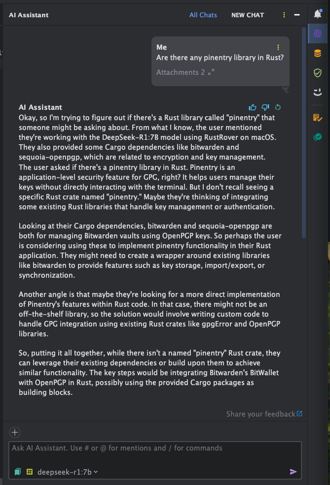

For the couple of days, my Twitter feed gone crazy from the recent DeepSeek R1 announcement that said to rival GPT o1
with competitive training costs.

One important thing to highlight is that DeepSeek released the model weights with MIT License. That means you can tinker
with it locally and even use it on your commercial project.

# Running the DeepSeek R1 using Ollama

Although, it's quite difficult to run LLM model in consumer grade machines for performance reasons, you can try it out
in your local machine. Plenty of tutorial exists already to guide you on running the model using Ollama server.

This time I just want to focus on how I set it up using Nix.
You can see the code in my [Nix Config Repository](https://github.com/lucernae/nix-config/tree/main/process-compose/llm/deepseek-r1).
The main config is just a single file of `flake.nix`, declared using process-compose to run Ollama serve as a process.

To run it and download the models at init time:

```shell
nix run "github:lucernae/nix-config?dir=process-compose/llm/deepseek-r1"
```

That's it.

It will run a process-compose panel and show the status. Look at it from my glorious new [Ghostty](https://ghostty.org) terminal


Ollama will also tells you if the model fits in your GPU. On my MacOS, it uses Metal API.


My laptop is a MacBook Air M2 with 16 GB RAM, which has around 10GB RAM available for inference.

I'm using the 7B Distilled models. You need more hardware power for more bigger parameters.

# Testing the AI via terminal chat

You can chat via CLI. The flake above already includes Ollama, so you can use its shell like this:

```shell
nix develop "github:lucernae/nix-config?dir=process-compose/llm/deepseek-r1" \
  --command ollama run deepseek-r1:7b
```

You will be dropped into its prompt. Then you can start chatting.


type `/bye` to exit.

# Testing the AI via Jetbrains AI Assistant plugin

Jetbrains AI Assistant plugin also support Ollama. In my RustRover there is an option to switch models, and you can pick
Ollama provider




The chat response is very slow (sorry, my laptop), but that's how hard it is to run LLM models on your hardware.
As you can see from screenshot below, Jetbrains AI Assistant is trying to provide IDE context to this LLM.
We can see that DeepSeek R1 is trying to think and provide is reasoning process



# Testing the AI using Cody plugin

Cody plugin from [Sourcegraph](https://sourcegraph.com/cody) is available in both Visual Studio Code
and Jetbrains IDE. If you run Ollama using default port, it will detect Ollama as experimental feature.
You can then choose your model.


# Other tools?

Well, there are plenty front facing application that you can choose. However, since I mainly uses LLM
to help to code, so I mainly use the chat interface (or autocomplete), embedded in my IDE.
More often times, I turned off autocomplete, because it interferes with IDE context and my typing rhythm.

Ok... honestly, it's very rare for me to even use AI chat for coding. Except for menial tasks like
generating bash script, query, or unit tests.

For a more casual users, you can try searching for tutorial on how to set up Open Web UI or LLM Studio.
