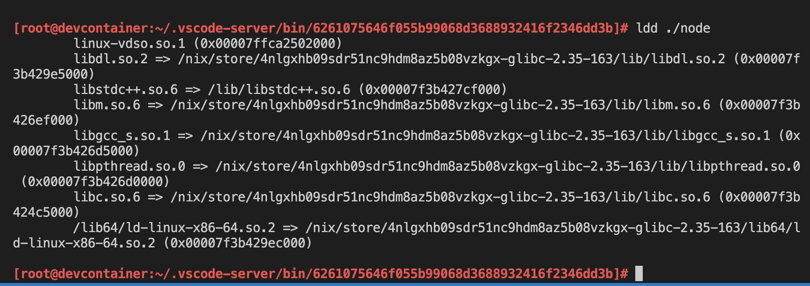
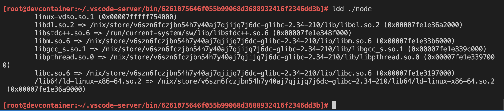
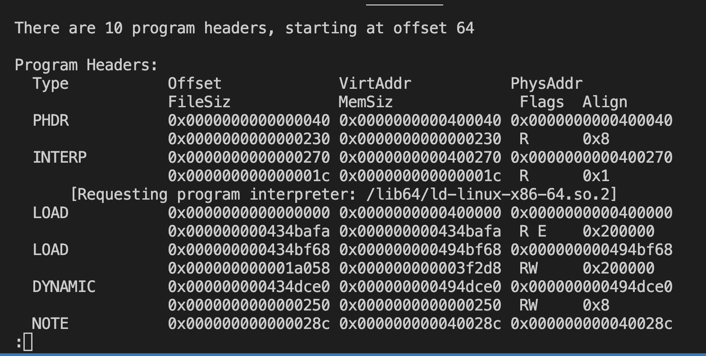
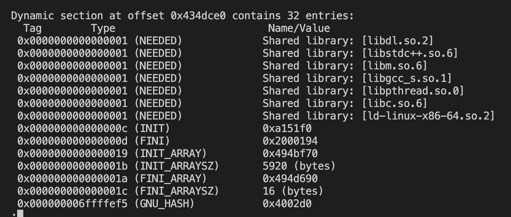
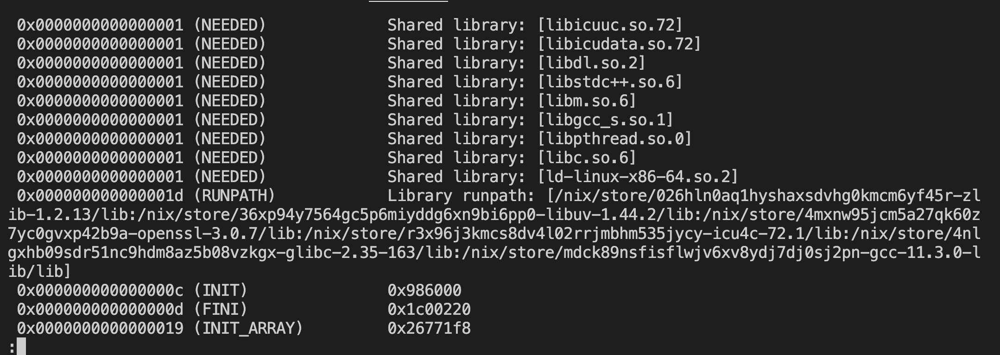

This is a very humbling experience when I first understands it.
I want to record it in my blog as self notes.

# The core problem

I was trying to make a VS Code devcontainer. To my surprise, there are so little 
work on making this happens. I needed it to wrap some functionality of docker 
containers. I want my colleague to have the same developer experience and 
easy-to-setup tooling. Unfortunately, asking them to learn Nix seems to be 
a huge barrier. So I thought if I wrap it as docker container (things they 
already been familiar with), it would be smoother.

So I started by packaging Nix inside the docker image.
However when I let vscode to build the devcontainers, I began to see various issue.
At runtime, vscode tries to install some core things. One of the core problem is that 
vscode uses their own version of node (which can change as new vscode release out).
Nix can install node, but usually it patches binaries by linking dynamic lib 
in Nix store. Vscode's node can't see them. Also, I can't force vscode to use Nix's nodejs.

# Troubleshooting ELF and dynamic lib patching using Nix for non-Nix binaries

The article will be structured as quick guide and step-by-step troubleshooting,
to understand how the binaries works.

To skip the reasoning part, jump to the [summary](#tldr-summary)

## Checking the existence of the binary interpreter

When the devcontainer failed to start, the error is bizarre and totally unrelated with 
the core problem. Fortunately, since I knew I was doing something that most people 
wouldn't have done before, I can guess where the problem lies.

VSC (Visual Studio Code), only shows error log of the creation of devcontainer.
From there, I can see the last command it tries to execute and what the exit value is.
The exit value doesn't help. So what I did is to restart the devcontainer manually, 
and run the command directly.

From there I can see that vscode uses it's own node binary installed in some location 
(IIRC) in `/home/vscode/.vscode-remote-machine/<some-hash>/node`. The exact path 
might be different because I didn't record it.

When I execute the command, it exits with an stderr saying "No such file found".

It's bizarre because the file is there. The binary exists. So "what exactly" that the 
kernel can't find?

My first guess would be to check using `ldd`. How do I guess this? 
Mostly because of my past experience working with C++ (although just as a laymen).
If I have no experience about this, I think I will search it via google or something.
Since the devcontainer probably empty from any build inputs, I need to get `ldd`.
Fortunately, I installed Nix inside the container. So, I can just use nix-shell:

```bash
nix-shell -p glibc
ldd ./node
```

Make sure that you are inspecting the `node` binary in the directory, and not `node` 
from your environment PATH.
It looks like this:



It seems it can't find `libstdc++.so.6`.
I'm just curious on why only libstdc++ is missing.
That means, it is not included in the Nix path.

Next task would be to find the lib in the nix store.

```bash
find /nix/store -name 'libstdc++.so.6'

> /nix/store/mdck89nsfisflwjv6xv8ydj7dj0sj2pn-gcc-11.3.0-lib/lib/libstdc++.so.6
```

From there, I could see the package name (gcc). Unfortunately, 
I could not find the recipe. Makes sense, since this is just a toolchain,
so it is possible that it is only being used in the build phase, and not part 
of the output.

Resorting back to googling things, I then found out that the package name 
was `stdenv.cc.cc.lib`. From this I could patch the container creation 
at build time (you know, when running `docker build`), so that I can include the lib 
in the image.

Now the next question would be, how to let this node binary know that the lib exists 
at Nix store? If I read Nix manual, it seems there is a hook called `autoPatchelf` hook 
that takes care of this thing, if the binaries are built using Nix. We can't do that for 
this vscode nodejs.

So our next option is to declare `LD_LIBRARY_PATH` environment variable, and 
then put the nix store path there. But this has risks of ruining NixOS rebuild switch,
since the linking path supposed to be changed at runtime.

I'm taking a compromise at that stage to declare this env variable as docker/compose 
variable (because vscode need it presents without hitting entrypoint). 
For the NixOS devcontainer, we need to reset this env variable to not let them interfere 
with the execution.

Set the variable, then check with ldd again

```bash
export LD_LIBRARY_PATH=/nix/store/mdck89nsfisflwjv6xv8ydj7dj0sj2pn-gcc-11.3.0-lib/lib
ldd ./node

> libstdc++.so.6 => /nix/store/mdck89nsfisflwjv6xv8ydj7dj0sj2pn-gcc-11.3.0-lib/lib/libstdc++.so.6 (0x00007f77f4ed2000)
```

The output will show that it found the library.

However, when I execute `./node` it still saying `bash: ./node: No such file or directory`.
Even though `ldd` says that all libraries has been found.

I just realized how stupid I am after pondering that the ldd program I used is the one installed 
by Nix. So, of course it can found the interpreter. That means, my next attempt would 
be to place a symlink of the interpreter in the location that node expects it to be.

The interpreter path is (from the screenshot), is the last line:

```bash
/lib64/ld-linux-x86-64.so.2 => /nix/store/4nlgxhb09sdr51nc9hdm8az5b08vzkgx-glibc-2.35-163/lib64/ld-linux-x86-64.so.2 (0x00007fbe93369000)
```

To quickly check it, I just make a symlink of the nix store path (the right-side path)
to the location that the binaries expects (the left-side path).

```bash
mkdir -p /lib64
ln -s /nix/store/4nlgxhb09sdr51nc9hdm8az5b08vzkgx-glibc-2.35-163/lib64/ld-linux-x86-64.so.2 \
    /lib64/ld-linux-x86-64.so.2
```

Executing `./node` again now works. Voila~!

Here's the final screenshot of a working link:



## Patching the ELF header of the binary

Once we figured out the problem, it's just a matter of choosing how to fix it.
Since devcontainer at the moment expects that everything already been set up 
by the image (no hook to attach before vscode does its magic).
Then at the image creation, I have to patch those things. I prefer to patch it using 
Nix itself, instead of doing manual bash work like that.

This solution works if the devcontainer we are creating is a plain Nix package manager 
on top of a minimal distro image. Or perhaps distro-less can work too.

However my end goal is to have a devcontainer that can build and switch NixOS 
configuration. For this to work, I was thinking of patching vscode node's binaries, 
in addition to having the original symlink ready at creation time.

So basically the first approach only works when the devcontainer is first created, 
but the symlink will be gone under `nixos-rebuild switch` operation **at runtime**.
If the symlink is gone, then when the devcontainer/codespace restarts, it would not 
be able to run node again.

I still haven't decided what the proper solution is. But the hacky way is to add 
NixOS activation scripts and redo the symlink. However my ideal solution for 
NixOS devcontainer is to have it patch ANY vscode node binaries located in 
`/home/vscode/.vscode-server/bin`, since over time it is possible that vscode 
installs multiple node version. Or the classice "it works on my machine, but not yours"
all over again, simply because both your colleague and you are not using the same 
vscode version.

It is critical to understand how patchelf works. So I read a little bit about it.

An [ELF](https://en.wikipedia.org/wiki/Executable_and_Linkable_Format), (not 
to be confused with a certain gorgeous fantasy race), is format for an executable 
binaries. A system (or computers) might use different architecture, such as x86_64 (standard Intel/AMD processors) or 
Aarch64 (like raspberry pi, M1 mac, or android phone). Thus an ELF header of a binary helps 
the kernel figure out what kind of binary it is. So you can't run x86_64 binary in an aarch64 
or the other way around without some kind of emulation triggered by the kernel.
The kernel knows this by reading the ELF header.

Let's say your host system is x86_64 and it reads ELF header of a binary. The header 
says that the program is an aarch64 program. If incidentally the host already has 
aarch64 **interpreter** registered, then it will use that to run the program. 
An example of how this works is how `qemu` uses `binfmt` to register different 
interpreter.

Now, what I refer as `patchelf` in Nix is how they uses `patchelf` utility to literally 
patch the ELF header so it points to the correct path of the interpreter.

In the previous example we linked `/lib64/ld-linux-x86-64.so.2`. With patchelf 
utility, it is the other way around. We patch the binary and change `/lib64/ld-linux-x86-64.so.2`
reference to the correct nix store path, where the interpreter actually exists.

To play around with this concept, we can install `binutils-unwrapped` package

```bash
nix-shell -p binutils-unwrapped
```

To read the ELF header, you uses `readelf`.

```bash
# read all header and load it to less (so you can search around)
readelf -a ./node | less

# read program header
readelf -l ./node | less

# read only the dynamic linking section
readelf -d ./node | less
```





Now, if you want to patch the interpreter path, you use patchelf:

```bash
patchelf patchelf --set-interpreter /nix/store/4nlgxhb09sdr51nc9hdm8az5b08vzkgx-glibc-2.35-163/lib64/ld-linux-x86-64.so.2 \
    ./node
```

## Checking the existence of RPath

RPath or runtime-path in my understanding is the LD_LIBRARY_PATH information 
embedded in the binary itself. In the screenshot above, in the dynamic section, 
there is no rpath being set. The dynamic libraries are loaded by name.
In NixOS, we can set the rpath so that it points to the profile symlink's path.
In Nix-built libraries, the rpath is set to the nix store path of the libraries used 
at the time of the build.

Rpath is the reason why Nix-built binaries will not conflict each other. Even though 
it uses a different version of the same library name.

Here's an example of how rpath looks like for node binary built by Nix:



## Patching the Rpath of the binary

Similar with previous steps, you do:

```bash
patchelf --set-rpath <the computed path of all the libraries location> ./node
```

# Where to go from here

Learning all the bits and pieces works together is really interesting.
Making devcontainer-nix helped me understands deeper into the architecture layer.

Anyway, my work in progress is in github: [lucernae/devcontainer-nix](https://github.com/lucernae/devcontainer-nix).
It's not the prettiest repo in the world, but I'm planning to use it for my own hobby project for now.
At least, it's working in both GitHub codespace and local VSCode.

Things I learned from this allows me to understand why I can't SSH-attach 
my vscode to my NixOS in my raspberry pi. It's because the 
node binary installed by VSC can't link to the interpreter. It's difficult 
to debug the issue back then because my Pi is headless, and 
VSC logs doesn't tell much. It is easier when it is a container (you can attach directly using docker to check around).

# TL;DR; Summary

The troubleshooting steps:

When a binary doesn't work:

1. `nix-shell -p glibc -p binutils-unwrapped`
2. `ldd <binary-path>`
3. checks if the dynamic lib was found
4. if not, try adding the lib nix store path to `LD_LIBRARY_PATH` or `patchelf --add-rpath <lib-path> <binary-path>`
5. checks interpreter location was found
6. if not, either make the symlink or `patchelf --set-interpreter <interpreter-path> <binary-path>`