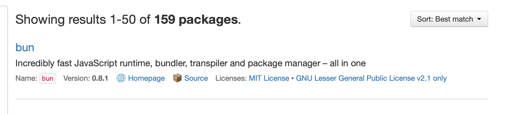
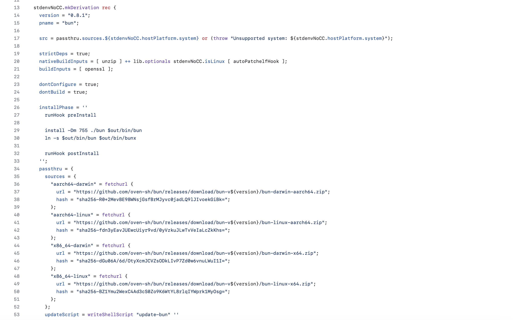

This is just a quick tips on how to use a custom version of software packages from Nixpkgs repo.

Recently I've been following a development of the new Javascript runtime [bun.sh](https://bun.sh).
They now have an announcement for their v1 version of Bun [here](https://bun.sh/blog/bun-v1.0).

I want to try the compatibility with gatsbyjs. As you may know, the dev env setup of this blog uses Nix Flake 
to install a custom-based nodejs that is pinned to be compatible with my gatsbyjs dependencies.
However, if I used [search.nixos.org](https://search.nixos.org/packages?channel=unstable&from=0&size=50&sort=relevance&type=packages&query=bun), version 1.0.0 
of bun doesn't exists yet.



But, the recipe already exists. If you click the "source" button, you will be redirected to GitHub pages of the recipe.

To override a package derivation, you can either use `override` or `overrideAttrs`. This is mentioned in the [nixpkgs manual](https://nixos.org/manual/nixpkgs/stable/#chap-overrides).
The difference between them is that `override` is used to override the input of the function. I gave an example a way back in [this article](../2022--11--17--00--overriding-development-shell-dependencies-using-nix/).
On the other hand, `overrideAttrs` is used to override inputs passed into `mkDerivation` function. 

These are what the [source code](https://github.com/NixOS/nixpkgs/tree/ecf1ea0cdb71e3631583e4d31defa8fcff447be4) looks like at the time of the writing: 



The attribute that we want to immediately change is the `src` attribute. From there, you can see that it was evaluated 
using attribute value of `passthru.sources`. Then looking at the `passthru.sources`, we can see that it fetches 
binary build of each systems from GitHub. So, in the case of Bun package, we didn't build from source code, but actually fetches binary from the release, according to `version` attribute.

This is simpler and faster, but probably less reliable long term because it was not built from the source code.

Nevertheless, we know that we need at least 3 attribute to overrides: `src`, `passthru.sources`, and `version`.

In Nix, you override it like this:

```nix
let
    bunV1 = pkgs.bun.overrideAttrs (final: prev: with pkgs; rec {
        version = "1.0.0";
        src = passthru.sources.${stdenvNoCC.hostPlatform.system} or (throw "Unsupported system: ${stdenvNoCC.hostPlatform.system}");
        passthru = prev.passthru // {
            sources = prev.passthru.sources // {
                "aarch64-darwin" = fetchurl {
                    url = "https://github.com/oven-sh/bun/releases/download/bun-v${version}/bun-darwin-aarch64.zip";
                    # hash = "";
                };
            };
        };
    });
in
    bunV1
```

Step by step explanation:

1. We create a new package called `bunV1`, which is assigned to be an output of `pkgs.bun.overrideAttrs` result.
2. We call `pkgs.bun.overrideAttrs` function with overlay function as its input.
3. Overlay function is in the form `final: prev: <expression>`, in which `prev` refers to the object/attr set before it is overridden.
4. Operator `//` means merge the attr set. That means `prev.passthru.sources // newAttrSet` means override attr set of `prev.passthru.sources` with a new one in `newAttrSet`.
   If some attribute has the same key, then the newAttr value will replace the previous value.
5. Since I'm using Macbook Air M2, I'm using `aarch64-darwin` system key in the sources. You can adapt accordingly, or 
   declare for all systems.

Now, things that I want to highlight and is easily forgotten for new Nix adopter is the hash used by `fetchurl` function.

Fetcher function works by comparing the sha or hash digest of the data it fetches. If the hash exists in nix store, it will use existing data in the store.
In our case now, we should expect the hash to be different when we update the Bun version. 
You can set `hash = "";` and then let the build fails. It will tell you the correct hash.

Other alternatives is to calculate the hash directly.

Use `nix repl` to evaluate the function:

```nix
pkgs = import <nixpkgs> {}
version = "1.0.0"
sys = "darwin-aarch64"
:b pkgs.fetchurl {
    url = "https://github.com/oven-sh/bun/releases/download/bun-v${version}/bun-${sys}.zip";
}
```

It will also tells you the correct hash. Then you can put it in the `hash` attribute.

That's it. 
Take a look at the [flake.nix](https://github.com/lucernae/maulana.id/blob/main/flake.nix) for the example.

To test out this Bun immediately using remote flake, just use:

```shell
nix develop github:lucernae/maulana.id
bun -v
```
