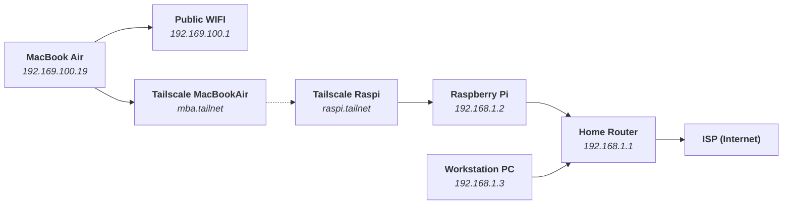

I came across [Tailscale Funnel](https://tailscale.com/kb/1223/tailscale-funnel/).
It is an interesting way to share your site over public internet.

Here's my story.

# Homelab configuration using Tailscale

As I explained in the previous article about how I got interested with [Tailscale](../2023--01--30--00--using-tailscale-with-nix),
it is a simple solution for your homelab servers. All of your devices can easily be connected within the same subnet, even if they are 
physically on a different network.

Since then, I have been using my Tailnet (sort of a catchy name for Tailscale network) by connecting my raspi at home.
By exposing a subnet, I can access my home router (that can't be installed with Tailscale), via my Raspi connected within the same network.
That way, I can access the subnet within the same Tailnet, using other devices.

I've been using this functionality for quite some time. Now that my raspi is dead, I don't have mini router within my homelab.
That's when I thought I should make my PC take the role for now. However, my PC has some customized network settings to be used within 
the PC itself. I still wanted to keep the functionality going.

One of usage my PC has, is as a machine for setting up devices. From within the tailnet, it can share Nix build caches, and sometimes 
can be used as a Nix builder for x86_64 arch (my main laptop at the moment is an M2 Air, aarch64). I also installed a [Rancher](https://ranchermanager.docs.rancher.com) server, 
so I can add arbitrary k8s cluster to be inspected there.

# Making a Tailscale Subnet Route

Let's suppose you have this kind of setup in your home network



The above diagram is not technically accurate, because to access other tailnet over the internet, you need to get thru each subnet router (public WIFI and your home ISP).
But it is what conceptually happened.

Basically, your **Tailscale** instance in each devices (in the diagram, Macbook Air and Raspberry Pi), create a tunnel between network.
Your MacBook Air can reach your Raspberry Pi, even though both devices are on separate network (different subnets), and even separated by NAT gateway.
Your MacBook Air can `ping` Raspberry Pi just by typing `ping raspi.tailnet` in the terminal.

By, the way, of course you need to replace `.tailnet` with your own tailnet domain (which you can see from Tailscale web console).
Meanwhile, `raspi` is your assigned device name for this Tailscale device.

So, if each devices has Tailscale in it, you can simply refer to the device by its assigned device name (just like what you do under DHCP hostname).
But what if you want to access your Workstation PC or Home Router that doesn't have Tailscale in it? This is where Tailscale subnet routing works.

First, you need to expose or advertise your subnet. Because the raspi is part of the subnet, we do these command inside raspi

```shell
tailscale up --advertise-routes=192.168.1.0/24
```

This will allow us to access `192.168.1.1` and `192.168.1.3` because `192.168.1.0/24` basically covers addresses with prefix `192.168.1.x`.

Next, you need to accept the advertised routes, from inside the tailnet device that wants to access this subnet. Let's say, the MacBook Air from above diagram.
You typed

```shell
tailscale up --accept-routes
```

To check if the connection working, if both Tailscale daemon active, from MacBook Air, I can access my routers control panel in `192.168.1.1` from the browser.

Note that in MacBook Air interface, there is no direct route from `192.168.100.x` subnet to `192.168.1.x` subnet. So it's kind of mindblowing.

# Using Tailscale Serve to proxy services

Now that we enabled subnet routing. There are two other interesting Tailscale features.

You can use Tailscale Serve to proxy service inside your Tailscale devices. That way it is accessible to other Tailscale device as well (in the same Tailnet).

There are 4 equally interesting usages.

1. HTTP to a mount point
2. HTTPS to a mount point
3. TCP to a mount point
4. TLS terminated TCP to a plain TCP

## Exposing HTTP service

The simplest one, is to expose something as HTTP.
You can use the command `tailscale serve http:<port> / <filepath>` to serve your directory over your tailnet.
But since on MacOS it was somewhat disabled because of sandbox. Alternatively, we can create a simple http server using Python

```shell
python -m http.server 9000
tailscale serve http / http://localhost:9000
```

Now, if you check using `tailscale serve status`, you will see something like this:

```shell
http://<your-device-name> (tailnet only)
http://<your-device-name>.<tailnet>.ts.net (tailnet only)
|-- / proxy http://127.0.0.1:9000
```

You can access your proxied service using `http://<your-device-name>`. Basically using your Tailscale device name. 
Also, it can be accessed from within any of your Tailscale device.

However, in my case, due to stupid Internet Service Provider (ISP) regulation, single phrase-hostname will be redirected by my ISP's DNS into 
their ad page...

Yeah it sucks.

So, for my particular case, it was easier to just access it by its full name: `http://<your-device-name>.<tailnet>.ts.net`, 
instead of tampering my DNS' settings.

Okaaay, now this seems to not be a big deal. It's just port reroute. You can do similar things with Caddy, Nginx, Traefik, etc.

But, imagine you work in a team. You can easily share your local development service just by using your Tailscale device name.
It kind of simplify the sharing process. Good for you if you are familiar with how advanced proxy services works. But if you 
only want to quickly bring some services up and share it, this could be a good alternatives.

## Exposing HTTPS service

Ok now, the next part has some concrete benefit. This is HTTPS support.

To expose HTTPS local server, normally you have to deal with certificate generators. This can be cumbersome, but I've learned 
along the way that there are certain tools that specializes on making certificate provisioning easier. Like Caddy, certmanager,
etc. But all of them shared the same limitation, which is a self signed certificate.

Self-signed certificate itself is not "less secure". It's just that it contains extra steps to verify it.
You need to accept root CA in your browser once to access your self-signed HTTPS endpoint.
You may need to install the certificate manually if you plan to access your endpoint without browsers (like using cURL or Postman).

But for Tailscale serve, since they provision a real DNS subdomain, the certificate is provisioned as public DNS hostname.
Which means, the root CA is registered in the browser. It is trusted automatically by the browser.

For example, consider exposing the previous Python server as HTTPS:

```shell
tailscale serve https / http://localhost:9000
```

Then you can access it in `https://<your-device-name>.<tailnet>.ts.net`. If you check the certificate, you can see that it was generated by [Let's Encrypt](https://letsencrypt.org).

This is something that I think has to be appreciated. Normally I generate Let's Encrypt certificate in the cloud, with my own tooling.
It can be via certbot or certmanager inside Kubernetes cluster. From a sysadmin/infra point of view, I think K8s + certmanager made it
really easy to provision (and regenerate upon expiry) this Let's Encrypt certificate, simply because K8s can also automate the ingress/proxying and DNS provisioning needed by Let's Encrypt.
The next best thing is probably Caddy and then Certbot.

However, all those approach needs a cloud server for the DNS to point to a public IP address.
Procuring public IP might be difficult for some.
In the past, as indie developer, I had to register a VPS/cloud server to get a public IP.
Not to mention that it requires some kind of identification such as Credit Card or National Identity Card/Passport, which I don't have.
If I were a student, it was inaccessible for me.

But now, Tailscale can provide you free HTTPS certificate, without you having to acquire DNS neither public IP. Isn't that amazing?

Well, technically, it was Let's Encrypt who provides the certificate, but still. You know what I mean. The process is seamless.

## TCP passthru/forwarder

TLS terminated TCP is a pretty similar use case with HTTPS proxying to HTTP.
I'm not sure how often you use TCP, but some example I can think of is using gRPC or the classic example of SMTP with TLS.
It is possible to add this secure layer, so the client can send encrypted request. Then your service receive unencrypted TCP.
For multi tier architecture, you can also add SSL layer for the Database connection to the service layer. This is because 
usually they are not in the same host or infra.

Since it's quite similar with previous HTTPS to HTTP proxy, I'm going to focus on TCP passthru instead.

TCP Passthru/Forwarder basically means the client sends raw TCP (so it applies for encrypted as well) and your service also receives raw TCP.
So, if the traffic uses TCP with TLS, the decryption happens from inside your service. 
Tailscale just acts as relay.

Let's say you have a local HTTPS server, using self-signed certificate (you use your own certificate).
To forward TCP requests in (passthru), you can do this:

```shell
tailscale serve tcp:443 tcp://localhost:443
```

That means when you access it on `https://<your-device-name>.<tailnet>.ts.net`, the server will present its own certificate.
Which means the traffic is unaltered and you had to accept the certificate yourself in the browser.
This case is particularly useful if you want to test your own certificate rollout.

If you want to "wrap" this self-signed certificate into one used by Tailscale, this is possible as well.

```shell
tailscale serve https / https+insecure://localhost:443
```

When you access it on `https://<your-device-name>.<tailnet>.ts.net`, it will use Tailscale certificate generated by Let's Encrypt.

I'm not quite sure how this works. But it seems the client connect with the Tailscale remote domain and the connection is fowarded 
to Tailscale device. It is then terminated/decrypted and proxied to your local service, which uses self-signed certificate.

## Tailscale Funnel

We will wrap up this article by discussing Tailscale Funnel features.

In the previous sections, we used Tailscale Serve to forward our services and shared it inside our Tailnet.
Tailscale Funnel is like a toggle to allow these routing rules to be exposed **over the internet**.

So, any services you've allowed using Tailscale Funnel will be accessible in public via its Tailscale domain.
Even if you access it from a computer that are not part of your Tailscale devices.

Toggling it is easy, just specify the port number. Obviously, only some select ports were possible (otherwise people will abuse this).
But for the general usage, I think port 443 is more than enough to cater your usage.
You can then use subpath routing inside your own device, if you want to host multiple services.
This is similar with how API gateway works.

Other than 443, the [docs](https://tailscale.com/kb/1223/tailscale-funnel/?q=tailscale%20funnel) said you can use 8443 and 10000.
Using 8443 is usually reasonable if you are exposing non-website services. Like an API or orchestration tools such as Kubernetes.

```shell
tailscale funnel 443 on
```

Do note that since you will be exposing your site over public networks, I recommend you activate https for this.
Also, don't use simple passwords if your services were involved with Auth.
Trust me, someone will have a way to brute force it.

## Combining Subnet Routing and Tailscale Serve

If you know how to manage reverse proxy. It is then possible to install a reverse proxy in one of your devices to act as some kind of Ingress/Load Balancer 
to access services in your subnet that is not part of your Tailscale devices.
Using the diagram above, I installed K8s Ingress on my Workstation device (I installed Tailscale as well).
I can then activate Tailscale Serve, to proxy traffic to my Ingress, so that it can be forwarded to other services that is not part of my Tailscale devices.

## Resetting your Tailscale Serve/Funnel

At the moment, the CLI command is still in Beta, so things might have changed in the future.
The command is similar with how firewall command works.
You can specify your rule with suffix argument `off`, to turn the routing off.
Or, you can use `tailscale serve reset` to reset your routing.

For example:

```shell
# turning a route on
tailscale serve http / http://localhost:9000
# turning a route off
tailscale serve http / http://localhost:9000 off
# resetting all rules
tailscale serve reset
```

Have fun trying this out