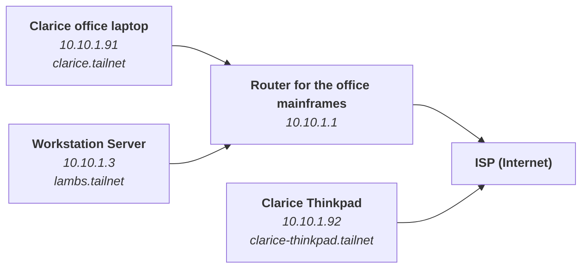
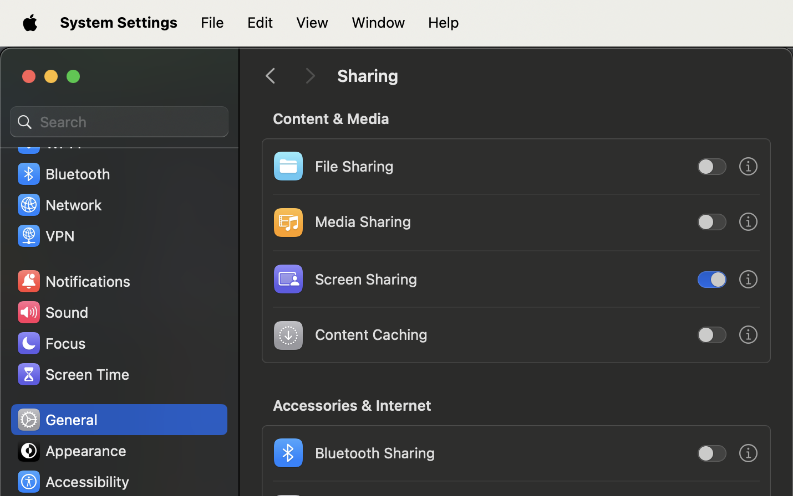
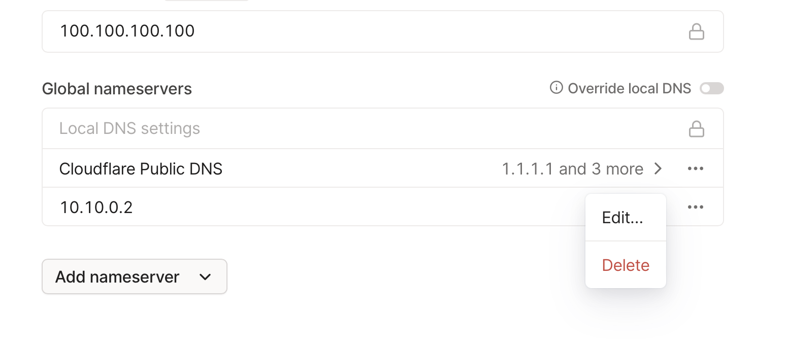

As part of the series of using Tailscale + Nix for indie developer,
we are now a entering a new chapter of "remote access" story.

I was very fortunate that my workplace gave (or rather, lend) us a shiny MacBook Pro 16 inch, medium specced.
But this thing is too bulky for me. It was very often that I had to work outside, in a caffe or other places, due to circumstances.
Part of it was due to load shedding and ISP problems.
If I had to bring it everywhere, I hurt my back...

So, a couple of months back, I set up tailscale on a separate user account in my work laptop.
This acts as a personal VPN.
My work laptop also has office VPN to access office resources and such.
Short story, I set up Tailscale subnet routing, so I can access office resources from my personal
MacBook Air, via my work laptop.
This is highly productive when I'm traveling, because I was able to bring my lighter MacBook Air device.
Battery also lasts longer while I'm traveling because the network and computation were done inside my work laptop.
I was just streaming the traffic from my travel laptop.

However, it seems my network admin decided to ban Tailscale domain. So, I couldn't install and activate Tailscale in my work laptop.

I guess, I can understand that this is probably due to legal or security issue.

Nevertheless, let's just imagine if this restriction is lifted. Here's what it looks like.

# Fat Server and Thin Client

There is this terminology (maybe, I'm not quite accurate, sorry) called Fat Server and Thin Client.

This is not related with body shaming, mind you. The idea is to have a very powerful (and often thick) server, located
on premise, supported with sufficient infrastructure, such as bandwidth, electricity, and security. This is the Fat Server.
Then there is a Thin Client, which is usually a computer, not as powerful as the server, but easier to use, like a terminal.

The operator is using Thin Client to access and process data, only exists in Fat Server. The data itself never goes out of Fat Server,
but Thin Client can send complicated commands to be processed in the server. This is a pretty secure model because
technically only the Server has access to the on-premise resources. Client can't access it directly.

# Story: Mountain Climbing Arc

Imagine we have an indie company "BlueSky Software". Lecter, is a sysadmin in this company. He oversees
infra setup. He owns a powerful Linux box workstation which is up 24/7, ready to compute and crunch numbers.

Then there is Clarice, she is an engineer, and she liked to work from anywhere. One day, Clarice needs to work near a volcanic
region. This is because she needs to do a geographical mapping of the area. But climbing a rocky mountain is a challenge by itself,
so she liked to bring as little tools as possible.

Clarice then asked Lecter:

"Bro, can you gave me a much lighter laptop, but durable, and make it able to connect to my office laptop here"

"Yeah sure." Says Lecter.

"I can give you a Thinkpad", he says.

Lecter installed her light Thinkpad X1 Carbon with NixOS and Tailscale.

"You can now connect to our mainframe or office laptop, whichever you want, as if you were in the office."

Not long, Clarice assembled a team consisting of herself, a drone engineer, and several local engineers and climbers to help them scale the area.

Lecter made this network architecture, equipped with Tailnet:



With Tailnet, Clarice's Thinkpad is like a part of the network, even if it is physically in a different network.

## Episode 1: Setting up Remote Desktop VNC

Clarice actually knew about how SSH terminals work. However, the management doesn't. Due to regulation, Clarice needs to
see Google Calendar to check for meeting schedule and such.
She also needs to access Slack, and a Gitea repository, accessible only from within office network.
Clarice remembered in the past, she had to use Linux `write` command. Ah the good old days.

Anyway, for story's sake, let's skip on how to set up a VNC Server in Linux. It was a nightmare.
So instead, pretend that Clarice work laptop is a Mac. She had to enable "Screen Sharing" feature, which is essentially an Apple Garden rebranded of VNC.

It was directly under System Settings > General > Sharing menu.



Also, Clarice doesn't forget to enable SSH as well in mac.

## Episode 2: Advertising Tailnet Subroute

On the other hand, Lecter also sets up his mainframe router.

The router is a NixOS box. To add Tailscale capabilities, you can check the previous article
[here](../2023--01--30--00--using-tailscale-with-nix/#for-now-the-installation-of-tailscale-on-nixos)

Since the office subnet uses `10.10.x.x` IP addresses, Lecter advertise it on Tailscale:

```shell
tailscale up --advertise-routes=10.10.0.0/16
```

Lecter sets up the Tailnet DNS. He added the office's DNS address `10.10.0.2` into the Global Domain settings.

The settings were in [https://login.tailscale.com/admin/dns](https://login.tailscale.com/admin/dns).



"Great! Now Clarice's Thinkpad can access our internal URLs"

## Episode 3: Using Remote Desktop from the mountain

There is a gov building near the site region where gov officials has high bandwidth internet to send seismic data (how cool is that!).

Clarice arrived this morning, and she forgot that she left an important document in her work laptop back at the office.

To open her office laptop screen, she uses VNC Client and access `clarice.tailnet:5900`, since VNC port is usually 5900.
Now she can interact with the desktop (er, laptop) screen in her office.

Actually, if she just wanted to browse her files, she can use SMB.

Mac has built in support of SMB. She can enable it from System Settings > General > Sharing > File Sharing.
From there she can set up User + Passwords + shared folder.

A little tips that Clarice knows, either Mac or Linux also has builtin supports of SMB browser in their file manager.
She can use the address bar of File Manager app and typed `smb://clarice@clarice.tailnet/shared-folder` to access her folders.

Alternatively, if `xdg-open` exists in terminal/shell, she can typed `xdg-open 'smb://clarice@clarice.tailnet/shared-folder'` on Linux,
or `open 'smb://clarice@clarice.tailnet/shared-folder'`, and then the OS will redirect it into the correct app.

This works with VNC too. Typing `xdg-open vnc://clarice.tailnet:5900` will also open associated VNC viewer in Linux.
Typing `open vnc://clarice.tailnet:5900` is its MacOS counterpart.

# Ending

By using this setup, Clarice can use the processing power of the office workstation while just streaming display output
using Tailnet and VNC/RDP.

Given huge internet bandwidth, it is also possible to stream data back to the office.
