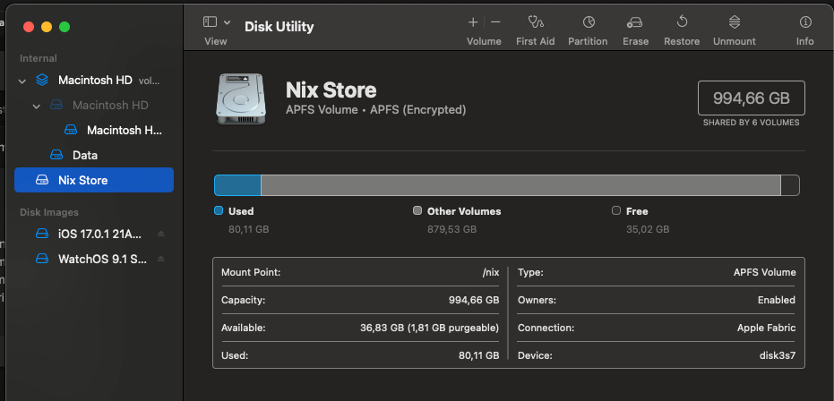
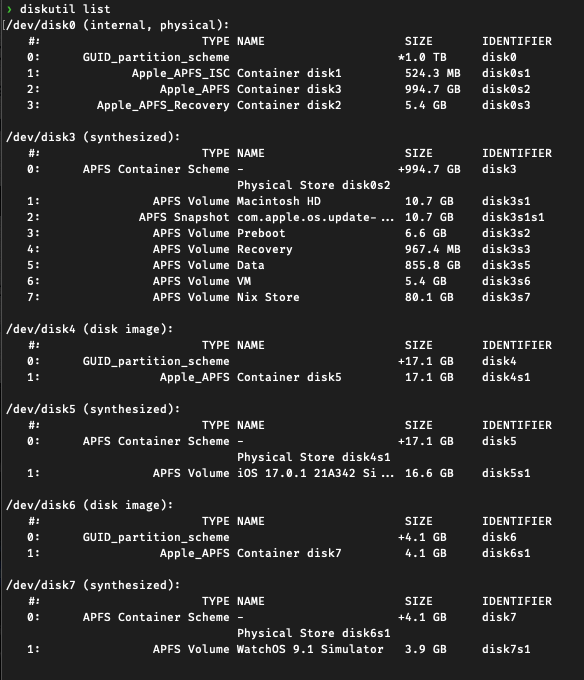
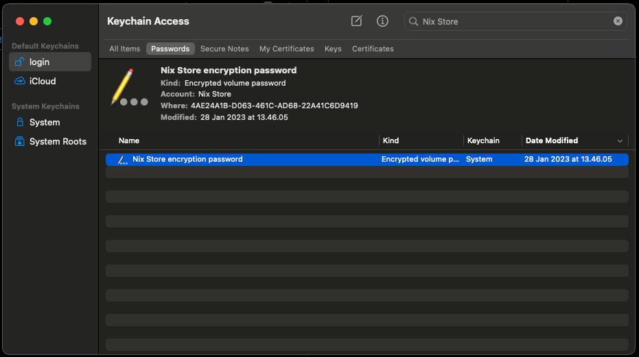

Several days after upgrading to MacOS Sequoia, I noticed that some of my basic CLI were not detected.
After checking terminal, my prompt doesn't show my usual Starship prompt, but rather the plain ZSH prompt.
This happens after some days without rebooting my laptop, so I'm not entirely sure why it can happen without rebooting.

A quick check in the terminal with `command -v nix` shows that nix wasn't found. Nix darwin profile also wasn't found.
So obviously any Nix based hook doesn't work. So I check `/nix` directory which is the Nix Store. It was empty.

In MacOS, I think after they began introducing APFS (Apple File Systems), the only way to have Nix Store is to make
a separate APFS volume and mount it into `/nix`. So the problem is not because the content of `/nix` were suddenly deleted.
It was just not mounted.

# Checking the Nix Store Volume

To check if the volume exists and not suddenly gone. I used Disk Utility from Spotlight. There I can see that the volume exists.



In the screenshot above, you can see the mount point set to `/nix`. This is after the fix, which is the normal state.
However, when the issue happened, it was mounted to `/Volumes/Nix Store`.

There is no interface to set the mount point from Disk Utility, as far as I know. So I unmount the volume and tried to mount
via terminal.

To see the lists of disks and volumes:

```shell
diskutil list
```



The above output shows that my Nix Store volume is on partition 7 of disk 3, or `disk3s7` as the identifier

My next attempt is to try to mount it using diskutil

```shell
sudo diskutil mount -mountPoint /nix /dev/disk3s7
```

But this gave me warning that the partition were locked (because it is using APFS). Ok then, I unlock it using diskutil again.

```shell
sudo diskutil apfs unlockVolume /dev/disk3s7
```

It will request an unlock key. Where to get it? The answer is on your keychain.app.
Open your Keychain and search for `Nix Store`.



You can then right click and choose `Get info` in order to see the encryption password. It will require you to input your administrative password.
You then give this encryption key to the terminal prompt when asked about the key.
If you are lucky and integrated `security` CLI with touch ID, then you can skip the entire Keychain lookup, because the CLI
will look it up for you. You just need to gave permission using your touch ID.

Now here's the stupid thing. Once you unlock the volume, turns out it is immediately mounted.

To where???

To the current mount point, which is `/Volumes/Nix Store`. You can't unlock and then mount it manually to `/nix`, because
it just immediately mounted. At least I don't have any way to do that.

# Mounting Nix Store at boot time

So we are going to use the old fashioned Unix-way. Mount the volume during boot time.

First we need to tell MacOS that it is okay to mount the disk at boot time to `/nix` location.
This configuration is located in `/etc/synthetic.conf`. I have two entries like below (create if it doesn't exists):

```ini
nix
run     private/var/run
```

Then we put our mount command in `/etc/fstab`. But in MacOS, it was advised to edit it using `vifs` CLI.
To mount it, get the device UUID first.
If you open the previous Keychain entries, the device UUID is the value of `Where` attribute.

Alternatively, just use `diskutil` to find the UUID

```shell
diskutil info disk3s7 | grep 'Volume UUID'
```

Now use `sudo vifs` and add entry like this:

```ini
UUID=<your Nix Store device UUID> /nix apfs rw
```

Then reboot, your Nix installation should work as usual.

# Remarks

You can view the content of the `fstab` (File System table) in `/etc/fstab`. Like using `cat /etc/fstab` command, rather than `sudo vifs` if you only want to see the content.

In general if you found that your `/nix` mount entry missing again (probably after OS update/upgrade).
You can do the walkthrough above.