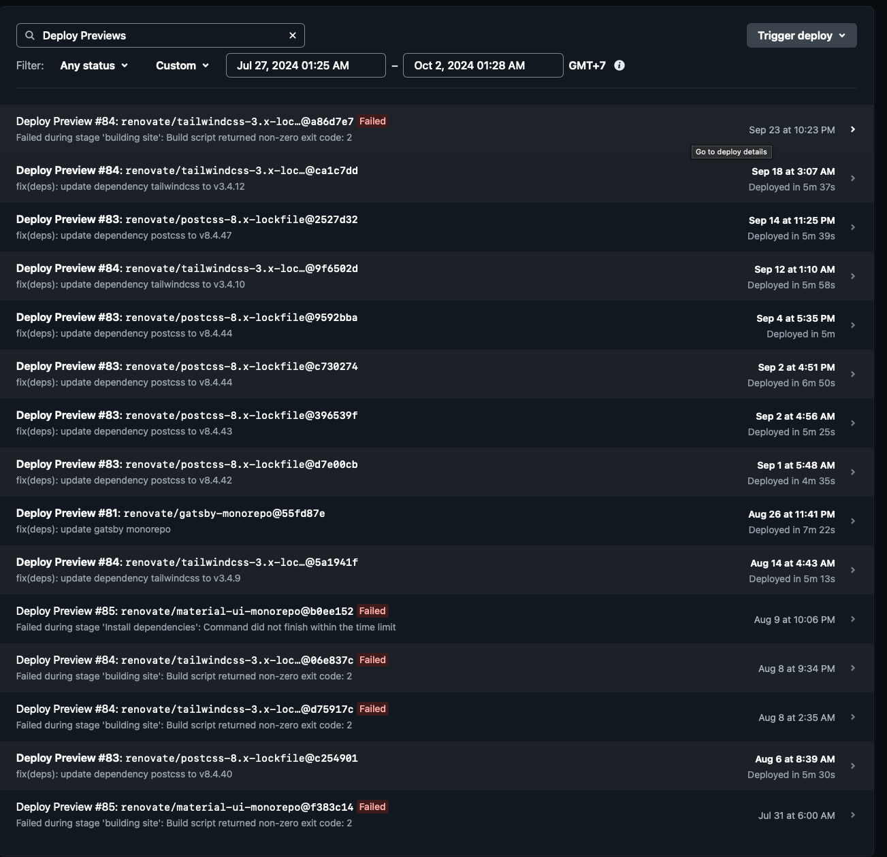
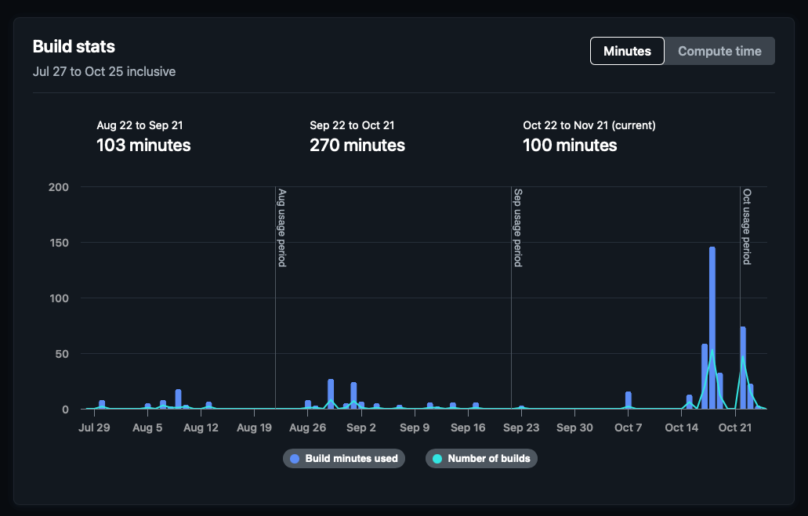

A migration plan seems overkill for just migrating your personal blog, but it s a good exercise as software developer.

How do you explain your thought process?

How do you make sure everything works?

What features you will consider as deprecated, and what is new?

Who is your users?

How do you plan the rollout?

Ask these questions as guide, then for each engineering decision you can refer to this question again to make sure you achieve your goals.

# Choosing technology stack framework and constraints

We already did that in [part 1](../part-01). Our options is to use Astro, because these are the feature set we care about:

1. Ability to use MDX as existing content
2. Static sites first approach
3. Community support
4. Quick to migrate

Notice that language and framework has no issue at the moment, because performance wise, all static sites will work more
or less the same when deployed. Language has no issue as well because I'm willing to learn new stack.
We have little to no constraint at all for time, because this is a side project. However preferably we want the migration
to be done in less than 16 hours (2 man-day) in total. This translate to realistically 4 weekend days, since I can only afford
to work on it 4 hours each saturday/sunday (because I'm a family man).

# Defining Key success metrics

You can only know that you did a good job after defining your success metrics and compare it post migration.
Sometimes your projects doesn't lead to success, but you need to learn from it.
Consequently, you can only learn from it if you have something quantitatively or qualitatively to compare.
More numbers are good. Investors likes numbers, even if it's a bad numbers.

Define your key metrics from top priority to low. That way you can cut metrics that aren't feasible for you to do.
Make a practice to define it as comparative or using numbers, with something as a baseline.

## Quantitative Key Metrics

1. All content migrated/compilable

This is high priority because we will consider our effort as a failure if there is even 1 *.mdx file that is not able to be rendered/compiled.
In that case we should change the stack or strategy.

2. Local dev compilation takes less than 1 minute

You might think I'm crazy, but yes, previously running `gatsby develop` took me 1 to 5 minutes. So we want to be faster.

3. Netlify build pipeline has to be less than 5 minutes.

If you think I'm joking that static site build took 5 minutes, here's a screenshot of build time from September:

Ideally we want less than that after the migration. But we can compromise if it turns out to be similar. As a reasoning
on why we want less than 5 minutes: Each month, Netlify give a generous free tier of 300 build minutes.
So at max around 60 times deployment. In my most active time, I'm perhaps writing 4 articles in a month.
But I have renovate bot that manages my dependencies. These will generate deploy preview that also take the build times.
So 60 times deployment is actually very limited. Not to mention, this shared with several sites I own, since I have other
repo that is specifically used to build the theme/engine (more on this later).

Here's how my September usage looks like. It's pretty close hitting 300 minutes!

## Qualitative Key Metrics

Other than above quantitative metrics (things that can be compared by numbers). We also have several key metrics, that
is qualitative and subjective. More or less because of my personal preference.

1. The new site/engine has to be able to use the same URL routing to get to the content

An important key when designing website content is that your URL **must stay the same** if it points to the **same resources**.
People might bookmark your link or share it in social media, so you want these URL to be able to work and point to the same content
after the migration.

2. The new site/theme has to be simple

It needs to be able to load fast in client side. Minimalist, because we want users to focus on reading, be it on mobile
or desktop

3. I can run the dev environment in GitHub codespaces, comfortably

In my previous attempt using GatsbyJS, I am able to use Nix Devcontainer to set up a [GitHub Codespaces](https://github.com/codespaces) instance.
The problem is that my Codespace will crash when I try to Gatsby's build or run develop command. I think the problem is that it can't handle processing the static images under containerized environment.

Other than these three, I don't have that much metrics to compare. Note that "Minimalist" is a pretty subjective metrics, but that is okay.
One important takeaway from defining qualitative metrics is that you need to be able to design the metrics that invokes **user opinion**.
Having bad feedback is better than no feedback at all. So for example, if someone said that new site **is not minimalist**,
it is better than if they said the site's theme is **so-so**, because we won't gain any insights.

# Planning the migration

Now that we have defined the goals, we can start defining the strategy. Remember that we only have 4 hours in each development sessions.
This needs to be meaningful, and each session we need to have some outcome or decisions.

I divided the migration projects into several milestones:

## Milestones

1. M1: Research phase

In this phase, I need to quickly test the feasibility of several framework that met the criteria. The outcome is
I need to choose one framework and I need to be able to run a lite version of it and deploy it via Netlify to make sure my pipeline work with minimal changes.

2. M2: Build MVP

In this phase, I work on a small version of the site. Possibly with smaller sets of contents that covers all important use cases and old feature sets in my current site.
I need to choose which feature can go into the new site, and which one were deprecated, or **compromised** and how to mitigate the content for this one.

Again, the outcome is that the site is deployable via Netlify and accessible via public internet to test the functionality.
But this time, it covers contents/feature set exists in the old site.

As an example, if my previous site can render $KaTeX$ equation then the new site should be able to as well. So I will make one MDX content
that tested several $KaTeX$ syntax to see if it is able to render.

3. M3: Migrating and integrating the contents

There could be different way to integrate the content into the new engine. So we dedicated one milestone to actually test
if my previous MDX contents is able to be rendered, or if it needs some adjustments.

The outcome is of course I can see switch my site to the new one

4. M4: Post deployment, Monitoring, Polishing, and Documenting

Pretty self-explanatory. After deployment, we need to check if things work correctly, or are there edge cases needs to be done.
These things sometime can't be planned beforehand because it showed up after we actually done the deployment.

For the documentation part, we just want to ensure that we learn something, be it good thing or bad thing after the exercise.

These articles are part of that, actually. Hahaha.

## Strategy

After defining the Milestone, we might want to put high level strategy to achieve those milestones.
So let's make a quick high level bullet points for each milestones.

1. M1: Research phase

We need to be humble in order to achieve the goal realistically. I'm not that knowledgeable with JavaScript/Frontend stack, so I will need help or guidance.
In order to do that:

    1.a. Use IDE

    I will use JetBrains [Rust Rover IDE](https://www.jetbrains.com/rust/). Reasoning:
        - Free for non-commercial use
        - Has JavaScript support, syntax highlight, and symbols autocomplete and jump. It will help me learn the codebases quickly
        - Possibility of getting sponsored by JetBrains. Ok, this is wishful thinking, but who knows...

    1.b. Use AI assistant

    I will use JetBrains AI Assistant. I have to pay for it, but it integrate with the IDE nicely. I wanted to try [Cursor](https://www.cursor.com) as well, but the price is pretty steep.
    10 USD vs 20 USD for monthly billing. So I choose JetBrains AI Assistant. Another good option that come with a decent Free Plan is [Cody AI](https://sourcegraph.com/pricing?product=cody).
    There is a plugin for Sourcegraph (the product name), that enables you Cody AI plugin inside the IDE. The Pro plan only costs 9 USD.

    1.c. Use Nix

    Pretty much obvious choice. Checking out different framework means you need to switch environment/language stack quickly, and Nix + Direnv is the perfect tools
    for that to quickly jump in and set up everything.

    Note, that with AI assistant, it's pretty trivial to generate Nix flake or modify existing flake to adapt. You just tell the assistant what to do, and it will
    generate flake config that you can quickly tests if it runs or not. Fortunately, I also use Nix Flake in previous GatsbyJS setup, so the AI assistant can learn from that.

2. M2: Build MVP

I'm going to create separate repo, which is eventually be [astro-blog-template](https://github.com/lucernae/astro-blog-template).
In this repo, I will use it to test smaller sets of contents to quickly build MVP.

No fancy strategy here, just do the actual work and get it done to be published on actual domain as MVP.

3. M3: Migrating and integrating the contents

I will create a new branch on my site repo, where I integrated the new engine from the MVP, and integrate the content there.
To ensure smooth troubleshooting, it is best to move my contents to the folder where the engine read, one at a time.
Hopefully we can see what goes wrong.

Note that it is not possible to rollout the content partially to production site, because the theme will be different and the experience will be jarring.
So it's best to switch the site in one go.

Rollback plan is done via rollback branch, created before the switch.

4. M4: Post deployment, Monitoring, Polishing, and Documenting

In this phase, I will basically revisit the original key success metrics, and just try comparing it and documenting it.
As part of the journey, I bet I run into problem with the site analytics or edge cases.

This site actually runs Google analytics that I hope is not too intrusive or affecting the performance. I just want to have an insights to see which page is organically popular.

For the polishing strategy, it's quite simple. Just do bugfix commit immediately when we see problem. Do iterative package upgrades as renovate suggested and see if it breaks or not.
Netlify automatically build preview page whenever a PR is made that passed the CI checks. So I can just check the preview page immediately.

I guess that's all for the strategy!

# Next Article

So far it is just a high level article. Next article is going to be my favorite! I'm going to rant about the technical details and challenges in the journey.
Boy, I hate JavaScript stack!!! Hope you enjoy the next one.