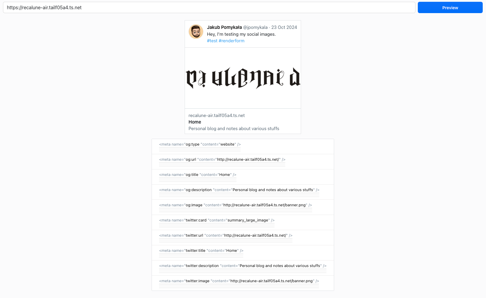

# Open Graph preview

As part of my blog migration to Astro, I'm fiddling around with the Open Graph metadata feature that it provides.

If you are not familiar, [Open Graph protocol](https://ogp.me) is a subset of HTML metadata that is used to
describe how certain sites to render links.

As an example, suppose that you have a link `https://foo.bar`. If the HTML content from that URL has the following
meta tag in their HTML head, then some site can render the preview links based on this metadata.

```html
<html>
    <head>
        <meta property="og:title" content="The Rock" />
        <meta property="og:type" content="video.movie" />
        <meta property="og:url" content="http://www.imdb.com/title/tt0117500/" />
        <meta property="og:image" content="http://ia.media-imdb.com/images/rock.jpg" />
    </head>
</html>
```

Here's my site's preview links in Twitter:


As you can see, it uses the template image from the blog template. I want to customize it.

Before I deploy the changes, of course I want to preview it locally. However if you use your local development links, it won't render.


This is because it needs to use HTTPS protocol. Otherwise the web previewer can't render. There is no technical limitation,
but mostly website that can render Open Graph were social medias. For social medias, it is necessary to enforce some security rules,
one of them is using HTTPS protocol to render media.

But setting up self signed certificates to serve HTTPS content is most often a complicated acrobatic maneuver.
Not only you need to setup the infra and TLS termination proxy on your local machine, you also need to setup the browser to trust the certificate.
So it can be quite a challenge.

# Using Tailscale Funnel to proxy HTTP content as HTTPS (free SSL/TLS termination)

What I really like about Tailscale is not only it is easy to use, it is quite fast to setup as well.

There is a beta feature called [Tailscale Funnel](https://tailscale.com/kb/1223/funnel) that I often uses to share
my development website over public internet to quickly test things.

Before running the funnel, make sure your Astro development server were run using host name that accept any connection:


```shell
astro dev --host 0.0.0.0
```

Take a note at the generated port. For me it was `4321`.

Now start your Tailscale service and then run the funnel from command line

```shell
tailscale funnel 4321
```

It will show you the public addressable URL, with the domain that ends with `*.ts.net`.


Now you can use the URL to preview the Open Graph card, like these:




That's quite simple isn't it?

Do take care how you uses Tailscale funnel because it is publicly available. Make sure you are not exposing secret.
As a basic security feature, Tailscale Funnel runs in foreground. So if you close your terminal or press CTRL+C, the funnel will be turned off.
However it is also possible to run the funnel in the background. So it will keep running, even if your terminal has been closed.